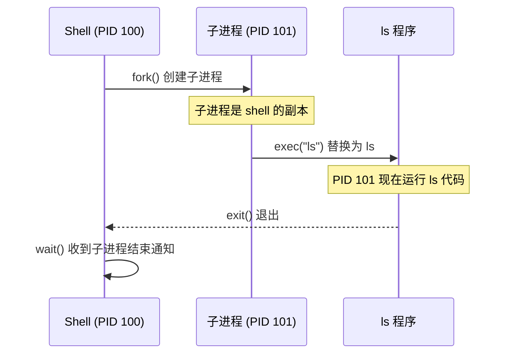

# Shell 实现原理

> **核心问题**：Shell 是如何启动和管理其他程序的？

---

## 0. 前置知识

阅读本章需要了解：
- C 语言基础（理解函数调用、指针）
- 基本的 Linux 命令行使用

---

## 1. 问题：Shell 到底在做什么？

当你在终端输入 `ls -l` 并按下回车，发生了什么？

表面上看，shell "运行"了 ls 命令。但操作系统的进程模型决定了：**一个进程不能直接变成另一个进程**。

那 shell 是怎么做到的？

---

## 2. 核心机制：fork + exec + wait

Shell 依赖三个系统调用（System Call）实现命令执行：

| 系统调用 | 作用 | 类比 |
|----------|------|------|
| `fork()` | 复制当前进程，创建子进程 | 细胞分裂 |
| `exec()` | 用新程序替换当前进程的代码和数据 | 灵魂替换 |
| `wait()` | 等待子进程结束 | 父母等孩子回家 |

**执行流程**：



---

## 3. 详细展开

### 3.1 fork()：进程复制

`fork()` 创建一个几乎完全相同的子进程：

```c
pid_t pid = fork();

if (pid == 0) {
    // 子进程执行这里
    printf("I am child, PID = %d\n", getpid());
} else if (pid > 0) {
    // 父进程执行这里
    printf("I am parent, child PID = %d\n", pid);
} else {
    // fork 失败
    perror("fork failed");
}
```

**关键点**：
- `fork()` 调用一次，返回两次（父进程和子进程各返回一次）
- 子进程返回 0，父进程返回子进程的 PID（Process ID，进程标识符）
- 子进程继承父进程的文件描述符（File Descriptor）、环境变量等

### 3.2 exec()：程序替换

`exec()` 系列函数用新程序替换当前进程：

```c
// execvp: v = 参数是数组, p = 在 PATH 中查找程序
char *args[] = {"ls", "-l", NULL};  // 必须以 NULL 结尾
execvp("ls", args);

// 如果 exec 成功，下面的代码永远不会执行
// 因为当前进程已经被 ls 程序替换了
perror("exec failed");  // 只有失败时才会执行到这里
```

**exec 家族**：

| 函数 | 特点 |
|------|------|
| `execl` | 参数逐个列出 |
| `execv` | 参数用数组传递 |
| `execlp` / `execvp` | 在 PATH 环境变量中查找程序 |
| `execle` / `execve` | 可以指定环境变量 |

### 3.3 wait()：等待子进程

父进程调用 `wait()` 等待子进程结束：

```c
int status;
pid_t child_pid = wait(&status);

if (WIFEXITED(status)) {
    printf("子进程正常退出，退出码: %d\n", WEXITSTATUS(status));
}
```

**为什么需要 wait？**

1. **回收资源**：子进程结束后，内核保留其退出状态，直到父进程调用 wait
2. **避免僵尸进程（Zombie Process）**：未被 wait 的已结束子进程会变成僵尸
3. **同步**：shell 需要等命令执行完才显示下一个提示符

---

## 4. 完整示例：最简 Shell

```c
#include <stdio.h>
#include <stdlib.h>
#include <string.h>
#include <unistd.h>
#include <sys/wait.h>

#define MAX_LINE 1024
#define MAX_ARGS 64

int main() {
    char line[MAX_LINE];
    char *args[MAX_ARGS];

    while (1) {
        // 1. 打印提示符
        printf("mysh> ");
        fflush(stdout);

        // 2. 读取输入
        if (fgets(line, MAX_LINE, stdin) == NULL) {
            break;  // EOF，退出
        }
        line[strcspn(line, "\n")] = '\0';  // 去掉换行符

        // 3. 解析命令（简单按空格分割）
        int argc = 0;
        char *token = strtok(line, " ");
        while (token != NULL && argc < MAX_ARGS - 1) {
            args[argc++] = token;
            token = strtok(NULL, " ");
        }
        args[argc] = NULL;

        if (argc == 0) continue;  // 空行

        // 4. fork + exec + wait
        pid_t pid = fork();

        if (pid == 0) {
            // 子进程：执行命令
            execvp(args[0], args);
            perror("exec failed");
            exit(1);
        } else if (pid > 0) {
            // 父进程：等待子进程
            int status;
            waitpid(pid, &status, 0);
        } else {
            perror("fork failed");
        }
    }

    return 0;
}
```

---

## 5. 本章小结

| 概念 | 说明 |
|------|------|
| `fork()` | 复制当前进程，子进程返回 0，父进程返回子进程 PID |
| `exec()` | 用新程序替换当前进程，成功后不返回 |
| `wait()` | 等待子进程结束，回收资源，避免僵尸进程 |
| Shell 执行模型 | fork 创建子进程 → exec 替换为目标程序 → wait 等待结束 |

**核心洞察**：Shell 并不"运行"命令，而是创建一个自己的副本，然后让副本"变成"目标程序。这种 fork-exec 模式是 Unix 进程模型的基石。

---

下一篇：管道（Pipe）实现——进程间如何传递数据？
