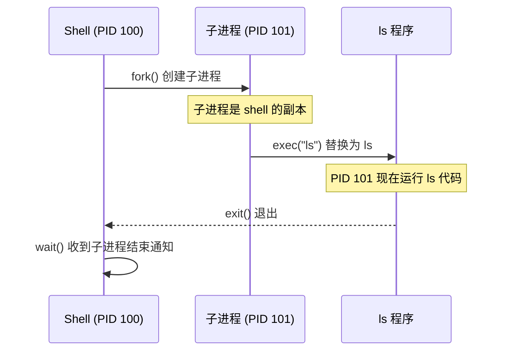

# Shell 实现原理

> **核心问题**：Shell 是如何启动和管理其他程序的？

---

## 0. 前置知识

阅读本章需要了解：
- Zig 语言基础（错误处理、切片）
- 基本的 Linux 命令行使用

---

## 1. 问题：Shell 到底在做什么？

当你在终端输入 `ls -l` 并按下回车，发生了什么？

表面上看，shell "运行"了 ls 命令。但操作系统的进程模型决定了：**一个进程不能直接变成另一个进程**。

那 shell 是怎么做到的？

---

## 2. 核心机制：fork + exec + wait

Shell 依赖三个系统调用（System Call）实现命令执行：

| 系统调用 | 作用 | 类比 |
|----------|------|------|
| `fork()` | 复制当前进程，创建子进程 | 细胞分裂 |
| `exec()` | 用新程序替换当前进程的代码和数据 | 灵魂替换 |
| `wait()` | 等待子进程结束 | 父母等孩子回家 |

**执行流程**：



---

## 3. 详细展开

### 3.1 fork()：进程复制

`fork()` 创建一个几乎完全相同的子进程：

```zig
const std = @import("std");
const posix = std.posix;

pub fn main() !void {
    const pid = try posix.fork();

    if (pid == 0) {
        // 子进程执行这里
        std.debug.print("I am child, PID = {}\n", .{posix.getpid()});
    } else {
        // 父进程执行这里，pid 是子进程的 PID
        std.debug.print("I am parent, child PID = {}\n", .{pid});
    }
}
```

**关键点**：
- `fork()` 调用一次，返回两次（父进程和子进程各返回一次）
- 子进程返回 0，父进程返回子进程的 PID（Process ID，进程标识符）
- 子进程继承父进程的文件描述符（File Descriptor）、环境变量等

### 3.2 为什么用 fork？为什么不直接创建进程？

你可能会问：为什么不设计一个 `create_process("ls", args)` 一步到位？

Windows 就是这样做的（`CreateProcess()`），但 Unix 选择 fork + exec 分离，核心原因是**灵活性**。

**fork 和 exec 之间是一个"窗口期"**，可以任意修改子进程状态：

```zig
const pid = try posix.fork();

if (pid == 0) {
    // ---- 窗口期：子进程可以自由配置自己 ----

    // 关闭标准输出，重定向到文件
    posix.close(posix.STDOUT_FILENO);
    _ = try posix.open("output.txt", .{ .ACCMODE = .WRONLY, .CREAT = true }, 0o644);

    // 切换工作目录
    try posix.chdir("/tmp");

    // ---- 配置完毕，再替换程序 ----
    return posix.execvpeZ("ls", &.{ "ls", "-l" }, std.c.environ);
}
```

**这种设计让管道实现变得自然**：

```zig
// 创建管道
const pipe_fd = try posix.pipe();

const pid1 = try posix.fork();
if (pid1 == 0) {
    // 子进程 1: ls
    posix.close(pipe_fd[0]);                      // 关闭读端
    try posix.dup2(pipe_fd[1], posix.STDOUT_FILENO);  // 标准输出 → 管道写端
    return posix.execvpeZ("ls", &.{"ls"}, std.c.environ);
}

const pid2 = try posix.fork();
if (pid2 == 0) {
    // 子进程 2: grep
    posix.close(pipe_fd[1]);                      // 关闭写端
    try posix.dup2(pipe_fd[0], posix.STDIN_FILENO);   // 标准输入 ← 管道读端
    return posix.execvpeZ("grep", &.{ "grep", ".zig" }, std.c.environ);
}
```

如果用 `CreateProcess()` 式 API，所有这些配置都要通过参数传递，接口会变得非常复杂。

**性能问题？Copy-on-Write 解决了**：

现代系统用 COW（Copy-on-Write，写时复制）优化 fork：

```
fork() 后：
┌─────────────┐     ┌─────────────┐
│ 父进程      │     │ 子进程      │
│ 页表 ───────┼──┬──┼─── 页表     │
└─────────────┘  │  └─────────────┘
                 ↓
          ┌──────────────┐
          │ 共享的物理页  │  ← 标记为只读
          └──────────────┘

只有当某一方写入时，才真正复制那一页。
exec() 会立即替换整个地址空间，所以 fork+exec 几乎没有复制开销。
```

### 3.3 exec()：程序替换

`exec()` 用新程序替换当前进程。Zig 通过 `std.posix` 提供封装：

```zig
const std = @import("std");
const posix = std.posix;

pub fn main() !void {
    // execvpeZ: 参数和环境变量都是 null-terminated 的 Z 字符串
    const args = [_:null]?[*:0]const u8{ "ls", "-l", null };
    const envp = std.c.environ;  // 继承当前环境变量

    // 如果 exec 成功，下面的代码永远不会执行
    // 因为当前进程已经被 ls 程序替换了
    return posix.execvpeZ("ls", &args, envp);

    // 只有失败时才会到这里（execvpeZ 返回 error）
}
```

**Zig 中的 exec 函数**：

| 函数 | 特点 |
|------|------|
| `execvpeZ` | 参数和环境变量都是 `[*:null]?[*:0]const u8` |
| `execvpe` | 参数是切片 `[]const [*:0]const u8` |
| `execve` | 最底层，直接对应系统调用 |

### 3.4 wait()：等待子进程

父进程调用 `waitpid()` 等待子进程结束：

```zig
const std = @import("std");
const posix = std.posix;

pub fn main() !void {
    const pid = try posix.fork();

    if (pid == 0) {
        // 子进程
        return posix.execvpeZ("ls", &.{"ls"}, std.c.environ);
    } else {
        // 父进程：等待子进程
        const result = posix.waitpid(pid, 0);

        if (posix.W.IFEXITED(result.status)) {
            const exit_code = posix.W.EXITSTATUS(result.status);
            std.debug.print("子进程退出码: {}\n", .{exit_code});
        }
    }
}
```

**为什么需要 wait？**

1. **回收资源**：子进程结束后，内核保留其退出状态，直到父进程调用 wait
2. **避免僵尸进程（Zombie Process）**：未被 wait 的已结束子进程会变成僵尸
3. **同步**：shell 需要等命令执行完才显示下一个提示符

---

## 4. 完整示例：最简 Shell

```zig
const std = @import("std");
const posix = std.posix;

pub fn main() !void {
    const stdin = std.io.getStdIn().reader();
    const stdout = std.io.getStdOut().writer();

    var line_buf: [1024]u8 = undefined;

    while (true) {
        // 1. 打印提示符
        try stdout.print("mysh> ", .{});

        // 2. 读取输入
        const line = stdin.readUntilDelimiter(&line_buf, '\n') catch |err| {
            if (err == error.EndOfStream) break;
            return err;
        };

        if (line.len == 0) continue;

        // 3. 解析命令（简单按空格分割）
        var args_buf: [64:null]?[*:0]const u8 = undefined;
        var argc: usize = 0;

        var iter = std.mem.splitScalar(u8, line, ' ');
        while (iter.next()) |arg| {
            if (arg.len == 0) continue;
            // 注意：这里简化处理，实际需要确保 null-terminated
            args_buf[argc] = @ptrCast(arg.ptr);
            argc += 1;
            if (argc >= 63) break;
        }
        args_buf[argc] = null;

        if (argc == 0) continue;

        // 4. fork + exec + wait
        const pid = try posix.fork();

        if (pid == 0) {
            // 子进程：执行命令
            const err = posix.execvpeZ(args_buf[0].?, &args_buf, std.c.environ);
            std.debug.print("exec failed: {}\n", .{err});
            posix.exit(1);
        } else {
            // 父进程：等待子进程
            _ = posix.waitpid(pid, 0);
        }
    }
}
```

> **注意**：上述代码为演示概念而简化，实际实现需要正确处理字符串的 null 终止符。

---

## 5. 本章小结

| 概念 | 说明 |
|------|------|
| `fork()` | 复制当前进程，子进程返回 0，父进程返回子进程 PID |
| `exec()` | 用新程序替换当前进程，成功后不返回 |
| `wait()` | 等待子进程结束，回收资源，避免僵尸进程 |
| fork-exec 分离 | 提供窗口期修改子进程状态，实现重定向、管道等 |
| Copy-on-Write | 现代优化，fork 几乎零开销 |

**核心洞察**：Shell 并不"运行"命令，而是创建一个自己的副本，然后让副本"变成"目标程序。fork 和 exec 的分离设计，让你在两者之间拥有完全的控制权——这是 Unix 进程模型的精髓。

---

下一篇：管道（Pipe）实现——进程间如何传递数据？
