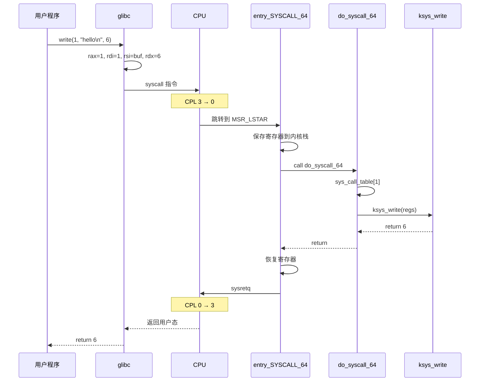
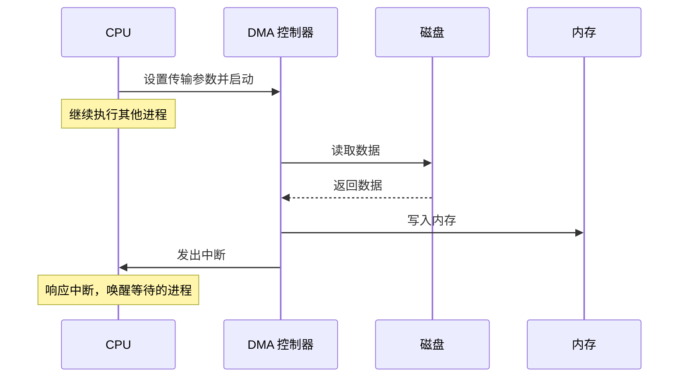

# 系统调用与双模式

上一课提到最小权限原则：用户程序运行在 Ring 3，不能直接访问硬件。但程序确实需要读文件、发网络包、分配内存。它怎么做到的？

来看一个实验。编译运行上一课的 `hello.c`，用 `strace` 追踪它的行为：

```
$ strace ./hello
execve("./hello", ["./hello"], 0x7ffd... /* 63 vars */) = 0
...
write(1, "hello\n", 6)                  = 6
exit_group(0)                           = ?
+++ exited with 0 +++
```

`write(1, "hello\n", 6)` 这一行，程序从用户态发出了一个请求，内核在内核态完成了实际的写入操作，然后返回用户态。中间发生了什么？

程序不能直接操作硬件。CPU 通过**双模式**（用户态和内核态）在硬件层面强制这条规则。跨越边界的标准方式是**系统调用**：用户程序把请求编号和参数放进寄存器，执行 `syscall` 指令，CPU 切换到内核态，内核根据编号查表找到处理函数。但每次系统调用都要切换模式，有些高频的只读操作能不能绕过这个开销？**vDSO** 就是内核预先映射到用户地址空间的代码段，让特定操作不需要进入内核。系统调用的参数怎么传、返回值怎么拿，这套二进制层面的规则叫 **ABI**。最后，系统调用是用户程序主动请求进入内核，但硬件事件（网卡收到数据包、磁盘完成读写）需要异步通知 CPU，这就是**中断与 DMA** 的职责。

## 双模式

双模式(dual mode)是 CPU 提供的一种硬件机制，把处理器的运行状态分为用户态(user mode)和内核态(kernel mode)两种模式，每种模式拥有不同的权限级别。

为什么需要双模式？假设没有这个机制，所有程序都运行在同一个权限级别。来推演一下这会导致什么后果。

任何程序都可以执行 `cli`(Clear Interrupt Flag)指令关闭中断。中断被关闭后，时钟中断无法触发，调度器就无法打断当前程序、切换到其他进程。这个程序永远霸占 CPU，其他所有进程（包括终端、SSH 会话）都得不到执行。唯一的恢复方式是物理重启。

任何程序都可以直接写任意物理内存地址。一个有 bug 的程序把数据写到了内核数据结构所在的地址，整个系统崩溃。一个恶意程序读取其他进程的内存，窃取密码、密钥等敏感数据。

任何程序都可以直接操作磁盘控制器的 I/O 端口，绕过文件系统的权限检查，读取硬盘上任何用户的文件。

这三类问题的根源是同一个：用户程序拥有了它不应该拥有的权限。一个恶意程序或一个有 bug 的程序就能摧毁整个系统。

双模式在硬件层面阻止了这些操作。x86-64 处理器定义了 4 个特权级（Ring 0 到 Ring 3），Linux 使用其中两个：

- **Ring 0**（内核态）：可以执行所有 CPU 指令，包括操作硬件的特权指令（`cli`/`sti` 控制中断、`in`/`out` 访问 I/O 端口、写控制寄存器 CR3 切换页表等）
- **Ring 3**（用户态）：只能执行普通计算指令。尝试执行特权指令会触发通用保护异常(General Protection Fault, #GP)，CPU 自动切换到内核态，由内核的异常处理程序接管

CPU 怎么知道当前处于哪个特权级？答案在 CS(Code Segment) 寄存器的最低 2 位，这两位叫做 CPL(Current Privilege Level，当前特权级)。CPL = 0 表示内核态，CPL = 3 表示用户态。每次执行指令时，CPU 都会检查 CPL 是否有权执行该指令。

用户态程序需要进入内核态，有三条路径：

1. **系统调用(system call)**：用户程序主动请求内核服务，通过 `syscall` 指令触发。这是最常见的路径
2. **异常(exception)**：CPU 在执行指令时遇到错误条件（除零、缺页、非法地址），自动切换到内核态由异常处理程序处理
3. **中断(interrupt)**：外部硬件设备（键盘、网卡、磁盘控制器）发出信号通知 CPU，CPU 暂停当前程序，切换到内核态执行中断处理程序

这三条路径的共同点是：**进入内核态的方式由硬件控制，用户程序无法自己修改 CPL。** 用户程序不能把 CS 寄存器的 CPL 位从 3 改成 0。只有通过 CPU 定义的入口点（`syscall` 指令、中断门、异常门），特权级才会切换。

:::thinking 用户态程序怎么知道自己在用户态？
严格来说，用户态程序不需要知道自己在哪个特权级，因为它不应该关心这件事。程序只管调用 `write()`、`read()` 这些函数，具体怎么进入内核是 C 标准库和 CPU 的事。

但如果你确实想知道，x86-64 没有提供一条"读取当前特权级"的用户态指令。CS 寄存器的值在用户态可以通过一些间接方式获取（比如 `mov %cs, %rax`），但正常程序不会这么做。

更实际的判断方式是检查进程的内存映射。`/proc/self/maps` 显示了进程的虚拟地址空间布局，用户态程序的代码段地址通常在低地址范围，而内核地址空间在高地址范围（x86-64 上，用户空间占虚拟地址的低 128 TB，内核空间占高 128 TB）。如果你的代码在低地址执行，那就是用户态。
:::

## 系统调用

系统调用(system call, syscall)是用户态程序请求内核服务的标准接口。用户程序通过系统调用让内核代为执行需要特权的操作（如读写文件、创建进程、分配内存），然后内核把结果返回给用户程序。

我们来完整追踪 `write(1, "hello\n", 6)` 从 C 代码到内核再返回用户态的全过程。

**第一步：C 代码调用 glibc 包装函数。** 程序调用 `write(1, "hello\n", 6)` 时，实际调用的是 glibc（GNU C Library）提供的包装函数(wrapper function)。这个包装函数的职责是：把 C 函数的参数按照系统调用的约定放进 CPU 寄存器，然后执行 `syscall` 指令。

glibc 的 `write` 包装函数做了这些事：

| 寄存器 | 值 | 含义 |
|--------|-----|------|
| `rax` | 1 | 系统调用编号（`__NR_write` = 1） |
| `rdi` | 1 | 第一个参数：文件描述符 |
| `rsi` | 指向 `"hello\n"` 的地址 | 第二个参数：数据缓冲区 |
| `rdx` | 6 | 第三个参数：字节数 |

这里有个问题是，为什么参数放在寄存器里而不是栈上？因为系统调用要穿越用户态/内核态边界。用户态的栈在内核态不能直接使用（两者使用不同的栈），而寄存器是 CPU 全局可见的。

**第二步：`syscall` 指令触发模式切换。** `syscall` 是 x86-64 专用的快速系统调用指令。执行这条指令时，CPU 硬件自动完成以下操作：

1. 把当前指令的下一条地址（返回地址）保存到 `rcx` 寄存器
2. 把当前 RFLAGS 寄存器的值保存到 `r11` 寄存器
3. 把 CPL 从 3 切换到 0（进入内核态）
4. 从 MSR_LSTAR 寄存器读取内核入口地址，跳转到该地址执行

MSR_LSTAR 是一个特殊的模型特定寄存器(Model-Specific Register)，内核在启动时把 `entry_SYSCALL_64` 函数的地址写入其中。所以 `syscall` 指令的效果是：跳转到 `entry_SYSCALL_64`，同时切换到内核态。

**第三步：`entry_SYSCALL_64` 保存现场。** 这是内核的系统调用入口函数，用汇编写成，定义在 `arch/x86/entry/entry_64.S`。它的首要任务是保存用户态的寄存器状态，这样系统调用完成后可以恢复：

```asm
// arch/x86/entry/entry_64.S (simplified)
SYM_CODE_START(entry_SYSCALL_64)
    swapgs                          // 切换到内核的 GS base（获取 per-CPU 数据）
    mov    %rsp, PER_CPU_VAR(...)   // 保存用户栈指针
    mov    PER_CPU_VAR(...), %rsp   // 加载内核栈指针

    // 把用户态寄存器压入内核栈，构造 pt_regs 结构体
    push   %rcx                     // 用户态 RIP（syscall 指令保存的）
    push   %r11                     // 用户态 RFLAGS（syscall 指令保存的）
    push   %rdi                     // 参数 1：fd
    push   %rsi                     // 参数 2：buf
    push   %rdx                     // 参数 3：count
    ...

    mov    %rsp, %rdi               // pt_regs 指针作为第一个参数
    call   do_syscall_64            // 调用 C 函数分发系统调用
SYM_CODE_END(entry_SYSCALL_64)
```

`swapgs` 指令切换 GS 段基址，让内核可以访问 per-CPU 数据结构（每个 CPU 核心有自己的内核栈和数据区域）。然后切换到内核栈，把用户态寄存器保存到栈上。这些寄存器值构成一个 `pt_regs` 结构体，内核的 C 代码通过这个结构体读取系统调用的参数。

**第四步：`do_syscall_64` 查表分发。** 这是一个 C 函数，定义在 `arch/x86/entry/common.c`，负责根据系统调用编号查表找到对应的处理函数：

```c
// arch/x86/entry/common.c (simplified)
__visible noinstr void do_syscall_64(struct pt_regs *regs, int nr)
{
    nr = syscall_enter_from_user_mode(regs, nr);

    if (likely(nr < NR_syscalls)) {
        nr = array_index_nospec(nr, NR_syscalls);
        regs->ax = sys_call_table[nr](regs);
    }

    syscall_exit_to_user_mode(regs);
}
```

`sys_call_table` 是一个函数指针数组，每个元素对应一个系统调用的处理函数。`nr` 是系统调用编号（来自 `rax` 寄存器），`sys_call_table[1]` 就是 `write` 的处理函数 `ksys_write`。`array_index_nospec` 是一个防止推测执行(speculative execution)攻击的边界检查宏。

系统调用表的内容定义在 `arch/x86/entry/syscalls/syscall_64.tbl` 中：

```
# <number>  <abi>   <name>          <entry point>
0           common  read            sys_read
1           common  write           sys_write
2           common  open            sys_open
3           common  close           sys_close
...
56          common  clone           sys_clone
57          common  fork            sys_fork
59          common  execve          sys_execve
60          common  exit            sys_exit
61          common  wait4           sys_wait4
...
```

编号 1 对应 `sys_write`。内核调用 `ksys_write(regs)`，这个函数从 `pt_regs` 中提取参数（fd=1、buf 指针、count=6），找到 fd 1 对应的文件对象（终端设备），调用该设备的写入方法，把 6 个字节输出到终端。

**第五步：返回用户态。** `ksys_write` 执行完毕后，返回写入的字节数（6）。这个值被存入 `pt_regs->ax`（对应 `rax` 寄存器），最终作为系统调用的返回值传回用户态。控制流回到 `entry_SYSCALL_64` 的返回部分：从内核栈恢复用户态寄存器，执行 `sysretq` 指令。`sysretq` 是 `syscall` 的反向操作：从 `rcx` 恢复用户态指令指针(RIP)，从 `r11` 恢复 RFLAGS，把 CPL 从 0 切换回 3。程序从 `syscall` 指令的下一条继续执行。

完整流程如下：



掌握了这个流程后，我们可以跳过 glibc，用内联汇编直接执行 `syscall` 指令：

```c
// bare_syscall.c
#include <stddef.h>

int main(void) {
    const char msg[] = "hello\n";
    long ret;

    __asm__ volatile (
        "syscall"
        : "=a" (ret)                    // output: rax = return value
        : "a"  ((long)1),              // input:  rax = __NR_write
          "D"  ((long)1),              // input:  rdi = fd (stdout)
          "S"  (msg),                  // input:  rsi = buf
          "d"  ((long)6)               // input:  rdx = count
        : "rcx", "r11", "memory"       // clobbers: syscall overwrites rcx and r11
    );

    return 0;
}
```

```
$ gcc bare_syscall.c -o bare_syscall && ./bare_syscall
hello
```

这段代码没有调用任何库函数，直接通过 `syscall` 指令和内核通信。clobber 列表中的 `rcx` 和 `r11` 是因为 `syscall` 指令会覆写这两个寄存器（分别用来保存返回地址和 RFLAGS）。

:::thinking 为什么不用 int 0x80 而要用 syscall 指令？
在 x86-32 时代，Linux 使用 `int 0x80`（软中断）触发系统调用。`int 0x80` 的执行过程是：CPU 查中断描述符表(Interrupt Descriptor Table, IDT)，找到 0x80 号中断对应的门描述符，验证权限，保存完整的用户态上下文（压入 SS、RSP、RFLAGS、CS、RIP 到内核栈），然后跳转到处理函数。

`syscall` 指令是 AMD64 架构专门为系统调用设计的。它跳过了 IDT 查表和完整上下文保存，只保存 RIP 到 `rcx` 和 RFLAGS 到 `r11`，然后直接跳转到 MSR_LSTAR 中预设的地址。省去了查表和多次内存写入，`syscall` 比 `int 0x80` 快了几十到上百个时钟周期。

在 x86-64 系统上，`int 0x80` 仍然可用（用于 32 位兼容模式），但 64 位程序应该使用 `syscall`。glibc 在 x86-64 上的系统调用包装函数全部使用 `syscall` 指令。
:::

:::expand 系统调用的开销
一次系统调用涉及多个步骤：设置寄存器、执行 `syscall` 指令、CPU 切换特权级、保存/恢复寄存器、查表分发、执行处理函数、`sysretq` 返回。即使处理函数本身很快，模式切换的固定开销也不可避免。

在现代 x86-64 硬件上，一次最简单的系统调用（比如 `getpid()`，几乎不做任何工作）的往返延迟大约在 100-200 纳秒。相比之下，一次普通的用户态函数调用只需要几纳秒。

2018 年的 Spectre/Meltdown 漏洞修补后，系统调用的开销进一步增加。内核启用了页表隔离(Kernel Page Table Isolation, KPTI)，每次系统调用都要切换页表（从用户态页表切换到内核态页表），导致 TLB 刷新和额外的内存访问。KPTI 之后，系统调用的固定开销大约增加了 100-400 纳秒，具体取决于硬件和工作负载。

对于 I/O 密集型操作（如读写文件），系统调用的模式切换开销相对于 I/O 等待时间可以忽略不计。但对于高频调用（如每秒几十万次的 `gettimeofday()`），这个开销就很显著了。vDSO 正是为了解决这类问题而设计的。
:::

## vDSO

vDSO(virtual Dynamic Shared Object，虚拟动态共享对象)是内核映射到每个用户进程地址空间中的一小段代码和数据，让特定系统调用可以在用户态直接完成，不需要切换到内核态。

为什么需要 vDSO？有些系统调用只是读取内核维护的数据，不修改任何状态。`gettimeofday()` 就是典型的例子：它只需要读取内核的时间数据，不涉及任何需要特权的操作。如果每次调用都要经历完整的 syscall → 内核态 → sysretq 往返，对于每秒可能调用几十万次的高频操作来说，开销是不可接受的。

vDSO 的工作原理是：内核在启动时创建一小段共享代码，并把它映射到每个进程的虚拟地址空间中。这段代码可以直接在用户态读取内核通过共享内存页导出的数据（如当前时间），不需要触发模式切换。可以在 `/proc/self/maps` 中看到 vDSO 的映射：

```
$ cat /proc/self/maps | grep vdso
7fff12345000-7fff12347000 r-xp 00000000 00:00 0  [vdso]
```

`[vdso]` 是一个只读、可执行的内存区域，大小通常只有一两个页面（4-8 KB）。它没有对应磁盘上的文件（偏移量和设备号都是 0），是内核直接映射到用户空间的。

当程序调用 `gettimeofday()` 时，glibc 不会执行 `syscall` 指令。glibc 在启动时检测到 vDSO 的存在后，会把 `gettimeofday` 的调用分发到 vDSO 中的实现。vDSO 的代码从内核导出的共享数据页中读取时间信息，在用户态完成计算并返回。整个过程没有模式切换，延迟从几百纳秒降到几十纳秒。

vDSO 目前加速的系统调用包括 `gettimeofday()`、`clock_gettime()`、`getcpu()` 和 `time()`。它们的共同特点是：只读取内核数据，不修改任何状态，不需要特权操作。

:::expand vvar 页
vDSO 的代码需要读取内核维护的数据（比如当前时间）。这些数据存放在 vvar(virtual variable)页中。vvar 也映射在用户地址空间里，紧挨着 vDSO：

```
$ cat /proc/self/maps | grep -E "vdso|vvar"
7fff12343000-7fff12345000 r--p 00000000 00:00 0  [vvar]
7fff12345000-7fff12347000 r-xp 00000000 00:00 0  [vdso]
```

vvar 页是只读的（权限是 `r--`），用户程序不能修改。内核在时钟中断处理程序中定期更新 vvar 页中的时间数据。vDSO 代码读取 vvar 页中的数据，加上 TSC（Time Stamp Counter）寄存器的值，计算出精确的当前时间。

这个设计的精妙之处在于：数据由内核在中断处理时更新（写入 vvar），由用户态代码读取（vDSO 读取 vvar）。读取不需要加锁，因为内核使用 seqcount（序列计数器）保证数据一致性：vDSO 代码在读取前后检查序列号，如果序列号变化了（说明内核正在更新数据），就重试读取。
:::

## ABI

ABI(Application Binary Interface，应用程序二进制接口)是在二进制层面定义的接口约定，规定了函数调用时参数如何传递、返回值如何获取、哪些寄存器由调用方保存、哪些由被调用方保存。

ABI 和 API(Application Programming Interface)不同。API 是源代码层面的接口：函数名叫什么、参数类型是什么、返回什么类型。同一个 API（比如 `write(fd, buf, count)`）在不同的 ABI 下编译出来的二进制代码可能完全不同，因为参数可能放在不同的寄存器里、栈的布局可能不同。API 兼容意味着源代码可以重新编译后运行，ABI 兼容意味着编译好的二进制文件可以直接运行，不需要重新编译。

x86-64 Linux 系统调用的 ABI 规定了以下寄存器约定：

| 寄存器 | 用途 |
|--------|------|
| `rax` | 系统调用编号（入参），返回值（出参） |
| `rdi` | 第 1 个参数 |
| `rsi` | 第 2 个参数 |
| `rdx` | 第 3 个参数 |
| `r10` | 第 4 个参数 |
| `r8` | 第 5 个参数 |
| `r9` | 第 6 个参数 |
| `rcx` | `syscall` 指令覆写（保存用户态 RIP） |
| `r11` | `syscall` 指令覆写（保存用户态 RFLAGS） |

返回值放在 `rax` 中。如果返回值在 -4095 到 -1 之间，表示出错，其绝对值就是 errno 错误码。

:::expand 为什么 syscall ABI 和 C 调用约定不一样
x86-64 的 C 语言调用约定(System V AMD64 ABI)规定前 6 个整数参数依次放在 `rdi`、`rsi`、`rdx`、`rcx`、`r8`、`r9` 中。注意第 4 个参数用的是 `rcx`。

但系统调用 ABI 的第 4 个参数用的是 `r10` 而不是 `rcx`。原因是 `syscall` 指令会把返回地址写入 `rcx`（覆写原来的值），所以 `rcx` 不能用来传递参数。glibc 的系统调用包装函数在执行 `syscall` 指令之前，会把第 4 个参数从 `rcx` 移到 `r10`：

```c
// glibc sysdeps/unix/sysv/linux/x86_64/sysdep.h (simplified)
#define INTERNAL_SYSCALL(name, nr, args...)          \
    ({                                               \
        ...                                          \
        register long _a4 asm("r10") = arg4;         \
        ...                                          \
        asm volatile ("syscall" : ...);              \
    })
```

这也解释了为什么用户态程序通常通过 glibc 而不是直接用 `syscall` 指令发起系统调用：glibc 的包装函数处理了 C 调用约定到 syscall ABI 的转换，以及错误码到 errno 的转换。
:::

## 中断与 DMA

中断(interrupt)是外部硬件设备向 CPU 发出的异步信号，通知 CPU 某个事件已经发生（如键盘按键、网卡收到数据包、磁盘完成读写）。

为什么需要中断？假设没有中断机制，CPU 想知道磁盘是否完成读写，唯一的办法是反复检查磁盘控制器的状态寄存器：

```c
// 轮询方式：CPU 空转等待设备就绪
while (!(inb(DISK_STATUS_PORT) & DISK_READY)) {
    // 什么也不做，反复检查状态寄存器
}
// 设备就绪，读取数据
data = inb(DISK_DATA_PORT);
```

这种方式叫轮询(polling)。轮询的问题很明显：CPU 在等待期间什么有用的事也做不了。一次磁盘 I/O 需要 3-10 毫秒，而 CPU 每纳秒可以执行好几条指令。5 毫秒的等待意味着 CPU 浪费了上千万个时钟周期在无意义的检查循环上。如果系统中有其他进程在等待运行，这些 CPU 时间本可以分配给它们。

中断机制让 CPU 不需要主动等待。CPU 发出磁盘读取命令后继续执行其他进程的代码。当磁盘完成数据传输后，磁盘控制器通过中断请求线(IRQ)向 CPU 发送一个电信号。CPU 在当前指令执行完毕后检查中断引脚，发现有中断请求，就暂停当前工作并响应中断。整个流程分为四步：

1. **保存上下文**。CPU 自动将当前的 RIP（指令指针）、CS（代码段）、RFLAGS（标志寄存器）、RSP（栈指针）和 SS（栈段）压入内核栈。这些寄存器记录了被中断的程序当前执行到了哪里、处于什么状态
2. **查 IDT 分发**。CPU 根据中断向量号查中断描述符表(Interrupt Descriptor Table, IDT)。IDT 是一个由内核在启动时初始化的数组，每个元素是一个门描述符(gate descriptor)，包含一个中断处理函数(interrupt handler)的地址和特权级。CPU 从 IDT 中取出对应的地址
3. **执行处理函数**。CPU 跳转到中断处理函数执行。对于磁盘中断，处理函数会从磁盘控制器读取传输状态，唤醒之前因等待这次 I/O 而睡眠的进程
4. **恢复上下文**。中断处理函数执行 `iretq` 指令返回。CPU 从内核栈上弹出之前保存的 RIP、CS、RFLAGS、RSP、SS，恢复到中断发生前的状态，继续执行被中断的代码。被中断的程序完全不知道自己曾被打断过

系统调用和中断都会导致 CPU 进入内核态，但触发方式和目的不同：

| | 系统调用 | 中断 |
|------|---------|------|
| 触发方 | 用户程序主动执行 `syscall` | 硬件设备异步发出信号 |
| 触发时机 | 可预测，由程序代码决定 | 不可预测，由外部事件决定 |
| 目的 | 请求内核提供服务 | 通知 CPU 外部事件已发生 |
| 入口 | MSR_LSTAR 指向的 `entry_SYSCALL_64` | IDT 中对应向量号的处理函数 |
| 返回指令 | `sysretq` | `iretq` |

上一课提到 DMA(Direct Memory Access)让设备直接把数据搬到内存，不需要 CPU 逐字节参与。DMA 和中断配合工作，构成了现代 I/O 的标准模式：

1. CPU 设置 DMA 传输参数（源地址、目标地址、传输长度），然后发出命令
2. DMA 控制器自主搬运数据，CPU 继续执行其他任务
3. DMA 传输完成后，DMA 控制器向 CPU 发出中断
4. CPU 响应中断，执行中断处理函数，处理传输完成的后续工作（如唤醒等待的进程）



没有 DMA 的时候，CPU 需要在设备和内存之间逐字节搬运数据（称为 PIO，Programmed I/O），一次大文件读取可能占满 CPU 的全部时间。DMA 把数据搬运的工作卸载到专用硬件上，CPU 只需要在开头发起命令和结尾处理中断，中间的时间可以全部用于执行用户程序。

:::thinking 系统调用、异常、中断有什么关系？
这三者都是从当前执行流切换到内核代码的机制，统称为陷入(trap)或入口事件。它们的区别在于触发来源和时机：

**系统调用**由用户程序主动触发（`syscall` 指令），发生在程序预期的位置，是同步的。程序知道自己在请求内核服务。

**异常(exception)** 由 CPU 在执行指令时检测到的错误或特殊条件触发，也是同步的（和当前指令直接相关），但不是程序主动请求的。常见的异常包括：除零错误(#DE)、缺页异常(#PF，访问的虚拟页不在物理内存中)、通用保护异常(#GP，执行非法指令或越权操作)。缺页异常尤其重要：它是虚拟内存机制的核心，内核通过处理缺页异常来实现按需分页(demand paging)和写时复制(Copy-on-Write)。

**中断**由外部硬件设备触发，是异步的（和当前正在执行的指令无关）。CPU 在完成当前指令后才检查中断请求。

三者在进入内核的方式上有共同点：都需要保存当前上下文、切换到内核栈、执行处理函数、恢复上下文后返回。异常和中断都通过 IDT 分发，系统调用通过 MSR_LSTAR 分发。从内核代码的角度看，它们的入口代码高度相似，都定义在 `arch/x86/entry/` 目录下。
:::

## 小结

| 概念 | 说明 |
|------|------|
| 双模式(dual mode) | CPU 硬件机制，分为用户态(Ring 3)和内核态(Ring 0) |
| CPL | CS 寄存器低 2 位，标识当前特权级 |
| 系统调用(syscall) | 用户态程序请求内核服务的标准接口 |
| `syscall` / `sysretq` | x86-64 快速系统调用指令：进入/返回内核态 |
| `entry_SYSCALL_64` | Linux x86-64 系统调用入口，汇编实现，保存/恢复寄存器 |
| `sys_call_table` | 系统调用表，函数指针数组，编号 → 处理函数 |
| vDSO | 内核映射到用户空间的代码段，让特定调用在用户态完成 |
| ABI | 二进制层面的接口约定：寄存器用法、参数传递方式 |
| 中断(interrupt) | 硬件设备向 CPU 发出的异步信号 |
| IDT | 中断描述符表，中断向量号 → 处理函数地址 |
| DMA | 设备直接搬运数据到内存，CPU 只负责发起和收尾 |

用户程序和内核之间只有一条权限边界，但有多种跨越方式。系统调用是用户程序主动跨越（同步），中断是硬件设备从外部触发（异步），异常是 CPU 执行指令时检测到的特殊条件（同步）。所有这些路径都由硬件控制入口，用户程序不能绕过。

---

**Linux 源码入口**：
- [`arch/x86/entry/entry_64.S`](https://elixir.bootlin.com/linux/latest/source/arch/x86/entry/entry_64.S) — `entry_SYSCALL_64`：系统调用汇编入口
- [`arch/x86/entry/common.c`](https://elixir.bootlin.com/linux/latest/source/arch/x86/entry/common.c) — `do_syscall_64`：系统调用 C 分发函数
- [`arch/x86/entry/syscalls/syscall_64.tbl`](https://elixir.bootlin.com/linux/latest/source/arch/x86/entry/syscalls/syscall_64.tbl) — 系统调用编号表
- [`arch/x86/include/asm/vdso/`](https://elixir.bootlin.com/linux/latest/source/arch/x86/include/asm/vdso/) — vDSO 实现

下一课进入进程的世界：一个程序怎么变成进程，进程怎么创建、替换和回收。
