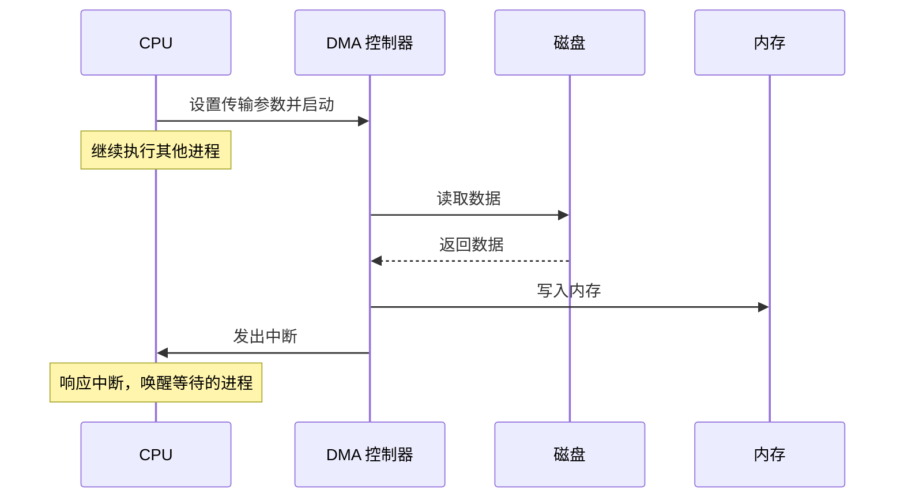

# 特权边界

上一课讲的是内核作为一个软件系统怎样组织，这一课则把镜头对准那条最关键的硬件边界：用户程序为什么不能直接碰硬件，CPU 又怎样在需要的时候把控制权交给内核。

## 双模式

双模式(dual mode)是 CPU 提供的一种硬件机制，把处理器的运行状态分为用户态(user mode)和内核态(kernel mode)两种模式，每种模式拥有不同的权限级别。

为什么需要双模式？假设没有这个机制，所有程序都运行在同一个权限级别。任何程序都可以关闭中断、直接写任意物理内存、绕过文件系统权限直接操作磁盘控制器。一个恶意程序或一个有 bug 的程序就能摧毁整个系统。

双模式在硬件层面阻止了这些操作。x86-64 处理器定义了 4 个特权级（Ring 0 到 Ring 3），权限从高到低依次递减。`Ring 1` 和 `Ring 2` 是两个中间特权级，理论上可以拿来放“比普通应用更有权限、但又不等于整个内核”的系统软件；Linux 实际只使用其中两个：

- **Ring 0**（内核态）：可以执行所有 CPU 指令，包括操作硬件的特权指令
- **Ring 3**（用户态）：只能执行普通计算指令。尝试执行特权指令会触发异常，由内核接管处理

:::thinking 既然有 4 个 Ring，为什么 Linux 只用 Ring 0 和 Ring 3？
x86 的确预留了 4 个 Ring，但主流操作系统最后几乎都收敛成“两层世界”：**内核一层，用户程序一层**。原因不难理解。

首先，`Ring 1 / Ring 2` 虽然是“中间特权级”，但很多内核组件并不适合塞进这样一个半高不低的层里。像页表管理、中断处理、调度器、设备驱动这些代码，往往共享同一套内核数据结构，也经常需要执行真正的特权操作。把它们拆到 Ring 1 或 Ring 2，通常不能换来明显隔离，反而会引入更复杂的调用约束和权限切换。

其次，x86 历史上的多 Ring 设计和分段机制绑得很深，但现代 Linux 主要依赖的是**分页保护 + 用户态/内核态切换**，而不是把系统软件细分成 4 层特权世界。对通用操作系统来说，`Ring 0 + Ring 3` 已经足够表达最关键的边界：**能不能直接碰硬件、能不能直接操作内核资源**。

所以从工程上看，Ring 1 和 Ring 2 不是“被遗忘了”，而是“存在，但大多数时候不值得用”。这也是为什么后面讨论系统调用、异常和中断时，几乎只会看到用户态和内核态这两种角色。
:::

CPU 怎么知道当前处于哪个特权级？答案在 CS 寄存器的最低 2 位，也就是 CPL(Current Privilege Level)。CPL = 0 表示内核态，CPL = 3 表示用户态。每次执行指令时，CPU 都会检查 CPL 是否有权执行该指令。

## 异常与中断

用户态进入内核最常见的被动入口有两条：**异常(exception)** 和 **中断(interrupt)**。

异常是 CPU 在执行当前指令时检测到的错误或特殊条件，它和当前这条指令直接相关，因此是**同步**发生的。常见异常包括：

- 除零错误
- 通用保护异常(`#GP`)
- 缺页异常(`#PF`)

缺页异常尤其重要。它不是单纯的“错误”，还是虚拟内存机制的一部分。后面讲地址空间和分页时会看到，按需分页(demand paging) 和写时复制(Copy-on-Write) 都依赖 #PF：CPU 先因为页不存在或不可写而抛出异常，内核再借这个入口分配物理页、调页或者复制共享页。

中断则不同。中断是外部硬件设备向 CPU 发出的**异步**信号，通知 CPU 某个事件已经发生，比如键盘按键、网卡收到数据包、磁盘完成读写。

为什么需要中断？假设没有中断机制，CPU 想知道磁盘是否完成读写，唯一的办法是反复检查设备状态寄存器：

```c
while (!(inb(DISK_STATUS_PORT) & DISK_READY)) {
    // 不断轮询
}
data = inb(DISK_DATA_PORT);
```

这种方式叫轮询(polling)。问题在于 CPU 在等待期间什么有用的事也做不了。中断机制让 CPU 发出 I/O 命令后继续执行别的进程，等设备真正完成时再回来处理。

CPU 响应中断时会做四件事：

1. 保存当前上下文
2. 查中断描述符表(IDT)找到对应处理函数
3. 执行中断处理函数
4. 恢复上下文，继续执行被打断的代码

## DMA

现代 I/O 还少不了 DMA(Direct Memory Access)。它让设备直接把数据搬到内存，不需要 CPU 逐字节参与。放在中断的上下文里看，DMA 和中断其实是一套组合拳：

1. CPU 设置 DMA 传输参数并发出命令
2. DMA 控制器自主搬运数据，CPU 去做别的事
3. 传输完成后，DMA 控制器向 CPU 发出中断
4. CPU 响应中断，执行收尾工作，比如唤醒等待的进程



没有 DMA 的时候，CPU 需要自己在设备和内存之间逐字节搬运数据；有了 DMA，CPU 只负责开头发命令和结尾处理中断。

## 小结

| 概念 | 说明 |
|------|------|
| Ring 0 / Ring 3 | Linux 实际使用的两个特权级 |
| CPL | 当前特权级，保存在 CS 寄存器低 2 位 |
| 异常 | CPU 执行当前指令时检测到的同步事件 |
| 中断 | 设备向 CPU 发出的异步通知 |
| IDT | 中断/异常向量到处理函数的分发表 |
| DMA | 设备直接把数据搬进内存，再用中断通知 CPU |

这一课的重点不是记住所有硬件细节，而是建立一个清楚的边界直觉：普通程序碰不到硬件；一旦真的需要硬件能力，或者硬件世界真的发生了事情，控制权必须通过 CPU 定义好的入口交给内核。

---

**Linux / x86 入口**：
- [`arch/x86/kernel/idt.c`](https://elixir.bootlin.com/linux/latest/source/arch/x86/kernel/idt.c) — IDT 的建立过程
- [`arch/x86/mm/fault.c`](https://elixir.bootlin.com/linux/latest/source/arch/x86/mm/fault.c) — x86 缺页异常处理

下一课进入这条边界上最常见、也最主动的一类入口：系统调用。
