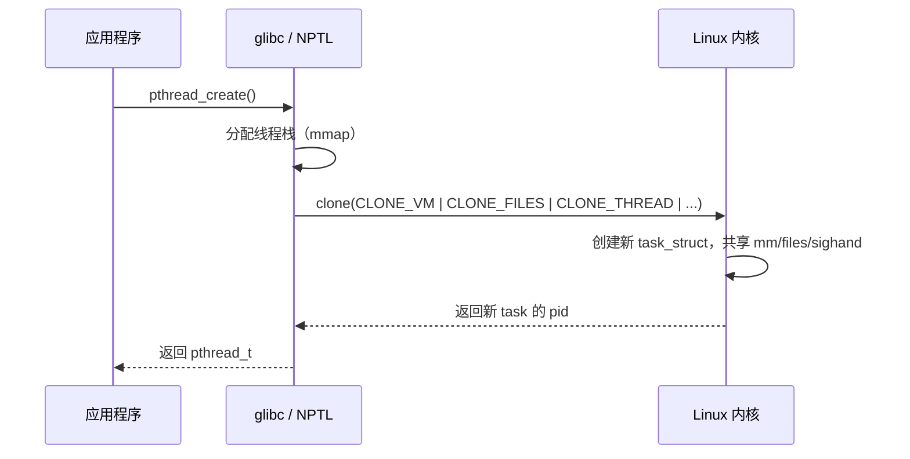

# 线程

前面几课讲的都是进程——独立的地址空间、独立的资源。但当多个执行流需要频繁共享数据时，进程的隔离性反而成了负担。来看这样一个场景：一个 Web 服务器要同时处理多个客户端请求。用多进程可以做到：每来一个请求，fork 一个子进程处理。但每个进程有独立的地址空间，进程之间要共享数据（比如缓存、连接池、计数器），就得用管道或共享内存这样的 IPC 机制，开销不小。而且 fork 要复制页表，虽然有 COW 优化，但后续写入会触发缺页异常、分裂物理页。进程间上下文切换还要刷 TLB。

如果多个执行流可以共享同一个地址空间，直接读写同一块内存，这些开销全部消失。这就是**线程**的动机——进程内的独立执行流，共享地址空间但有独立栈和寄存器。Linux 内核不区分线程和进程，通过 `clone()` 标志位控制共享粒度，这就是 **Linux 的线程实现**。用户态线程和内核线程之间存在映射关系，Linux 选了最直接的**一对一**模型。共享地址空间意味着所有数据都可见，但有时线程需要私有数据，**线程本地存储**解决这个问题。多线程能带来多大加速？**Amdahl 定律**给出了理论上限。最后，多核硬件上多线程还会遇到**缓存一致性**与**伪共享**问题。

## 线程

线程(thread)是进程内部的一条独立执行流，与同进程的其他线程共享地址空间和文件描述符表，但拥有独立的栈、程序计数器(program counter)和寄存器状态。

你可能会问：为什么不直接用多进程？我们来算一下多进程方案的代价。进程之间地址空间隔离，所以共享数据必须走 IPC。fork 要复制页表，后续写入会导致 COW 分裂。上下文切换时要切换页表基址寄存器（x86 的 CR3），因此 TLB 会失效。现在假设多个执行流共享同一个地址空间：不需要 IPC 了，直接读写同一块内存。页表只有一份，不需要复制。上下文切换时不换页表，TLB 也不会失效。这些代价全部消失了。这就是线程。

来看一下线程和进程到底有哪些区别：

| 资源 | 进程间 | 同进程的线程间 |
|------|--------|--------------|
| 地址空间（代码、堆、全局变量） | 独立 | 共享 |
| 文件描述符表 | 独立（fork 后各自一份副本） | 共享 |
| 信号处置(signal disposition) | 独立 | 共享 |
| 栈 | 独立 | 独立（每个线程有自己的栈） |
| 程序计数器、寄存器 | 独立 | 独立 |
| PID | 不同 | 相同（共享 tgid） |

进程生命周期一篇介绍过 `task_struct` 的 `pid` 和 `tgid` 字段，以及 `getpid()` / `gettid()` 的错位命名。这里直接用：同一进程的所有线程共享同一个 `tgid`，所以 `getpid()` 返回相同值；每个线程有自己的 `pid`，通过 `gettid()` 获取。

```
进程（主线程）: pid=100, tgid=100
  ├── 线程 1:   pid=101, tgid=100
  └── 线程 2:   pid=102, tgid=100

getpid() → tgid → 100（三个 task 都返回 100）
gettid() → pid  → 100, 101, 102（各不相同）
```

共享地址空间意味着一个线程可以读写另一个线程的堆数据、全局变量，甚至（如果知道地址的话）另一个线程的栈。这带来了两个直接后果。

第一，方便。线程之间传递数据不需要任何 IPC 机制，一个线程写了一个全局变量，另一个线程立刻能读到。这是选择线程而非进程的核心原因。

第二，危险。一个线程写坏了某块内存（比如数组越界、use-after-free），所有线程都受影响，整个进程可能崩溃。而多进程模型中，一个进程写坏自己的内存不会影响其他进程，因为地址空间隔离。更隐蔽的问题是：两个线程同时读写同一个变量，结果取决于执行顺序，这就是竞态条件(race condition)。竞态条件是并发编程中最常见的 bug 来源，下一课「同步原语」专门解决这个问题。

:::expand 线程栈的 mmap 分配

CPU 调度一课介绍过单进程的地址空间布局：代码段在低地址，堆向上增长，栈在高地址向下增长。那多个线程的栈放在哪里？

主线程的栈就是进程天生的那块高地址栈区。之后每次 `pthread_create()`，NPTL 会调用 `mmap()` 在地址空间中另外申请一块固定大小的内存区域作为新线程的栈。`mmap()` 是一个系统调用，作用是在进程的虚拟地址空间里划出一段范围并完成映射，内存管理一章会详细讲。这里只需要知道：它申请的区域不依附于已有的堆或栈，可以落在地址空间中任意合适的位置，通常在堆和主线程栈之间的空白地带。

```
高地址
┌─────────────────────────┐
│       内核空间            │
├─────────────────────────┤
│   主线程的栈  ↓           │  ← 进程天生的栈区，向低地址增长
│                         │
├─────────────────────────┤
│   线程 3 的栈（mmap）     │  ← pthread_create() 时 mmap() 分配，默认 8MB
├─────────────────────────┤
│   线程 2 的栈（mmap）     │  ← 同上
├─────────────────────────┤
│   动态链接库 / 其他 mmap  │
├─────────────────────────┤
│         堆  ↑            │
├─────────────────────────┤
│   .bss / .data / .text  │
└─────────────────────────┘
低地址
```

每个线程的栈是一块独立的 mmap 区域，大小默认 8MB（`ulimit -s` 可查）。线程创建时分配，线程退出时释放。各线程的 SP 寄存器初始指向自己那块区域的顶端，函数调用在这块区域内部增减，不会触碰其他线程的栈。
:::

## Linux 的线程实现

Linux 内核不区分进程和线程，内核只有一种可调度实体：task，用 `task_struct` 表示。"进程"和"线程"的区别仅在于创建时传给 `clone()` 系统调用的标志位不同，标志位决定了新 task 与父 task 共享多少资源。

这不是一个简化的说法，而是内核的真实结构。看一下 `kernel/fork.c`（v6.12）中 `fork()` 和 `clone()` 两个系统调用的实现：

```c
// kernel/fork.c — fork() 系统调用
SYSCALL_DEFINE0(fork)
{
    struct kernel_clone_args args = {
        .exit_signal = SIGCHLD,
    };
    return kernel_clone(&args);    // ← flags 为空，不共享任何资源
}

// kernel/fork.c — clone() 系统调用
SYSCALL_DEFINE5(clone, unsigned long, clone_flags, ...)
{
    struct kernel_clone_args args = {
        .flags       = (lower_32_bits(clone_flags) & ~CSIGNAL),
        .exit_signal = (lower_32_bits(clone_flags) & CSIGNAL),
        .stack       = newsp,
        .tls         = tls,
        ...
    };
    return kernel_clone(&args);    // ← flags 由调用者传入
}
```

两个系统调用最终都调用了同一个函数 `kernel_clone()`。唯一的区别是 `kernel_clone_args` 里的 `.flags` 字段：`fork()` 传的是空 flags（不共享任何资源），`clone()` 传的是调用者指定的 flags。进程和线程的全部区别，就在这个 flags 里。

进程生命周期一篇提到过 `clone()` 的标志位，这里展开看每个标志具体控制什么：

| 标志 | 效果 |
|------|------|
| `CLONE_VM` | 共享地址空间（共享 `mm_struct`）。不设此标志，新 task 得到地址空间的副本 |
| `CLONE_FILES` | 共享文件描述符表。不设此标志，新 task 得到 fd 表的副本 |
| `CLONE_SIGHAND` | 共享信号处置表。不设此标志，新 task 得到信号处置的副本 |
| `CLONE_THREAD` | 新 task 与调用者属于同一个线程组（共享 `tgid`）。设了此标志，`getpid()` 返回相同值 |

那"一个进程里有多个线程"在内核里到底长什么样？其实内核里根本没有一个叫"进程"的对象。`fork()` 创建了一个 task（`pid=100, tgid=100`），此时它既是"进程"也是唯一的线程（主线程）。然后这个 task 调用 `pthread_create()`，内核通过 `clone(CLONE_THREAD | ...)` 再创建一个 task（`pid=101, tgid=100`）。现在有两个 task 共享同一个 `tgid`，内核把它们叫做一个线程组(thread group)。用户态所说的"进程"，就是这个线程组。

```
fork() 之后：
  task_struct (pid=100, tgid=100)  ← 这就是"进程"，也是主线程

pthread_create() 之后：
  task_struct (pid=100, tgid=100)  ← 主线程
  task_struct (pid=101, tgid=100)  ← 新线程

两个 task 共享 tgid=100，构成一个线程组。
用户态调 getpid() 都返回 100（tgid），看起来是"同一个进程里的两个线程"。
```

所以判断一个 task 是"进程"还是"线程"，看的就是它是不是线程组里唯一的成员。单线程程序的 task `pid == tgid`，所以它既是进程也是线程。多线程程序中，`pid == tgid` 的那个 task 是主线程，其余通过 `CLONE_THREAD` 创建的 task 是其他线程。

在内核数据结构层面，"共享"和"复制"的实现很直接。`task_struct` 中的 `mm`（地址空间）、`files`（文件描述符表）、`sighand`（信号处置）都是指针。设了对应的 `CLONE_*` 标志，新 task 的指针直接指向父 task 的同一个结构体，增加引用计数；没设标志，就分配新结构体并复制内容：

```c
// kernel/fork.c (simplified)
// CLONE_VM not set (fork): copy address space
child->mm = copy_mm(parent->mm);

// CLONE_VM set (thread): share address space
child->mm = parent->mm;
atomic_inc(&parent->mm->mm_users);
```

以上都是内核视角。但你写应用程序时，不会直接调用 `clone()` 去手动拼 flags。glibc(GNU C Library)提供了 NPTL(Native POSIX Threads Library，原生 POSIX 线程库)，它封装了 `clone()` 调用，对外暴露 POSIX 标准的 `pthread` 接口。你调用 `pthread_create()` 创建线程，NPTL 在底层调用 `clone(CLONE_VM | CLONE_FILES | CLONE_SIGHAND | CLONE_THREAD | CLONE_SETTLS | ...)`。

:::expand glibc 与 C 标准库

glibc(GNU C Library)是大多数 Linux 发行版默认的 C 标准库实现。C 程序调用的 `printf()`、`malloc()`、`pthread_create()` 等函数都由它提供。它同时也是系统调用的封装层：你在 C 代码中调用 `fork()`，实际上是调用 glibc 中的 `fork()` 函数，它再通过 `syscall` 指令进入内核。

一个比较有意思的事情是，C 语言和它的标准库竟然不是同一个组织做的。C 语言标准由 ISO/IEC 委员会制定（C89, C99, C11, C23...），标准只规定了库函数的**接口**（`printf` 的签名、行为、返回值），不提供实现。实现由各平台各自完成：Linux 上是 GNU 项目的 glibc，macOS 上是 Apple 的 libSystem，Windows 上是 Microsoft 的 UCRT，Alpine Linux 用的是 Rich Felker 个人开发的 musl libc。

这在今天的语言中很少见。Python、Rust、Zig、Go 的标准库都和语言本身由同一个团队一起发布，装了编译器就自带标准库。C 之所以不同，是因为它诞生于 1972 年，设计目标是跨不同的 Unix 系统移植。标准只定义接口契约，每个操作系统厂商自己写实现，C 程序才能在不同平台上编译运行。这个"语言和库分离"的设计是那个时代的产物。
:::



:::expand NPTL 之前的 LinuxThreads

NPTL 出现之前（Linux 2.6 之前），glibc 使用的线程库叫 LinuxThreads。它也基于 `clone()` 创建线程，但有一个根本问题：当时内核没有 `CLONE_THREAD` 标志，每个线程有不同的 `pid`。这导致几个严重后果：

- `getpid()` 在不同线程中返回不同值，违反 POSIX 标准
- 信号只能发给单个线程（单个 `pid`），而不是整个进程（线程组），不符合 POSIX 信号语义
- LinuxThreads 不得不用一个额外的"管理线程"来协调信号转发和线程同步，增加了开销和复杂性

Linux 2.6 引入了 `CLONE_THREAD`、线程组(thread group)、`tgid` 等内核支持。NPTL 利用这些新特性，实现了完全符合 POSIX 的线程语义。从此 `getpid()` 在所有线程中返回相同值，信号可以发给整个进程（内核选择一个线程投递），管理线程也不再需要了。
:::

## 线程模型

前一节介绍了 Linux 的做法：每次 `pthread_create()` 都通过 `clone()` 在内核中创建一个 `task_struct`，每个用户可见的线程都对应一个内核调度实体。这种一个对一个的映射叫做一对一模型(one-to-one)。但一对一不是实现线程的唯一方式。"线程"是一个抽象概念（共享地址空间的独立执行流），而用户可见的线程和内核调度实体之间可以有不同的映射关系。这些不同的映射方式就是线程模型(threading model)。

要理解为什么会有不同的模型，需要回到操作系统发展的早期。那时很多内核根本不支持线程，内核的可调度实体只有进程，没有更细粒度的执行流。如果程序需要并发（比如一个 Web 服务器要同时处理多个连接），唯一的办法是在用户空间自己管理多个执行流。

具体做法是：在一个进程内部，由用户态的线程库分配多份独立的栈，维护每份栈对应的寄存器状态，在它们之间切换。这种切换完全在用户态完成（保存/恢复寄存器并跳转），不需要任何系统调用。这就是用户级线程(user-level thread)。内核只看到一个进程，不知道它内部有多个执行流在轮流执行。创建一个新的用户级线程也不需要调用 `clone()`，只是在用户空间多分配一份栈。

这里出现了一个新概念：用户态调度。调度课讲的调度是内核调度器从就绪的 task 中选一个分配 CPU。用户态调度是同样的事情，但发生在用户空间：线程库在一个进程的执行流内部，决定接下来运行哪个用户级线程，保存当前线程的寄存器、加载下一个线程的寄存器、跳过去。整个过程不涉及系统调用。

但有一个前提必须明确：用户级线程不能凭空运行，它必须跑在一个内核可调度实体（进程或内核线程）上面。CPU 真正执行的是内核调度的 task，用户级线程只是在某个 task 的执行流内部，由线程库切来切去。内核只看到那个 task 在跑，不知道里面有好几个用户级线程在轮流执行。

用户级线程的创建和切换都不经过内核，但这个"跑在一个内核线程上"的前提带来了一个致命缺陷。

用户级线程再怎么"用户态"，它要读文件、收网络包，就必须发起系统调用。系统调用会让 CPU 从用户态陷入内核态，而内核看到的调用者不是某个用户级线程（它根本不知道用户级线程的存在），而是承载这些用户级线程的那个内核线程。如果这次系统调用需要等待（比如 `read()` 等磁盘数据），内核就把这个内核线程的状态设为睡眠，移出运行队列。这个内核线程上的所有用户级线程都跟着停下来了，因为它们共享同一个内核线程的执行流，内核线程不跑了，用户级线程库连被调度的机会都没有。

用户级线程和内核级线程代表了两种不同的取舍。用户级线程创建快、切换快，但内核看不到它们，一个阻塞就全部停，也无法利用多核。内核级线程每次创建和切换都要经过内核，但内核直接调度每个线程，阻塞互不影响，可以跑在不同核心上。两种方式的组合产生了三种线程模型。

**多对一模型(many-to-one)**：多个用户级线程映射到一个内核级线程。就是上面描述的纯用户级线程方案。创建快、切换快，但一个用户级线程阻塞时其他的全部停下来，而且只有一个内核级线程，无法利用多核并行。

**一对一模型(one-to-one)**：每个用户可见线程对应一个内核级线程。这就是前一节介绍的 Linux 的做法。一个线程阻塞不影响其他线程，多核可以并行。代价是每次创建线程都要调用 `clone()` 进入内核，每次线程切换都是一次内核上下文切换。这里不存在用户态调度，`pthread_create()` 创建的就是内核线程本身，`struct pthread` 只是它在用户空间的管理包装（记录 TLS、线程 ID、取消状态等），不是一个独立的调度实体。

:::thinking struct pthread 是一对一模型的必要组成部分吗？

前面说 NPTL 在用户空间维护了一个 `struct pthread` 管理数据结构。那如果不用 C、不用 glibc，一对一模型还需要这层东西吗？

看一下 Zig 的做法。Zig 默认不链接 libc，`std.Thread.spawn()` 在 Linux 上直接调用 `clone()` 系统调用，自己用 `mmap` 分配线程栈，没有 `struct pthread`。但每次 `spawn()` 都会调一次 `clone()`，创建一个内核 `task_struct`，一个用户态的 spawn 对应一个内核线程，中间没有用户态调度，所以仍然是一对一模型。Rust 则走了另一条路：`std::thread::spawn()` 在 Linux 上调用 `pthread_create()`，通过 glibc/NPTL，有 `struct pthread`，但本质一样，也是一对一。

```zig
// Zig std: 直接调 clone()，不经过 pthreads
linux.clone(
    Instance.entryFn,
    @intFromPtr(&mapped[stack_offset]),
    flags,
    @intFromPtr(instance),
    &instance.thread.parent_tid,
    tls_ptr,                          // ← 自己准备 TLS 区域
    &instance.thread.child_tid.raw,
)
```

所以 `struct pthread` 不是一对一模型的内在要求，只是 glibc 这个特定实现的管理数据结构。一对一模型真正需要的只有一件事：调用 `clone()` 让内核创建一个新的 `task_struct`。但有一件事不管用不用 glibc 都避不开：如果你的语言支持线程本地变量（`threadlocal`），创建线程时就必须分配一块 TLS 内存并初始化，然后通过 `CLONE_SETTLS` 标志告诉内核把新线程的 TLS 基址寄存器（x86-64 上是 FS）指向这块内存。这是硬件层面的要求，跟线程库的选择无关。
:::

**多对多模型(many-to-many)**：M 个用户级线程映射到 N 个内核级线程（M ≥ N）。理论上兼具两者优点：用户态切换快，内核级线程提供真正的并行。但实现极其复杂，需要用户态调度器和内核调度器协调。

Linux 为什么选了一对一？NPTL 的设计者 Ulrich Drepper 和 Ingo Molnar 在设计白皮书中给出了明确的理由：多对多模型需要内核调度器和用户态调度器同时工作，两个调度器之间的协调很难做到最优，容易互相干扰反而降低整体性能。此外，M:N 模型下的信号处理极其复杂，阻塞管理也需要大量额外机制。内核已经有了一个高度优化的调度器，在用户态再造一个等于重复造轮子。

与此同时，Ingo Molnar 在内核侧做了一系列优化来消除一对一模型的性能瓶颈：O(1) 调度器让线程调度的时间复杂度与线程数无关，`clone()` 系统调用被大幅优化，futex(Fast Userspace Mutex) 让线程同步不再需要每次都陷入内核。优化后的效果是：在 2002 年的 IA-32 硬件上，10 万个线程在 2 秒内创建完成，而同一台机器上 LinuxThreads 需要约 15 分钟（数据来自 Drepper & Molnar 的 NPTL 设计白皮书）。

一对一模型下，用户级线程的创建和切换确实比内核线程快（纯用户态操作天然比陷入内核的开销小），这一点 Linux 并没有试图否认或解决。Linux 的选择是：内核只提供最简单的一对一模型，对大多数应用来说这个开销完全可以接受。如果某个应用确实需要几十万个轻量级并发执行流，那是用户态运行时的事：语言或框架可以在一对一的内核线程之上自己搭建多对多调度，Go 的 goroutine 就是这样做的。内核不为这种场景增加复杂性。

```
多对一                 一对一                  多对多
┌─────────────┐     ┌─────────────┐      ┌─────────────┐
│ U1  U2  U3  │     │ U1  U2  U3  │      │ U1 U2 U3 U4 │
│  \  |  /    │     │  |   |   |  │      │  \ | /  |   │
│   \ | /     │     │  |   |   |  │      │   \|/   |   │
│    \|/      │     │  |   |   |  │      │   /|\   |   │
│     K1      │     │  K1  K2  K3 │      │  K1  K2     │
└─────────────┘     └─────────────┘      └─────────────┘
一个线程阻塞        线程独立调度          实现复杂
= 全部阻塞         Linux 的选择
```

:::expand Go 的 goroutine 与 M:N 模型

Go 语言的 goroutine 是多对多模型的一个现代实例。Go 运行时维护三个概念：

- **G**(goroutine)：用户级线程，初始栈只有几 KB，可以轻松创建数十万个
- **M**(machine)：对应一个内核级线程（OS thread）
- **P**(processor)：逻辑处理器，数量默认等于 CPU 核心数，持有本地运行队列

Go 的调度器在用户态运行，把 G 分配到 P 上，P 绑定到 M 上执行。这个模型的结构性关键在于：运行队列挂在 P 上，而不是挂在 M 上。当一个 goroutine G1 发起阻塞系统调用时，Go 运行时在进入系统调用之前就把 P 从当前的 M1 上摘下来。M1 只带着 G1 进入阻塞，而 P 连同队列中的其他 goroutine 一起迁移到另一个空闲的 M2 上继续执行。阻塞的 M1 上只有 G1 一个，其他 goroutine 不受影响。多对一模型的致命缺陷在于运行队列绑死在唯一的 M 上，无处可迁移；Go 通过让 P 在多个 M 之间迁移，从结构上解决了这个问题。

什么样的应用需要这种模型？以直播弹幕服务为例。一个热门直播间有 10 万人同时观看，每个观众与服务器之间维持一条长连接用来接收实时弹幕。当一个用户发送弹幕时，服务器要把这条消息推送给 10 万个连接。但绝大多数时间里，这 10 万个连接都是空闲的：观众在看直播，没有新弹幕需要推送，每个连接只是静静地等待下一条消息。服务器对每个连接做的事情极其简单（收到一条弹幕，序列化成字节，写到连接里），几乎没有计算，全部时间花在等待网络 I/O 上。如果为每个连接分配一个内核线程，10 万个线程 × 8MB 默认栈 = 800GB 内存，显然不可能。goroutine 的初始栈只有几 KB，10 万个 goroutine 的栈内存只需要几百 MB，切换也由用户态运行时完成。这种"大量并发连接但每个连接几乎不做计算、大部分时间在等 I/O"的场景，正是 M:N 模型的主战场。

光能迁移还不够。如果一个 goroutine 做纯 CPU 计算不发起系统调用，P 就不会主动让出，队列里其他 goroutine 照样饥饿。Go 通过两种机制实现抢占：编译器在每个函数调用点插入调度检查点（协作式抢占），以及 Go 1.14 引入的基于信号的异步抢占（即使没有函数调用也能打断）。这种深度的编译器与运行时协作，是通用线程库（如 NPTL）做不到的，也是多对多模型难以在操作系统层面通用实现的原因。
:::

## 线程本地存储

线程本地存储(Thread-Local Storage, TLS)是让每个线程拥有变量的独立副本的机制。

前面讲过，同一个进程的所有线程共享地址空间，所以全局变量对所有线程都是可见的。但有些数据天然是 per-thread 的。最典型的例子是 `errno`。如果你写过 C 的多线程程序，可能用过 `errno` 来检查系统调用的错误码。但你有没有想过：多个线程同时调用系统调用，`errno` 不会被覆盖吗？

C 标准库的 `errno` 用于报告最近一次系统调用的错误码。在单线程程序中，`errno` 是一个普通的全局变量，没有问题。但在多线程程序中，假设 `errno` 仍然是一个普通全局变量：

1. 线程 A 调用 `read()`，失败，内核把 `errno` 设为 `EAGAIN`（11）
2. 线程 A 还没来得及检查 `errno`，线程 B 被调度执行
3. 线程 B 调用 `write()`，失败，内核把 `errno` 设为 `ENOSPC`（28）
4. 线程 A 恢复执行，读 `errno`，得到 28（`ENOSPC`）

线程 A 的 `read()` 失败原因是"资源暂时不可用"，却误以为是"磁盘空间不足"。程序逻辑完全错了。所以在多线程环境中，`errno` 必须是每个线程各自一份。现代 C 库中 `errno` 实际上是一个宏，展开后是类似 `(*__errno_location())` 的函数调用，返回当前线程的 errno 副本的地址。

除了 `errno`，还有随机数种子、线程级缓存、性能计数器等，都适合用 TLS。

不同语言提供了不同的 TLS 语法：

| 语言 | 语法 | 示例 |
|------|------|------|
| C (GCC) | `__thread` | `__thread int counter;` |
| C11 | `_Thread_local` | `_Thread_local int counter;` |
| C++ 11 | `thread_local` | `thread_local int counter;` |
| Zig | `threadlocal` | `threadlocal var counter: i32 = 0;` |

Zig 中使用 TLS：

```zig
const std = @import("std");

threadlocal var call_count: u32 = 0;

fn doWork() void {
    call_count += 1;
    std.debug.print("thread {}: call_count = {}\n", .{
        std.Thread.getCurrentId(),
        call_count,
    });
}

pub fn main() !void {
    const t1 = try std.Thread.spawn(.{}, doWork, .{});
    const t2 = try std.Thread.spawn(.{}, doWork, .{});
    doWork(); // main thread
    t1.join();
    t2.join();
}
```

三个线程各自有独立的 `call_count` 副本，互不影响。每个线程调用 `doWork()` 后，自己的 `call_count` 变成 1，不会看到其他线程的值。

但这里有一个值得深想的问题：所有线程共享同一个地址空间，代码段也只有一份。三个线程执行的是同一条 `call_count += 1` 指令，同一个变量名，怎么就访问到了不同的内存地址？

答案涉及三个层面的配合：编译器、操作系统和硬件。

**编译器**负责把 TLS 变量和普通全局变量区分开。当你声明一个变量为 `threadlocal`（或 C 的 `__thread`），编译器不会把它放到普通的 `.data` 或 `.bss` 段，而是放到专门的 `.tdata`（有初始值的 TLS 变量）或 `.tbss`（零初始化的 TLS 变量）段。更关键的是，编译器生成的访问指令不是普通的内存寻址，而是通过 FS 段寄存器做相对寻址。FS 是 x86 架构中的一个段寄存器，名字没有特殊含义（只是 ES 之后按字母顺序追加的），但在现代 x86-64 Linux 上被专门用来存放当前线程的 TLS 基址。在 x86-64 上，访问一个 TLS 变量的指令类似：

```
mov eax, dword ptr fs:[offset]
```

这里的 `offset` 是这个 TLS 变量在 TLS 块内的偏移量，在编译期就确定了。`fs:[offset]` 的意思是"以 FS 寄存器的值为基址，加上偏移量，得到实际内存地址"。所以，只要不同线程的 FS 寄存器指向不同的内存区域，同一条指令就会访问不同的地址。

**操作系统和线程库**负责让每个线程的 FS 指向不同的地方。每次创建新线程时，线程库（NPTL 或 Zig 的 `Thread.spawn`）会做两件事：第一，根据 ELF 文件中 `.tdata` 段的内容，复制一份作为新线程的 TLS 块（这样每个线程的 TLS 变量都从相同的初始值开始）；第二，调用 `clone()` 时带上 `CLONE_SETTLS` 标志，把新 TLS 块的地址传给内核。内核收到后，把新线程的 FS 寄存器设置为这个地址。

```
线程创建时的 TLS 初始化：

ELF .tdata 段（模板）
┌──────────────┐
│ call_count=0 │
└──────────────┘
       │
       ├── 复制 ──→ 线程 1 的 TLS 块（FS₁ 指向这里）
       │            ┌──────────────┐
       │            │ call_count=0 │
       │            └──────────────┘
       │
       ├── 复制 ──→ 线程 2 的 TLS 块（FS₂ 指向这里）
       │            ┌──────────────┐
       │            │ call_count=0 │
       │            └──────────────┘
       │
       └── 复制 ──→ 线程 3 的 TLS 块（FS₃ 指向这里）
                    ┌──────────────┐
                    │ call_count=0 │
                    └──────────────┘

三个线程执行同一条指令 mov eax, fs:[offset]
但 FS 值不同，所以访问的物理地址不同。
```

**硬件**则保证了这一切的高效。FS 寄存器的值在线程上下文切换时由内核保存和恢复（就像其他寄存器一样），所以每个线程始终看到自己的 FS 值。而 `fs:[offset]` 寻址是 CPU 原生支持的操作，没有函数调用开销，访问 TLS 变量和访问普通全局变量的性能几乎没有差别。

## Amdahl 定律

到这里，我们已经知道同一个进程的多个线程可以被内核调度到不同的 CPU 核心上并行执行。每个核心跑一个线程，共享同一个地址空间，不需要 IPC，这正是线程相比多进程的核心优势。一个自然的问题是：如果我有 N 个核心，开 N 个线程，程序能跑快 N 倍吗？

Amdahl 定律(Amdahl's Law)回答了这个问题：不能。程序中不可并行的串行部分决定了加速比的天花板，而这个天花板往往比你想象的低得多。

:::expand Gene Amdahl


Gene Amdahl(1922—2015)是计算机体系结构领域的先驱。他在 IBM 主导设计了 System/360 大型机，这是第一个实现"系列兼容"的计算机家族（同一系列不同型号可以运行相同的软件，这在当时是革命性的）。1967 年，他在一次会议上提出了后来以他命名的定律，论证了并行处理的加速存在根本性的上限。这个定律至今仍是评估并行化收益时最基本的分析工具。
:::

加速比(speedup)的定义很直接：用单个处理器的执行时间除以 $N$ 个处理器的执行时间，即 $S(N) = T(1) \,/\, T(N)$。$S(N) = 2$ 意味着快了一倍，$S(N) = N$ 意味着完美的线性加速。

现在来推导。设程序的总执行时间为 $T(1)$，其中串行部分占比 $f$（$0 \le f \le 1$），可并行部分占比 $1-f$。串行部分无法并行，耗时始终是 $f \cdot T(1)$。可并行部分在 $N$ 个处理器上理想分摊，耗时变为 $(1-f) \cdot T(1) \,/\, N$。所以 $N$ 个处理器的总耗时是：

$$
T(N) = f \cdot T(1) + \frac{(1-f) \cdot T(1)}{N}
$$

代入加速比的定义 $S(N) = T(1) \,/\, T(N)$，得到：

$$
S(N) = \frac{1}{f + \dfrac{1-f}{N}}
$$

当 $N \to \infty$ 时，可并行部分的执行时间趋近于 0，加速比的上限为：

$$
S_{\max} = \frac{1}{f}
$$

我们用具体数值感受一下。假设一个程序 95% 可并行（$f = 0.05$），你不断加核心：

- $N = 2$：$S = 1 / (0.05 + 0.95/2) = 1.90$ 倍
- $N = 8$：$S = 1 / (0.05 + 0.95/8) = 5.93$ 倍
- $N = 64$：$S = 1 / (0.05 + 0.95/64) = 14.74$ 倍
- $N = \infty$：$S = 1 / 0.05 = 20$ 倍

64 个核心只得到了 14.74 倍加速，距离理论上限 20 倍还有差距。核心再多也不会超过 20 倍。

不同串行比例下的加速上限：

| 串行比例 $f$ | $N = 4$ | $N = 16$ | $N = 64$ | $N = \infty$ |
|-------------|---------|----------|----------|--------------|
| 5% | 3.48 | 9.14 | 14.74 | 20 |
| 10% | 3.08 | 6.40 | 8.77 | 10 |
| 25% | 2.29 | 3.37 | 3.82 | 4 |
| 50% | 1.60 | 1.88 | 1.97 | 2 |

这张表值得多看一眼。当 $f = 25\%$ 时，哪怕有无限个核心，加速比也不过 4 倍。**瓶颈在串行部分。** 加核心的收益递减得非常快，优化串行部分才是提升并行性能的关键。

## 缓存一致性与伪共享

多核 CPU 中每个核心有自己的 L1/L2 缓存(cache)。主存(main memory)是共享的，但访问慢（约 100 纳秒）。缓存把最近访问的数据放在核心附近，访问快（L1 约 1 纳秒）。

这里有一个细节需要先说清楚：CPU 写数据时，新值是写到缓存里的，不是直接写到主存。这叫做写回(write-back)策略。比如 Core 0 执行 `counter = 5`，这个 5 只写进了 Core 0 的 L1 缓存，主存里还是旧值。等到这条缓存行被淘汰或者其他核心需要这条数据时，缓存里的新值才会写回主存。写回策略避免了每次写操作都访问慢速主存，但也带来了一个问题：如果两个核心的缓存中都有同一块内存的数据，一个核心在自己的缓存里写入了新值，另一个核心的缓存还是旧值，怎么办？

这就是缓存一致性(cache coherence)问题。硬件通过缓存一致性协议来解决。最广泛使用的是 MESI 协议，它给每条缓存行(cache line)定义了四种状态：

| 状态 | 含义 |
|------|------|
| **M**(Modified) | 本核心修改过，与主存不一致，其他核心没有副本 |
| **E**(Exclusive) | 本核心独占，与主存一致，其他核心没有副本 |
| **S**(Shared) | 多个核心都有副本，与主存一致，只读 |
| **I**(Invalid) | 无效，不可用 |

我们来看 MESI 协议是怎么保证一致性的。假设 Core 0 和 Core 1 的缓存中都有同一条缓存行的拷贝，两边的状态都是 Shared（多核共享，与主存一致）。现在 Core 0 执行了一条写指令，把新值写进自己的缓存。此时 Core 0 的缓存里是新值，主存还是旧值，所以 Core 0 把这条缓存行的状态改为 Modified。同时，它通过总线通知 Core 1：这条缓存行我改了，你那边的拷贝作废。Core 1 收到通知后把自己缓存中的这条缓存行标记为 Invalid。之后 Core 1 如果要读这条数据，发现状态是 Invalid，就得从 Core 0（或主存）重新加载最新的值。通过这种"写入时通知、读取时重新加载"的机制，硬件保证了在任意时刻，所有核心看到的数据是一致的。

缓存一致性协议由硬件自动执行，所以你写代码时通常不需要关心它。但有一种情况会悄悄拖垮性能：伪共享(false sharing)。

缓存的最小单位不是单个变量，而是缓存行(cache line)，通常 64 字节。CPU 每次从主存加载数据，以缓存行为单位。因此两个变量如果地址相邻，很可能落在同一条缓存行上。

想象这个场景：两个线程分别在不同的核心上运行，各自操作一个独立的计数器。这两个计数器在内存中紧挨着，恰好在同一条 64 字节的缓存行上。

```
Cache line (64 bytes)
┌────────────────────────────────────────────┐
│  counter_a (8 bytes)  │  counter_b (8 bytes) │ ... padding ...
└────────────────────────────────────────────┘
     ↑ Core 0 writes          ↑ Core 1 writes
```

1. Core 0 写入 `counter_a`，整条缓存行的状态变为 Modified
2. MESI 协议通知 Core 1：你的这条缓存行无效了
3. Core 1 要写 `counter_b`，发现缓存行是 Invalid，必须从 Core 0 重新获取
4. Core 1 拿到缓存行并写入 `counter_b`，又通知 Core 0 无效
5. 如此反复，缓存行在两个核心之间"乒乓"传递

两个线程操作的是完全不同的变量，逻辑上没有任何共享。但因为硬件以缓存行为单位管理缓存，它们被迫互相干扰。这就是"伪"共享：看起来像共享同一块数据导致的缓存失效，实际上只是地址碰巧相邻。

伪共享对性能的影响可以很大。在高频更新的场景下（比如每个线程各自维护一个计数器），伪共享可能让性能下降数倍。这个 bug 尤其阴险，因为你看代码逻辑完全没有问题，两个线程操作的是不同的变量，但性能就是上不去。

解决方案是填充(padding)：让每个线程操作的数据独占一条缓存行，不和其他线程的数据挤在一起。Linux 内核中经常能看到 `____cacheline_aligned_in_smp` 属性，它的作用就是把结构体对齐到缓存行边界，避免在 SMP（对称多处理器）环境下产生伪共享。

:::expand Zig 中的缓存行对齐

Zig 标准库提供了 `std.atomic.cache_line` 常量（通常是 64），可以用来对齐：

```zig
const std = @import("std");
const cache_line = std.atomic.cache_line;

const Counter = struct {
    value: u64 align(cache_line) = 0,
};

const ThreadCounters = struct {
    counters: [4]Counter = .{.{}} ** 4,
};
```

`align(cache_line)` 让每个 `Counter` 的起始地址对齐到缓存行边界。由于对齐后编译器会自动填充，每个 `Counter` 实际占用一整条缓存行（64 字节），四个 counter 各自独占一条缓存行，伪共享就消除了。
:::

## 小结

| 概念 | 说明 |
|------|------|
| 线程(thread) | 进程内的独立执行流，共享地址空间和 fd 表，独立栈和寄存器 |
| `clone()` 标志位 | `CLONE_VM`、`CLONE_FILES`、`CLONE_THREAD` 等，控制新 task 与父 task 共享多少资源 |
| NPTL | glibc 中的线程库，基于 `clone()` 实现 POSIX pthread 接口，一对一模型 |
| 线程模型 | 多对一、一对一、多对多。Linux 选择一对一：每个线程对应一个内核 task |
| 线程本地存储(TLS) | 让每个线程拥有全局变量的独立副本，Zig 用 `threadlocal` 声明 |
| Amdahl 定律 | 加速上限 $S = 1/f$，$f$ 是串行比例。瓶颈在串行部分 |
| 缓存一致性 | 多核缓存同一地址时，MESI 协议保证数据一致 |
| 伪共享(false sharing) | 不同线程操作不同变量但落在同一缓存行，导致缓存行反复失效。用缓存行对齐消除 |

线程是"共享地址空间的执行流"。Linux 用 `clone()` 统一了进程和线程的创建，区别仅在于共享多少资源。共享带来了方便（无需 IPC，直接读写同一块内存），也带来了风险（竞态条件、缓存一致性问题）。Amdahl 定律提醒我们并行的收益有上限，瓶颈在串行部分。这些风险和约束，正是下一课「同步原语」要解决的问题。

---

**Linux 源码入口**：
- [`kernel/fork.c`](https://elixir.bootlin.com/linux/latest/source/kernel/fork.c) — `copy_process()`：`clone()` 的核心实现，根据标志位决定复制还是共享
- [`kernel/fork.c` — `copy_mm()`](https://elixir.bootlin.com/linux/latest/source/kernel/fork.c) — 地址空间的复制或共享逻辑
- [`include/uapi/linux/sched.h`](https://elixir.bootlin.com/linux/latest/source/include/uapi/linux/sched.h) — `CLONE_VM`、`CLONE_THREAD` 等标志位定义
