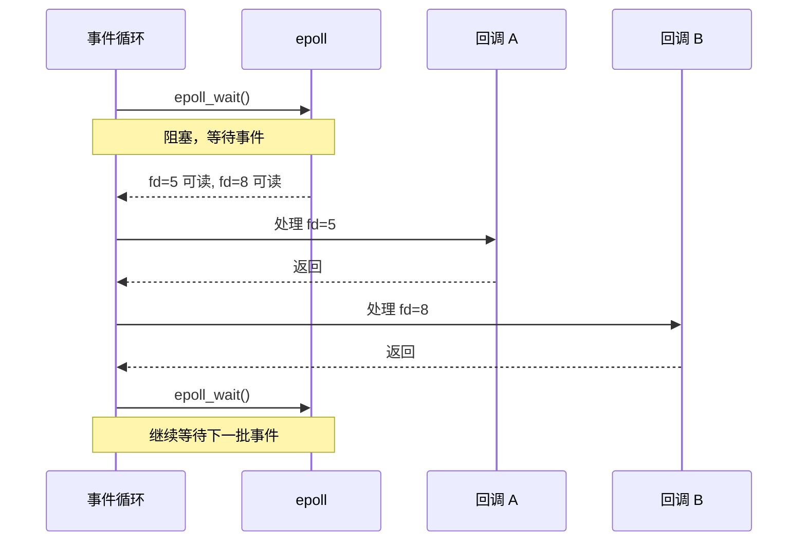

# 事件驱动并发

- 写作时间：`2026-03-04 首次提交，2026-03-30 最近修改`
- 当前字符：`15330`

前三课的并发方案都基于多线程。线程能工作，但随着连接数增长，代价会越来越高：同步原语保护共享状态的复杂度上升，锁用不好就死锁。而且线程本身也有资源成本，连接数一多，这个成本会变成真正的瓶颈。有没有一种方案能跳过这些问题？

来看一个具体场景。假设你要写一个 TCP echo 服务器，同时服务大量客户端。最直接的方案是 thread-per-connection：每来一个连接就创建一个线程处理。下面的代码用到了 socket API（网络与 IPC 一章会详细讲），这里只需要知道基本模式：`socket()` 创建通信端点，`bind()` 绑定地址，`listen()` 开始监听，`accept()` 接受新连接并返回一个 fd，之后就可以用 `read()`/`write()` 在这个 fd 上收发数据。

<<< @/concurrency/code/echo_thread.c

代码很简洁，但算一笔账。`ulimit -s` 显示 Linux 默认线程栈大小是 8MB。如果有 10,000 个并发连接，就需要 10,000 个线程，仅线程栈就要 80GB 内存。再加上每个线程对应一个 `task_struct`（约 6KB）、调度器要维护的运行队列开销、以及锁竞争带来的上下文切换，这个方案在连接数上完全扩展不了。

问题不是线程做不好，而是大多数连接在大多数时间都在等数据。这正是调度一课 `pipe_read()` 展示的等待队列模式：每个 socket 也有自己的等待队列，`read()` 在接收缓冲区为空时把线程挂上去睡眠，网络数据到达后唤醒。thread-per-connection 下，10,000 个连接就是 10,000 个等待队列，每个上面挂着一个占着 8MB 栈和 `task_struct` 的睡眠线程，大部分时间什么也不做。

既然大多数线程都睡在各自 socket 的等待队列上，能不能让一个线程同时等所有 socket，哪个有数据就处理哪个？要回答这个问题，先要看清一个线程面对"数据没到"有哪些应对方式，这就是 **I/O 模型**。上一段描述的等待队列模式就是其中一种做法（即阻塞 I/O），I/O 模型一节会展开其他几种做法以及它们之间的取舍。其中真正让一个线程同时监视多个 socket 的是多路复用：**select 与 poll** 把一组 fd 交给内核逐个检查，但每次都要过一遍全部 fd。**epoll** 换了思路，让就绪的 socket 主动报告，不再逐个检查。在 epoll 之上构建 **事件循环**：一个单线程不断等待事件、分发回调、再等待，这是 Redis、Nginx、Node.js 的核心架构。但每次读写仍要系统调用，**io_uring** 用共享环形缓冲区把系统调用也省掉了。

## I/O 模型

I/O 模型(I/O model)描述的是应用程序面对"数据还没到"时的不同应对方式，核心区别在于：线程怎么处理这段等待。

最基础的是阻塞 I/O(blocking I/O)。开篇已经展示了这个过程：线程调用 `read()` 时如果数据还没到，内核把线程挂到 socket 的等待队列上睡眠，数据到达后唤醒线程并把数据复制到用户缓冲区。睡眠期间线程释放了 CPU，其他线程可以正常运行，所以阻塞 I/O 并不浪费 CPU。如果一个线程只负责一个连接，睡眠等待是完全合理的——数据没到，线程也没别的事可做。但如果一个线程想同时照看多个连接呢？它阻塞在连接 A 的 `read()` 上睡着了，连接 B 的数据到了却无法处理——因为唤醒它的条件是连接 A 的数据到达，不是连接 B 的。

```c
while (1) {
    read(fd_A, buf, sizeof(buf));  // 线程睡在 A 的等待队列上
    handle(buf);                   // 即使此时连接 B 的数据已经可读，线程也醒不过来

    read(fd_B, buf, sizeof(buf));  // 必须等 A 的数据到达并处理完，才轮得到 B
    handle(buf);
}
```

非阻塞 I/O(non-blocking I/O)的思路是让 `read()` 立即返回。通过 `fcntl()` 给 fd 设置 `O_NONBLOCK` 标志后，`read()` 在数据未就绪时不再把线程挂到等待队列上，而是立即返回 `-1` 并设置 `errno = EAGAIN`，表示"现在没数据，稍后再试"。这样线程就可以依次检查每个连接，不会因为某一个连接没数据就睡过去。

```c
int flags = fcntl(fd, F_GETFL, 0);
fcntl(fd, F_SETFL, flags | O_NONBLOCK);

while (1) {
    ssize_t n = read(fd, buf, sizeof(buf));
    if (n > 0) {
        // 处理数据
    } else if (n == -1 && errno == EAGAIN) {
        // 没有数据，继续轮询
    }
}
```

线程确实能同时照看多个连接了，但新的问题也很明显：你必须不停地轮询(polling)。如果大部分时间数据都没到，循环的绝大部分迭代都在做无用功，白白消耗 CPU。

既然非阻塞 I/O 在所有连接都没有数据可读时仍然 CPU 空转，那多路复用的思路就简单了：在所有连接都没有数据时，挂起线程让它进入睡眠。这有点像回到了阻塞 I/O 的做法，但关键的不同在于：阻塞 I/O 在等某一个具体连接的数据到达，一个连接没数据就导致其他已有数据的连接无法被及时处理；而 I/O 多路复用(I/O multiplexing)只要任何一个连接有数据到达就会唤醒线程，既解决了阻塞 I/O 一次只能等一个连接的局限，又避免了非阻塞 I/O 的 CPU 空转。

```c
// 非阻塞 I/O：线程自己挨个问
while (1) {
    for (int i = 0; i < nfds; i++) {
        read(fds[i], buf, sizeof(buf));  // 大部分返回 EAGAIN
    }
}

// I/O 多路复用：让内核告诉你谁有数据
while (1) {
    int n = select(nfds, &readfds, ...);  // 阻塞，直到至少一个 fd 就绪
    for (/* 只遍历就绪的 fd */) {
        read(fd, buf, sizeof(buf));       // 读到的一定是有数据的
    }
}
```

异步 I/O(asynchronous I/O)走得更远。应用程序提交一个 I/O 请求后立即返回，内核在后台完成整个操作（包括数据复制），完成后通知应用程序。与多路复用不同，异步 I/O 连"内核把数据从内核缓冲区复制到用户缓冲区"这一步都不需要应用程序参与。用人话说就是：多路复用是"内核告诉你谁有数据，你自己调 `read()` 去读"，异步 I/O 是"内核替你读好了再告诉你"。这意味着多路复用下，线程每次处理就绪的连接仍然要通过 `read()` 系统调用陷入内核；连接数多、事件密集时，这些系统调用的开销会累积。异步 I/O 把读写也交给了内核，应用程序和内核之间的交互次数大幅减少。

四种模型的对比：

| 模型 | 等待数据就绪 | 数据复制 | 线程是否阻塞 |
|------|------------|---------|------------|
| 阻塞 I/O | 阻塞 | 阻塞 | 是，全程阻塞 |
| 非阻塞 I/O | 不阻塞（轮询） | 阻塞 | 否，但 CPU 空转 |
| I/O 多路复用 | 阻塞在 select/poll/epoll | 阻塞 | 是，但一个线程等多个 fd |
| 异步 I/O | 不阻塞 | 不阻塞 | 否，内核完成全部工作 |

:::expand POSIX aio

POSIX 标准定义了一套异步 I/O 接口：`aio_read()`、`aio_write()`、`aio_error()`、`aio_return()` 等。glibc 的实现（`glibc/rt/aio_misc.c`）并不是真正的内核级异步 I/O，而是在用户态用线程池模拟的。具体过程是：调用者提交一个 `aio_read()` 后，glibc 从内部线程池取出一个工作线程，让这个工作线程去执行普通的阻塞 `read()`。工作线程阻塞在等待队列上睡眠，数据到达后被唤醒、完成数据复制，然后通过信号（`SIGEV_SIGNAL`）或回调函数（`SIGEV_THREAD`）通知调用者"数据读好了"。

从调用者的视角看，`aio_read()` 提交后立即返回，数据到了会收到通知，确实像异步 I/O。但从系统整体看，阻塞并没有消失，只是从调用者的线程转移到了线程池里的工作线程。每次 I/O 仍然是一次 `read()` 系统调用、一次线程阻塞和唤醒，系统调用次数和上下文切换一个都没减少。Linux 的 io_uring 才是真正的内核级异步 I/O，后面会详细讨论。
:::

## select 与 poll

select 和 poll 是 Unix/Linux 最早提供的 I/O 多路复用系统调用，允许一个线程同时等待多个 fd 上的事件。

先看 `select()` 的接口：

```c
int select(int nfds, fd_set *readfds, fd_set *writefds,
           fd_set *exceptfds, struct timeval *timeout);
```

`fd_set` 是一个位图(bitmap)，每一位对应一个 fd。调用前，用 `FD_SET()` 把要监视的 fd 对应的位设为 1；调用后，内核把没有事件的 fd 对应的位清零，只留下就绪的 fd。`nfds` 是所有被监视 fd 中最大值加 1，内核用它来确定需要扫描的范围。

用 select 重写 echo server：

<<< @/concurrency/code/echo_select.c

整个服务器只有一个线程，用 `select()` 同时等待所有连接。没有线程创建、没有栈内存开销、没有锁。但 select 有三个明显的限制：

1. **`FD_SETSIZE` 上限**。`fd_set` 是一个固定大小的位图，`FD_SETSIZE` 默认是 1024。这意味着 select 最多只能监视 1024 个 fd。这个限制是编译期决定的，要改只能重新编译内核头文件。

2. **每次调用都要重建 `fd_set`**。select 返回时会修改传入的 `fd_set`（把未就绪的 fd 清零），所以每次调用前都必须把所有要监视的 fd 重新设置一遍。上面代码中 `read_fds = all_fds` 这行就是在做这件事。

3. **O(n) 线性扫描**。select 返回后只告诉你"有 fd 就绪了"，但不告诉你是哪些。你必须用 `FD_ISSET()` 逐个检查每个 fd。内核实现也是线性扫描：`fs/select.c` 中的 `do_select()` 遍历所有被监视的 fd，逐个调用它们的 `poll()` 方法检查是否有事件。

:::thinking 为什么 select 要求调用者每次重新设置 fd_set？

`fd_set` 既是输入参数（告诉内核"我关心哪些 fd"），又是输出参数（内核告诉你"哪些 fd 就绪了"）。内核在 `do_select()` 中用同一个 `fd_set` 来写结果：把没有事件的 fd 对应的位清零，只留下就绪的。这意味着调用结束后，原来的"关心列表"已经被覆盖了。

一种替代设计是用两组 `fd_set`：一组输入、一组输出，内核不修改输入。但 select 的接口设计于 1983 年的 4.2BSD，那个时代内存紧张，多一份 `fd_set` 的开销是实际考量。而且 `fd_set` 通过值传递（实际上是 `copy_from_user` 复制到内核空间），即使分成两组，内核还是要从用户空间复制一份进来。select 选择了最简单的方案：复用同一块内存，代价是调用者每次要重新初始化。

poll 吸取了这个教训，用 `struct pollfd` 数组把"关心的事件"（`events` 字段）和"就绪的事件"（`revents` 字段）分开存储，内核只写 `revents`，不动 `events`，调用者不需要每次重建。
:::

`poll()` 改进了 select 的前两个限制。它用 `struct pollfd` 数组代替位图，没有 `FD_SETSIZE` 的限制；输入（`events`）和输出（`revents`）分离，不需要每次重建。但第三个问题没变：内核仍然要遍历整个数组，用户态也要遍历找出就绪的 fd。

| 特性 | select | poll |
|------|--------|------|
| fd 数量上限 | `FD_SETSIZE`（默认 1024） | 无上限（动态数组） |
| 每次调用是否需要重建 | 是（`fd_set` 被内核修改） | 否（`events` 和 `revents` 分离） |
| 内核扫描复杂度 | O(n) | O(n) |
| 用户态检查复杂度 | O(n) | O(n) |

当 fd 数量少（几十到几百个）时，select 和 poll 工作得很好，线性扫描的开销可以忽略。但当 fd 数量达到数千甚至数万时，每次系统调用都要遍历所有 fd，其中大部分可能根本没有事件，这个 O(n) 开销就变得不可接受了。

## epoll

epoll 是 Linux 特有的 I/O 多路复用机制，通过在内核中维护一棵红黑树(red-black tree)存储被监视的 fd、一条就绪链表(ready list)收集有事件的 fd，实现了 O(1) 的事件通知。

与 select/poll 的根本区别在于：select 和 poll 是无状态的，每次调用都要重新告诉内核"我关心哪些 fd"；epoll 是有状态的，通过 `epoll_ctl()` 提前注册 fd，内核记住了你的"关心列表"，之后每次 `epoll_wait()` 只需要检查就绪链表，不需要重新扫描。

epoll 的 API 只有三个函数：

```c
// 创建 epoll 实例，返回一个 epoll fd
int epoll_create1(int flags);

// 注册/修改/删除被监视的 fd
int epoll_ctl(int epfd, int op, int fd, struct epoll_event *event);

// 等待事件，返回就绪的 fd 数量
int epoll_wait(int epfd, struct epoll_event *events,
               int maxevents, int timeout);
```

`epoll_create1()` 在内核中创建一个 `eventpoll` 结构体。来看这个结构体的核心字段：

```c
// fs/eventpoll.c (simplified)
struct eventpoll {
    struct rb_root_cached rbr;    // 红黑树根，存储所有被监视的 fd
    struct list_head     rdllist; // 就绪链表，存储有事件的 fd
    wait_queue_head_t    wq;      // 等待队列，epoll_wait() 的调用者在这里睡眠
    // ...
};
```

红黑树 `rbr` 存储了通过 `epoll_ctl()` 注册的所有 fd，树中每个节点是一个 `epitem` 结构体，代表一个被监视的 fd：

```c
// fs/eventpoll.c (simplified)
struct epitem {
    struct rb_node       rbn;     // 红黑树节点，挂在 eventpoll.rbr 上
    struct list_head     rdllink; // 就绪链表节点，挂在 eventpoll.rdllist 上
    struct epoll_filefd  ffd;     // 被监视的 fd
    struct epoll_event   event;   // 用户注册的事件掩码（EPOLLIN / EPOLLOUT / EPOLLET 等）
    struct eventpoll     *ep;     // 指回所属的 eventpoll 实例
    // ...
};
```

`epoll_ctl(EPOLL_CTL_ADD)` 在红黑树中插入一个 `epitem`，`EPOLL_CTL_DEL` 从树中删除，`EPOLL_CTL_MOD` 修改 `epitem` 中的事件掩码。`epoll_wait()` 检查就绪链表 `rdllist`：如果链表非空，直接返回就绪事件；如果为空，调用者在 `wq` 上睡眠等待。

内核实现的关键在 `fs/eventpoll.c`。当 `epoll_ctl(EPOLL_CTL_ADD)` 注册一个 fd 时，`ep_insert()` 除了在红黑树中插入 `epitem`，还给这个 fd 注册一个回调函数(callback) `ep_poll_callback`。之后当这个 fd 上有数据到达时（比如网卡收到数据包，协议栈处理完毕），内核会调用这个回调函数，回调函数把对应的 `epitem` 通过 `rdllink` 加入就绪链表 `rdllist`，然后唤醒 `wq` 上睡眠的线程。`epoll_wait()` 的实现（`ep_poll()`）被唤醒后，从 `rdllist` 中取出就绪的 `epitem`，把它们的事件信息复制到用户空间返回。

epoll 支持两种触发模式。水平触发(Level-Triggered, LT)是默认模式：只要 fd 上有未读数据，`epoll_wait()` 每次调用都会报告这个 fd。边缘触发(Edge-Triggered, ET)只在 fd 状态发生变化时报告一次：数据从无到有时通知一次，之后不再通知，直到下一次新数据到达。

下面是本课的旗舰代码：一个基于 epoll ET 模式 + 非阻塞 I/O 的 echo server。

<<< @/concurrency/code/echo_epoll.c

:::thinking ET 模式为什么必须搭配非阻塞 I/O？

ET 模式只在 fd 状态变化时通知一次。假设 socket 上到了 8KB 数据，`epoll_wait()` 返回这个 fd 就绪，你调用 `read(fd, buf, 4096)` 读了 4KB。此时 fd 上还剩 4KB 未读数据，但 ET 模式不会再次通知你（因为状态没有"变化"，数据一直都有），这 4KB 就会一直留在缓冲区里，直到对端再发数据触发新的通知。

所以 ET 模式要求每次通知时必须用循环把数据读完：

```c
while (1) {
    ssize_t n = read(fd, buf, sizeof(buf));
    if (n == -1 && errno == EAGAIN) break;  // 读完了
    // 处理数据
}
```

但如果 fd 是阻塞的，当数据读完后，最后一次 `read()` 会阻塞（因为没有数据了），整个事件循环就卡住了。设置 `O_NONBLOCK` 后，`read()` 在没有数据时返回 `EAGAIN` 而不是阻塞，循环可以安全退出，事件循环继续处理其他 fd。

所以 ET + 非阻塞 I/O 是一个配套组合：ET 要求读完所有数据，非阻塞保证"读完"这个循环能终止。
:::

与 select 版本对比：没有 `FD_SETSIZE` 限制，没有每次重建 fd_set 的开销，`epoll_wait()` 只返回就绪的 fd。10,000 个连接中如果只有 5 个有数据，select 要遍历 10,000 个 fd，epoll 只返回 5 个事件。

:::thinking 为什么 epoll 比 select 快？

这个问题需要追到内核实现才能看清楚。

select 的核心是 `fs/select.c` 中的 `do_select()`。每次调用 `select()` 时，`do_select()` 做三件事：第一，从用户空间复制 `fd_set` 到内核空间（`copy_from_user`）；第二，遍历 `[0, nfds)` 范围内的所有 fd，对每个 fd 调用它的 `poll()` 方法检查是否有事件；第三，把结果写回用户空间的 `fd_set`。如果没有任何 fd 就绪，`do_select()` 让线程睡眠，被唤醒后再次遍历所有 fd。整个过程是 O(n) 的，而且每次系统调用都要重新来一遍。

epoll 的核心是 `fs/eventpoll.c` 中的 `ep_poll()` 和 `ep_insert()`。注册 fd 时（`epoll_ctl`），`ep_insert()` 把 fd 加入红黑树，并注册回调 `ep_poll_callback`。之后当 fd 有事件时，回调函数直接把这个 fd 的 `epitem` 加入就绪链表。`epoll_wait()` 调用 `ep_poll()`，它只需要检查就绪链表 `rdllist` 是否为空。非空就把链表中的事件复制到用户空间，为空就睡眠。

关键差异在于：select 每次调用都主动遍历所有 fd 去检查状态，是"拉"模型；epoll 让内核在事件发生时通过回调主动通知，是"推"模型。select 的开销与被监视的 fd 总数成正比，epoll 的开销与就绪的 fd 数量成正比。当 10,000 个 fd 中只有 10 个就绪时，select 做了 10,000 次检查，epoll 只返回 10 个事件。
:::

:::expand C10K 问题

1999 年，Dan Kegel 在他的文章 *The C10K Problem* 中提出了一个问题：如何让一台服务器同时处理 10,000 个并发连接？在当时，这是一个真实的工程挑战。

thread-per-connection 模型下，10,000 个连接意味着 10,000 个线程，内存和调度开销使这个方案不可行。select 有 `FD_SETSIZE = 1024` 的硬限制。poll 去掉了这个限制，但 O(n) 的扫描开销在 10,000 个 fd 时仍然太高。

Kegel 的文章系统地分析了各种 I/O 策略，其中重点推荐了基于事件通知的方案。Linux 2.5.44（2002 年）引入了 epoll，FreeBSD 引入了 kqueue，Windows 有 IOCP(I/O Completion Ports)。这些机制让单线程处理数万个并发连接成为现实，C10K 问题随之解决。今天的高性能服务器（Nginx、Redis、Node.js）都基于这类事件驱动架构，能够轻松处理数十万甚至百万级并发连接。
:::

## 事件循环

事件循环(event loop)是一种编程模式：单个线程在循环中调用 `epoll_wait()`（或类似的多路复用 API）等待事件，收到事件后分发给对应的回调函数处理，处理完毕后返回继续等待。

事件循环的骨架代码：

```c
while (running) {
    int n = epoll_wait(epfd, events, MAX_EVENTS, -1);  // 阻塞等待事件
    for (int i = 0; i < n; i++) {
        handler_t handler = lookup(events[i].data.fd);  // 找到该 fd 注册的回调
        handler(&events[i]);                             // 执行回调
    }
}
```

这个模式有一条核心约束：**回调必须非阻塞**。事件循环是单线程的，如果一个回调执行了阻塞操作（比如读数据库、请求外部 API），整个循环就停在这里，所有其他 fd 的事件都得不到处理。在 thread-per-connection 模型中，一个线程阻塞只影响一个连接；在事件循环中，一个回调阻塞影响所有连接。

这引出了事件驱动与多线程模型的本质区别。多线程是抢占式并发(preemptive concurrency)：操作系统调度器决定何时切换线程，线程可以在任意时刻被中断。事件循环是协作式并发(cooperative concurrency)：每个回调主动让出控制权（通过返回），循环才能继续处理下一个事件。抢占式并发需要锁来保护共享状态，协作式并发天然不需要锁，因为同一时刻只有一个回调在执行。但协作的前提是每个参与者都遵守"不阻塞"的约定。



:::expand Reactor 与 Proactor 模式

事件循环的设计模式在软件工程中有两个经典变体。

**Reactor 模式**：事件循环等待 fd 就绪（可读/可写），然后通知应用程序去执行实际的 I/O 操作（`read()`/`write()`）。epoll 就是 Reactor 模式的基础：`epoll_wait()` 通知你"fd 可读了"，你自己调用 `read()` 读数据。Redis、Nginx、libevent、libev 都是 Reactor 模式。

**Proactor 模式**：应用程序提前提交 I/O 操作（"我要读这个 fd 的数据到这块缓冲区"），内核/框架在后台完成整个 I/O 操作，完成后通知应用程序"数据已经读好了，在你指定的缓冲区里"。Windows 的 IOCP 是 Proactor 模式的典型实现，Linux 的 io_uring 也支持 Proactor 语义。

两者的区别在于"谁执行 I/O"。Reactor 是"通知你就绪了，你自己读"，Proactor 是"你告诉我读哪里，我读好了通知你"。Proactor 减少了应用程序的参与度，但实现更复杂，需要操作系统提供真正的异步 I/O 支持。
:::

## io_uring

io_uring 是 Linux 5.1（2019 年）引入的异步 I/O 框架，通过内核与用户空间共享的提交队列(Submission Queue, SQ)和完成队列(Completion Queue, CQ)两个环形缓冲区(ring buffer)，实现了无需系统调用的异步 I/O 提交与收割。

为什么还需要 io_uring？epoll 已经解决了"高效等待多个 fd"的问题，但它只负责通知"fd 就绪了"，实际的读写操作仍然需要 `read()`/`write()` 系统调用。一次典型的网络 I/O 需要两个系统调用：`epoll_wait()` 等待就绪，`read()` 读取数据。每次系统调用都要从用户态陷入内核态，保存/恢复寄存器，还要经过 Spectre/Meltdown 缓解措施带来的额外开销。在高吞吐场景下，系统调用本身的开销成为瓶颈。

io_uring 的核心思想是：把系统调用变成内存写入。应用程序把 I/O 请求写入 SQ（一块与内核共享的内存），内核完成后把结果写入 CQ（同样是共享内存），应用程序从 CQ 读取结果。整个过程可以不需要任何系统调用。

```
用户空间                              内核空间
┌──────────────┐                   ┌──────────────┐
│  Submission  │ ── 共享内存 ──→   │   内核读取    │
│  Queue (SQ)  │   应用写入 SQE    │   SQE 并执行  │
└──────────────┘                   └──────────────┘

┌──────────────┐                   ┌──────────────┐
│  Completion  │ ←── 共享内存 ──   │   内核写入    │
│  Queue (CQ)  │   应用读取 CQE    │   完成的 CQE  │
└──────────────┘                   └──────────────┘
```

使用流程分四步：第一，从 SQ 获取一个空闲的提交队列条目(Submission Queue Entry, SQE)；第二，在 SQE 中填入操作类型和参数（如"读取 fd=5 到 buf，长度 4096"）；第三，提交（更新 SQ 的 tail 指针，让内核看到新的 SQE）；第四，从 CQ 收割完成队列条目(Completion Queue Entry, CQE)，获取操作结果。

liburing 是 Jens Axboe（io_uring 的作者）开发的用户态库，封装了底层的 mmap 和环形缓冲区操作。下面用 liburing 读取一个文件：

<<< @/concurrency/code/io_uring_read.c

编译时需要链接 liburing：`gcc -o io_uring_read io_uring_read.c -luring`。

上面的代码中，`io_uring_submit()` 仍然会发起一次 `io_uring_enter()` 系统调用来通知内核。但 io_uring 提供了 SQPOLL 模式，可以彻底消除提交阶段的系统调用。

创建 io_uring 时传入 `IORING_SETUP_SQPOLL` 标志，内核会启动一个专门的内核线程（sq_thread）不断轮询 SQ 的 tail 指针。应用程序写入 SQE 后只需要更新 tail 指针（一次普通的内存写入），内核线程发现 tail 变了就立刻取走 SQE 执行。整个提交过程没有系统调用，没有用户态到内核态的切换。

:::thinking io_uring 的零系统调用是怎么做到的？

关键在于 SQ 和 CQ 是通过 `mmap` 映射的共享内存，用户空间和内核空间看到的是同一块物理内存。

普通模式下，应用程序填好 SQE 后调用 `io_uring_enter()` 系统调用通知内核"有新请求了"。内核收到后从 SQ 取出 SQE 执行。这里仍然有一次系统调用。

SQPOLL 模式下，内核启动一个内核线程（实现在 `io_uring/sqpoll.c` 的 `io_sq_thread()` 函数中），这个线程在一个循环中不断检查 SQ 的 tail 指针。SQ 是环形缓冲区，有 head（内核消费位置）和 tail（应用程序生产位置）两个指针。当 `tail != head` 时，说明有新的 SQE 等待处理，内核线程取出并执行。应用程序只需要往共享内存中写入 SQE 并更新 tail 指针，这是纯用户态的内存操作，不涉及任何系统调用。

收割阶段同理：内核完成 I/O 后把 CQE 写入 CQ 并更新 CQ 的 tail 指针，应用程序读取 CQE 并更新 head 指针，也是纯内存操作。

这就是"零系统调用"的含义：提交和收割都变成了对共享内存中环形缓冲区指针的读写，用户态和内核态通过共享内存通信，不再需要 `syscall` 指令来切换特权级。代价是一个持续运行的内核线程会消耗 CPU，所以 SQPOLL 模式适合高吞吐场景，不适合空闲时间长的轻负载服务。
:::

:::expand Jens Axboe


Jens Axboe 是丹麦裔软件工程师，Linux 内核块层(block layer)的长期维护者。他设计并实现了多个 Linux I/O 子系统的核心组件：CFQ I/O 调度器、Deadline 调度器、splice 系统调用，以及 io_uring。io_uring 于 2019 年合入 Linux 5.1，是 Linux 近年来最重要的内核特性之一，被 liburing、Tokio(Rust)、libxev(Zig) 等用户态框架广泛采用。他目前在 Meta 工作，继续维护 io_uring 和块层子系统。
:::

## 小结

| 概念 | 说明 |
|------|------|
| I/O 模型 | 阻塞、非阻塞、多路复用、异步四种，核心区别在于等待方式 |
| select | 最早的多路复用 API，位图实现，`FD_SETSIZE` 限制，O(n) 扫描 |
| poll | 去掉了 fd 数量限制，输入/输出分离，但仍 O(n) 扫描 |
| epoll | 红黑树 + 就绪链表，O(1) 事件通知，有状态，支持 LT/ET 模式 |
| 事件循环(event loop) | 单线程循环：`epoll_wait` → 分发回调 → 返回。回调必须非阻塞 |
| io_uring | 共享 SQ/CQ 环形缓冲区，SQPOLL 模式可实现零系统调用异步 I/O |

事件驱动的本质是用一个线程复用大量连接的等待时间：select/poll 用遍历实现了多路复用，epoll 用回调和就绪链表消除了遍历开销，io_uring 用共享环形缓冲区消除了系统调用本身的开销。从 select 到 io_uring，每一步都在减少"等待"这件事的代价。

---

**Linux 源码入口**：
- [`fs/select.c`](https://elixir.bootlin.com/linux/latest/source/fs/select.c) — `do_select()`：select/poll 内核实现，线性扫描所有 fd
- [`fs/eventpoll.c`](https://elixir.bootlin.com/linux/latest/source/fs/eventpoll.c) — `ep_poll()`、`ep_insert()`：epoll 核心，红黑树 + 就绪链表
- [`io_uring/`](https://elixir.bootlin.com/linux/latest/source/io_uring/) — io_uring 子系统，SQ/CQ 环形缓冲区管理
- [`io_uring/sqpoll.c`](https://elixir.bootlin.com/linux/latest/source/io_uring/sqpoll.c) — SQPOLL 内核轮询线程实现
