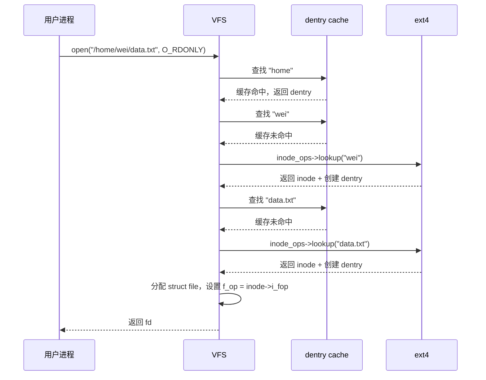

# VFS 与实现

- 写作时间：`2026-03-04 首次提交，2026-03-30 最近修改`
- 当前字符：`11881`

上一课建立了文件和目录的用户态视图：文件是数据加元数据，目录是名字到 inode 的映射，路径名解析逐级查目录条目找到最终的 inode。但那些讨论留下了一个关键问题：`/etc/hostname` 在 ext4 上，`/proc/cpuinfo` 在 procfs 上，`/tmp/data` 在 tmpfs 上——三个完全不同的文件系统，进程却用完全相同的 `open()`/`read()`/`close()` 来操作它们。内核怎样做到这一点？

答案是在具体文件系统之上加一层抽象。这一层叫做虚拟文件系统(Virtual File System, VFS)。VFS 定义了一组统一的数据结构和操作接口，每个具体文件系统只需要填写自己的实现函数。当进程调用 `read()` 时，VFS 先找到这个文件属于哪个文件系统，然后调用那个文件系统提供的 `read` 实现。对进程来说，这层转发是透明的。

本课先介绍 VFS 的四个核心对象和它们的操作表，然后看路径名解析怎样在 VFS 层面高效运行，最后把视角从内存中的抽象切换到磁盘上的物理布局，看文件系统怎样组织超级块、inode 表和数据块，以及怎样分配和回收存储空间。

## VFS 四大对象

VFS 用四个核心数据结构描述文件系统中的一切实体：超级块(superblock)、inode、目录项(dentry)和打开文件(file)。

这四个对象各自承担一个清晰的角色。**超级块**描述一个已挂载的文件系统整体——它是什么类型、块大小多少、根目录在哪里。**inode** 描述一个具体的文件——类型、权限、大小、数据块位置。**dentry** 描述目录树中的一个节点——一个名字和它所指向的 inode 之间的关系。**file** 就是上一课讲的打开文件描述——一次 `open()` 产生的运行时状态。

```
mount("/dev/sda2", "/home", "ext4")

         superblock                     dentry 树
    ┌─────────────────┐         ┌─────────────────────┐
    │ s_type: ext4    │         │  "/" (dentry)        │
    │ s_blocksize: 4096│        │   ├── "home" (dentry)│ ← 挂载点
    │ s_root: ────────│────→    │   │    ├── "wei"     │
    │ s_op: ext4_sops │         │   │    └── "doc"     │
    └─────────────────┘         │   ├── "etc"          │
                                │   └── "tmp"          │
            inode               └─────────────────────┘
    ┌─────────────────┐
    │ i_mode: 0644    │              file (struct file)
    │ i_size: 8192    │         ┌─────────────────┐
    │ i_blocks: 16    │         │ f_pos: 1024     │
    │ i_op: ext4_iops │         │ f_mode: O_RDONLY│
    │ i_fop: ext4_fops│         │ f_inode: ───────│──→ inode
    └─────────────────┘         └─────────────────┘
```

在 Linux 内核中，这四个对象对应四个结构体，全部定义在 `include/linux/fs.h` 中：

```c
// include/linux/fs.h (simplified)

struct super_block {
    struct file_system_type *s_type;     // filesystem type (ext4, tmpfs, ...)
    unsigned long            s_blocksize;// block size in bytes
    struct dentry           *s_root;     // root dentry of this filesystem
    const struct super_operations *s_op; // superblock operations
    // ...
};

struct inode {
    umode_t                  i_mode;     // file type + permissions
    loff_t                   i_size;     // file size in bytes
    struct timespec64        i_atime, i_mtime, i_ctime;
    const struct inode_operations *i_op; // inode operations (lookup, mkdir, ...)
    const struct file_operations  *i_fop;// default file operations
    struct super_block      *i_sb;       // which filesystem this inode belongs to
    // ...
};

struct dentry {
    struct qstr              d_name;     // name of this component
    struct inode            *d_inode;    // the inode this name points to
    struct dentry           *d_parent;   // parent directory's dentry
    struct list_head         d_child;    // siblings in parent
    struct list_head         d_subdirs;  // children (if directory)
    const struct dentry_operations *d_op;
    struct super_block      *d_sb;
    // ...
};

struct file {
    loff_t                   f_pos;      // current offset
    unsigned int             f_flags;    // open flags (O_RDONLY, ...)
    fmode_t                  f_mode;     // access mode
    struct inode            *f_inode;    // the inode
    const struct file_operations *f_op;  // file operations for this file
    // ...
};
```

:::thinking dentry 和目录条目有什么区别？
上一课说目录的内容是 `(名字, inode 编号)` 的映射，那个映射存在磁盘上，叫目录条目(directory entry)。`struct dentry` 是内核在内存中的表示，它不仅缓存了磁盘上的映射信息，还维护了父子关系（`d_parent`、`d_subdirs`）来构建目录树的内存表示。一个关键的区别是：磁盘上的目录条目只存在于目录类型的 inode 的数据块中，而内存中的 dentry 对象形成了一棵可以快速遍历的树。

另外，dentry 还可以是"负的"(negative dentry)：`d_inode` 为 NULL，表示"这个名字在目录中不存在"。内核把负 dentry 也缓存起来，这样下次查找同一个不存在的路径时就不需要再去磁盘上确认了。
:::

## 操作表

VFS 实现多态的机制是操作表(operations table)：每个核心对象都包含一个指向函数指针结构体的字段，具体文件系统在初始化时把自己的实现函数填进去。

这和面向对象语言中的虚函数表(vtable)是同一个思路，只不过用 C 的结构体和函数指针实现。当 VFS 需要执行某个操作时，它不直接调用具体文件系统的函数，而是通过对象中的操作表间接调用。

三个最重要的操作表：

**`file_operations`** 定义了对打开文件的操作。进程调用 `read()`、`write()`、`llseek()` 时，VFS 最终会调用该文件对应的 `file_operations` 中的函数指针：

```c
// include/linux/fs.h (simplified)
struct file_operations {
    loff_t (*llseek)(struct file *, loff_t, int);
    ssize_t (*read)(struct file *, char __user *, size_t, loff_t *);
    ssize_t (*write)(struct file *, const char __user *, size_t, loff_t *);
    int (*open)(struct inode *, struct file *);
    int (*release)(struct inode *, struct file *);
    int (*mmap)(struct file *, struct vm_area_struct *);
    // ...
};
```

ext4 填写的是读写磁盘数据块的实现，procfs 填写的是从内核数据结构生成文本的实现，管道(pipe)填写的是在内核缓冲区中传递字节的实现。进程调用 `read(fd, buf, 100)` 时，VFS 从 `struct file` 中取出 `f_op->read`，调用它。至于这个函数背后是去读磁盘、读内存还是读内核数据结构，VFS 不关心。

**`inode_operations`** 定义了对 inode 的操作，主要是和目录树结构相关的：在目录中查找一个名字(lookup)、创建文件(create)、创建目录(mkdir)、删除文件(unlink)、创建链接(link)等：

```c
struct inode_operations {
    struct dentry *(*lookup)(struct inode *, struct dentry *, unsigned int);
    int (*create)(struct mnt_idmap *, struct inode *, struct dentry *, umode_t, bool);
    int (*mkdir)(struct mnt_idmap *, struct inode *, struct dentry *, umode_t);
    int (*unlink)(struct inode *, struct dentry *);
    int (*link)(struct dentry *, struct inode *, struct dentry *);
    int (*symlink)(struct mnt_idmap *, struct inode *, struct dentry *, const char *);
    int (*rename)(struct mnt_idmap *, struct inode *, struct dentry *,
                  struct inode *, struct dentry *, unsigned int);
    // ...
};
```

路径名解析每走一级目录，都要调用那个目录 inode 的 `i_op->lookup` 来查找下一级名字对应的 inode。

**`super_operations`** 定义了对文件系统整体的操作：分配新 inode(alloc_inode)、写回脏 inode(write_inode)、卸载时的清理(put_super)等：

```c
struct super_operations {
    struct inode *(*alloc_inode)(struct super_block *);
    void (*destroy_inode)(struct inode *);
    int (*write_inode)(struct inode *, struct writeback_control *);
    void (*put_super)(struct super_block *);
    int (*statfs)(struct dentry *, struct kstatfs *);
    // ...
};
```

VFS 的整个调用链可以用一次 `open("/home/wei/data.txt", O_RDONLY)` 串起来：



从这条调用链可以看出，VFS 的角色是**调度者**：它接收系统调用，执行路径名解析，在缓存和具体文件系统之间做选择，最终把请求派发给正确的文件系统实现。

## 路径名查找与缓存

路径名查找(pathname lookup)是 VFS 中最频繁的操作。每次 `open()`、`stat()`、`rename()`、`unlink()` 都要先把路径字符串转换成最终的 dentry 和 inode。

上一课已经介绍了路径名解析的基本流程：从根目录开始，逐级在目录条目中查找每个路径分量。但如果每次查找都要从磁盘读取目录数据，性能会非常差。一个典型的编译过程可能在一秒钟内触发上万次路径查找，不可能每次都去访问磁盘。

内核的解决方案是 **dentry 缓存(dcache)**。所有曾经被查找过的 dentry 都会被缓存在内存中，用哈希表组织。下次查找相同的路径分量时，内核先查哈希表：如果命中，就直接拿到 dentry 和它指向的 inode，不需要访问磁盘；只有缓存未命中时，才调用具体文件系统的 `lookup` 函数从磁盘读取。

```
路径名查找 /home/wei/data.txt：

   "/"     → dcache 查找 → 命中 → dentry (/)
   "home"  → dcache 查找 → 命中 → dentry (home)
   "wei"   → dcache 查找 → 未命中 → ext4 lookup → 创建 dentry 并加入 dcache
   "data.txt" → dcache 查找 → 未命中 → ext4 lookup → 创建 dentry 并加入 dcache
```

dcache 的效果非常显著。在一个运行中的系统上，绝大多数路径查找都能完全在内存中完成，因为热路径的 dentry 已经被缓存了。内核还会缓存 inode 对象（inode cache），使得从 dentry 拿到完整的 inode 信息也不需要磁盘访问。

:::thinking 路径名查找中的竞态问题
路径名查找在多核系统上面临一个挑战：进程 A 正在解析 `/home/wei/data.txt`，同时进程 B 可能在重命名 `/home/wei/` 目录。如果不做保护，进程 A 可能在解析到一半时踩到被移走的目录。

Linux 的解决方案经历了几代演进。早期版本使用全局的目录信号量，但并发性很差。现代内核采用 RCU(Read-Copy-Update) 保护的无锁路径查找：大多数只读查找操作在 RCU 读侧临界区内完成，不需要获取任何锁。只有当路径分量跨越挂载点或者遇到符号链接时，才可能退回到加锁模式。这种设计使得路径名查找在高并发场景下仍然能保持极高的吞吐量。
:::

## 磁盘布局

以上讨论的 VFS、dentry、inode 都是内存中的抽象。但文件系统最终要把数据持久地存在磁盘上。磁盘布局(disk layout)定义了文件系统怎样在块设备上组织数据。

块设备(block device)是以固定大小的块(block)为单位进行读写的存储设备。磁盘、SSD 和 USB 存储都是块设备。文件系统把块设备的存储空间划分成若干区域，每个区域承担特定的职责。一个典型的磁盘布局包含这些区域：

```
┌────────────┬────────────┬─────────────┬──────────────────────────┐
│ 引导块      │ 超级块      │ inode 表     │ 数据块                     │
│ (boot      │ (super-    │ (inode      │ (data blocks)            │
│  block)    │  block)    │  table)     │                          │
└────────────┴────────────┴─────────────┴──────────────────────────┘
```

**引导块(boot block)** 占据设备的第一个块，存放引导加载程序。不是每个分区都需要引导块，但文件系统格式通常会预留这个位置。

**超级块(superblock)** 记录文件系统的全局信息：块大小、总块数、inode 总数、空闲块数、空闲 inode 数、文件系统类型和状态等。挂载文件系统时，内核首先读取超级块来了解这个文件系统的基本参数。`struct super_block` 就是超级块在内存中的表示。

**inode 表(inode table)** 存放所有 inode 的数组。每个 inode 占据固定大小的磁盘空间（ext4 中默认 256 字节），记录文件的元数据和数据块的位置信息。inode 编号就是这个数组的下标：inode 42 表示 inode 表中第 42 个位置的 inode。

**数据块(data block)** 存放文件的实际内容。普通文件的数据块存放字节序列，目录的数据块存放目录条目。

:::expand 块组
实际的文件系统比上图更复杂。ext4 把整个分区分成多个块组(block group)，每个块组都有自己的 inode 表和数据块区域，以及块组描述符(group descriptor)和块位图(block bitmap) / inode 位图(inode bitmap)。这样做的好处是：同一个目录下的文件尽量分配在同一个块组中，减少磁头寻道距离（对 HDD）或提高访问局部性（对 SSD）。超级块和块组描述符会在多个块组中保存冗余副本，防止单块损坏导致整个文件系统不可用。
:::

## 空间分配与空闲管理

文件创建或追加写入时需要分配新的数据块，文件删除时需要回收数据块。文件系统怎样决定把数据放在磁盘的什么位置？

**空间分配策略**决定了文件数据块在磁盘上的排列方式。不同的策略在顺序读写性能、随机读写性能和空间利用率之间做出不同的权衡。

**连续分配(contiguous allocation)** 让每个文件占据一段连续的磁盘块。顺序读写性能最好——磁头只需要移动一次。但创建文件时必须预知文件大小，而且文件删除后产生的间隙会导致外部碎片，和内存管理中连续分配遇到的问题一样。早期的 CD-ROM 文件系统 ISO 9660 使用这种方式。

**链式分配(linked allocation)** 让每个数据块的末尾存放下一个数据块的编号，形成链表。不会产生外部碎片，文件可以任意增长。但随机访问需要从头开始遍历链表，性能很差。FAT(File Allocation Table) 文件系统把链表信息集中存放在一张独立的表中，避免了逐块遍历磁盘，但仍然需要遍历 FAT 表。

**索引分配(indexed allocation)** 把文件的所有数据块编号集中存放在一个索引结构中。传统 Unix 文件系统的 inode 使用多级索引：inode 中有 12 个直接指针（直接指向数据块）、1 个一级间接指针（指向一个存满数据块编号的块）、1 个二级间接指针和 1 个三级间接指针。小文件只用直接指针，几乎没有额外开销；大文件通过间接指针层层扩展。

**区段分配(extent-based allocation)** 是索引分配的改进。一个区段(extent)记录的是"从第 N 块开始的连续 M 个块"，用 (起始块号, 长度) 两个字段就能描述一段连续区域。对于顺序写入的大文件，一个区段可能覆盖几百 MB 甚至几 GB 的数据，而传统索引需要逐块记录编号。ext4 就使用区段分配。

**B-tree 分配** 把文件数据块的映射组织成 B-tree 或 B+ tree，支持高效的查找、插入和范围扫描。Btrfs 和 XFS 使用这种方式。B-tree 的优势在大量小文件和频繁修改的场景中更为明显。

| 策略 | 顺序读写 | 随机读写 | 空间利用 | 代表 |
|------|---------|---------|---------|------|
| 连续 | 极好 | 好 | 差（碎片） | ISO 9660 |
| 链式(FAT) | 好 | 差 | 好 | FAT32 |
| 多级索引 | 好 | 好 | 好 | 传统 Unix (ext2) |
| 区段 | 极好 | 好 | 极好 | ext4, XFS |
| B-tree | 好 | 极好 | 极好 | Btrfs, XFS |

**空闲空间管理**跟踪哪些块是空闲的、哪些已被占用。最常见的方式是**位图(bitmap)**：用一个比特数组表示每个块的状态，1 表示已占用，0 表示空闲。一个 4KB 的位图块可以跟踪 32768 个数据块（4096 × 8 位），也就是 128MB 的存储空间。分配新块时，文件系统在位图中找到空闲位并标记为已占用；释放块时，把对应位清零。

ext4 在位图的基础上还维护了预分配机制：文件写入时一次性预留比当前需要更多的连续块，减少碎片并降低后续写入时的分配开销。

## 小结

| 概念 | 说明 |
|------|------|
| VFS(虚拟文件系统) | 在具体文件系统之上的统一抽象层，定义了通用数据结构和操作接口 |
| 四大对象 | superblock（文件系统整体）、inode（文件身份）、dentry（目录树节点）、file（打开状态） |
| 操作表 | `file_operations`、`inode_operations`、`super_operations`，具体文件系统填入自己的实现 |
| dentry 缓存(dcache) | 哈希表缓存已查找过的路径分量，使绝大多数路径查找在内存中完成 |
| 路径名查找 | VFS 逐级解析路径，先查 dcache，未命中才调用文件系统的 lookup |
| 磁盘布局 | 引导块 + 超级块 + inode 表 + 数据块，文件系统在块设备上的物理组织 |
| 空间分配 | 连续 / 链式(FAT) / 多级索引 / 区段(extent) / B-tree，各有性能和空间利用率的权衡 |
| 位图(bitmap) | 用比特数组跟踪块的占用状态，是最常见的空闲空间管理方式 |

VFS 让内核只需要写一套系统调用入口，就能支持任意多种文件系统。每个文件系统通过填写操作表来"注册"自己的行为。dentry 缓存让路径名查找几乎不碰磁盘。而磁盘布局和空间分配策略则决定了文件数据在物理介质上的组织方式，直接影响读写性能和空间效率。

---

**Linux 源码入口**：
- [`include/linux/fs.h`](https://elixir.bootlin.com/linux/latest/source/include/linux/fs.h) — `struct super_block`、`struct inode`、`struct dentry`、`struct file` 以及所有操作表的定义
- [`fs/namei.c`](https://elixir.bootlin.com/linux/latest/source/fs/namei.c) — `path_lookupat()`、`link_path_walk()`，路径名查找的核心逻辑
- [`fs/dcache.c`](https://elixir.bootlin.com/linux/latest/source/fs/dcache.c) — dentry 缓存的哈希表、查找和回收
- [`fs/inode.c`](https://elixir.bootlin.com/linux/latest/source/fs/inode.c) — inode 缓存和通用 inode 操作
- [`fs/ext4/super.c`](https://elixir.bootlin.com/linux/latest/source/fs/ext4/super.c) — ext4 超级块操作和文件系统注册
- [`fs/ext4/namei.c`](https://elixir.bootlin.com/linux/latest/source/fs/ext4/namei.c) — ext4 的目录查找实现
- [`fs/ext4/extents.c`](https://elixir.bootlin.com/linux/latest/source/fs/ext4/extents.c) — ext4 区段分配
