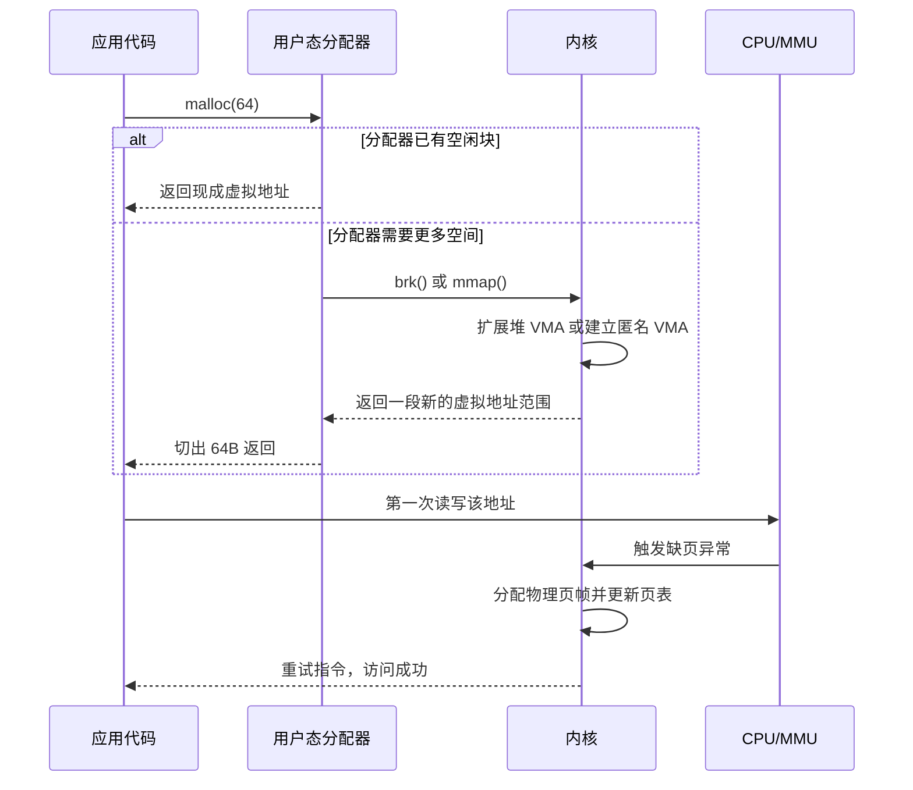

# 内存映射

- 写作时间：`2026-03-04 首次提交，2026-03-27 最近修改`
- 当前字符：`7272`

上一课把按需分页、缺页异常和页面替换连成了一条动态链：页先不进内存，访问到了再补进来，内存不够时再回收。但站在写程序的人的角度，还会剩下一个更贴手的问题：`malloc(64)` 到底什么时候真的“分到了内存”？为什么有时 `mmap()` 一下就返回了地址，真正写进去时才发生缺页？又为什么进程明明申请成功了，最后还是会被 OOM 杀掉？

这一课就沿着这条“程序运行时拿到一块内存”的链继续往前推。我们先把 **mmap 与 VMA** 这对核心概念确立，明确“映射”到底建立了什么；然后区分 **匿名映射与堆增长**，把 `malloc()`、`brk()` 和 `mmap()` 放到同一条时间线上；接着看 **文件映射** 怎样把 page cache、共享写回和写时复制连起来；再用 **地址空间布局** 把这些区域放回 Linux 进程的整体视图里；有了映射和布局之后，才看 **交换** 怎样为匿名页提供后备存储，以及 **OOM Killer 与内存 cgroup** 怎样在内存真的不够时决定谁留下、谁退出。

## mmap 与 VMA

内存映射(memory mapping)是在进程的虚拟地址空间中建立“一段虚拟地址范围对应什么后备对象、带什么权限”的机制。

上一课已经见过，按需分页并不会要求页面在建立映射的瞬间就进入 RAM。`mmap()` 做的第一件事不是“分一堆物理页”，而是告诉内核：从某个虚拟地址开始，到某个长度结束，这段区域以后该按什么规则解释。这个“规则包”在 Linux 里由 VMA(virtual memory area) 表示。一个 VMA 记录至少三类信息：地址范围、访问权限，以及后备对象(backing object)。后备对象可能是一个文件，也可能只是匿名内存。

POSIX 接口层面，最常见的映射长这样：

```c
void *p = mmap(NULL, 4096,
               PROT_READ | PROT_WRITE,
               MAP_PRIVATE | MAP_ANONYMOUS,
               -1, 0);
```

这行代码并不等于“立刻拿到一张已经驻留在 RAM 里的 4KB 物理页”。它只是在当前进程地址空间里建立了一段长度为 4096 字节、可读可写、私有、匿名的映射关系。真正的物理页通常要等第一次访问 `p[0]` 时，才会在缺页异常路径里被补上。

这也是为什么上一课会把 `mmap` 和 VMA 放在一起说。VMA 是内核里对“这段地址将来该怎么解释”的记录，`mmap()` 则是创建这类记录的主要接口之一。很多看上去截然不同的内存来源，在内核眼里最终都会表现成“一棵 VMA 集合”：程序代码段、数据段、主线程栈、线程栈、共享库、匿名映射、文件映射，都是地址空间中一段一段的 VMA。

## 匿名映射与堆增长

匿名映射(anonymous mapping)是不以普通文件为后备对象的映射，它通常用来承载堆、线程栈、共享内存段和大块动态分配。

从 C 程序的表面看，动态内存分配接口是 `malloc()` 和 `free()`。但它们并不直接等于系统调用。真正向内核申请地址空间时，用户态分配器通常走两条路：一条是 `brk()` 扩展传统的堆区，另一条是 `mmap()` 单独建立匿名映射。glibc 的默认分配器 ptmalloc 往往把较小的分配放进堆里，把较大的分配直接交给 `mmap()`；不同 allocator 的阈值和策略并不相同，有些实现甚至几乎完全依赖 `mmap()`。这里要抓住的不是具体阈值，而是两层分工：

1. `malloc()` 先向用户态分配器要一小块可用空间。
2. 用户态分配器不够用时，才向内核要更大的虚拟地址范围。

真正的时间顺序更接近下面这张图：



这条链里最关键的一刀是：**虚拟地址的分配** 发生在 `brk()` 或 `mmap()` 建立 VMA 的时候，**物理页的分配** 发生在第一次真正触碰页面的时候。两者通常不是同一时刻。

`brk()` 的特点是把程序的“堆顶”整体往高地址方向推，也就是扩展进程那段连续的 heap 区域。这样做适合把很多小对象放在同一片连续虚拟地址里，由用户态分配器自己再切成更小的块。`mmap()` 的特点则是独立创建一段新的 VMA，不需要依附于既有堆边界，所以非常适合线程栈、大块 buffer、共享内存以及文件映射。并发一章里已经见过，`pthread_create()` 给新线程准备栈时，通常就是用 `mmap()` 单独映射一块区域，而不是把主线程那片堆再切一段出来。

`free()` 也常常不会立刻把内存还回内核。更常见的情况是：用户态分配器先把这块地址记进自己的空闲链表，等待下一次 `malloc()` 复用。只有当整段大块区域都不再需要，或者 allocator 判断“值得归还”时，才会通过 `munmap()` 或收缩堆边界把地址空间交还给内核。也就是说，程序里看见的“申请”和“释放”，和内核里看见的“建立映射”和“撤销映射”，中间隔着一层用户态分配器。

## 文件映射

文件映射(file-backed mapping)是以后备文件为数据来源的内存映射，进程对这段虚拟地址的访问会通过页缓存(page cache)与底层文件内容发生联系。

一旦后备对象从“匿名”变成“文件”，内存映射就不只是“给我一块新地址”了，而是“把某个文件区间解释成一段地址”。这样做的直接好处是：程序可以像访问内存一样访问文件内容，而不必每次显式调用 `read()` 再把数据拷到用户缓冲区里。这里的页缓存就是“内核里缓存文件页面的那层内存副本”。访问尚未驻留的文件页时，缺页异常路径会把对应文件页装入页缓存，再把当前进程的页表项指向它。

这里最重要的区分是 `MAP_SHARED` 和 `MAP_PRIVATE`：

| 方式 | 读到的内容 | 写入后的去向 | 其他进程是否可见 |
|------|------------|--------------|------------------|
| `MAP_SHARED` | 文件当前内容 | 先改 page cache，之后再回写到文件 | 可见 |
| `MAP_PRIVATE` | 文件当前内容 | 写入时触发写时复制，改到新的匿名页 | 不可见 |

`MAP_SHARED` 的核心机制是：多个进程的页表项指向同一组 page cache 页。映射建立后，大家看到的是同一组文件页；某个进程修改了其中一个字节，改动先进入 page cache，之后由内核按回写策略刷回文件。`MAP_PRIVATE` 则复用了上一章讲 `fork()` 时见过的写时复制(Copy-on-Write, COW)机制：初始时多个进程可以共享同一批只读页，但只要哪个进程先写，它就会在缺页异常里得到一张新的匿名页，之后的修改只落到自己的私有副本上，原文件内容不变。

这个区别很重要，因为它直接决定页面回收时的去路。干净的文件页可以直接丢弃，因为文件里本来就有一份权威副本；`MAP_SHARED` 的脏页需要回写；`MAP_PRIVATE` 或匿名页一旦被修改，就不再只是“文件的一个视图”，而已经变成了匿名脏页，后续回收时通常要走交换区而不是回写原文件。

## 地址空间布局

Linux 进程地址空间布局是把代码、数据、堆、映射区、栈以及内核保留区域按一定规则组织在同一套虚拟地址空间中的方式。

进程生命周期一课已经看过最基本的 text、data、heap、stack 四段模型。到了这一课，这个模型需要再补上一层现实中的 Linux 布局：真正的地址空间不只有“堆和栈”，中间还有一大片由 `mmap()` 管理的映射区，动态链接库、线程栈、文件映射和很多匿名大块内存都落在这里。线程一课里看到的“每个线程的栈都是单独 `mmap()` 出来的区域”，就是这一层布局的直接表现。

下面是一个简化后的 64 位 Linux 进程视图：

```text
高地址
┌──────────────────────────────┐
│          内核空间             │
├──────────────────────────────┤
│     主线程栈 / argv / env     │
│              ↓               │
├──────────────────────────────┤
│   线程栈 / 共享库 / 文件映射   │
│ 匿名映射 / 内核提供的辅助页   │
│        （mmap 区）            │
├──────────────────────────────┤
│            heap              │
│              ↑               │
├──────────────────────────────┤
│      .bss / .data / .text    │
└──────────────────────────────┘
低地址
```

这个布局不是一成不变的。地址空间随机化(Address Space Layout Randomization, ASLR)会在每次执行时打乱很多区域的起点；不同架构和不同内核配置也会调整用户空间和内核空间的边界。但从学习角度看，关键结构是稳定的：代码和静态数据在较低地址，`brk()` 管理的堆向上增长，主线程栈在高地址向下增长，而中间那片最灵活的区域由 `mmap()` 承担。以后你在 `/proc/<pid>/maps` 里看到一长串地址区间，本质上就是这些 VMA 的清单。

## 交换

交换(swap)是在匿名页被回收时把其内容写到某个后备存储中，以便未来再次访问时还能把这张页恢复回来的机制。

到这里，`swap` 这个词才第一次正式出现。可以先把它理解成一句很朴素的话：**某些页虽然暂时要从 RAM 里让出去，但内容还得留个后手，免得以后再访问时无处可找。** 上一课讲页面替换时已经看到，物理内存不够时内核必须挑一些页让出去。但“让出去”并不总是同一种动作，不同页型的后路不同：

| 页类型 | 回收时的典型动作 |
|--------|------------------|
| 干净文件页 | 直接丢弃，需要时再从文件读回 |
| 脏文件页 | 先回写文件，之后可回收 |
| 匿名页 | 写入交换区，之后可回收 |

所以 swap 不是“所有页面的后备磁盘”，而主要是匿名页的后备存储。这里的匿名页既包括真正的匿名映射，也包括那些原本来自 `MAP_PRIVATE` 文件映射、后来因为写时复制变成私有副本的页。它们不再有一个可以直接重读的文件版本，所以要想把物理页腾出来，就必须先把当前内容写进交换区。

这也解释了一个常见误解：`mmap()` 文件并不等于“这段内容一定会进 swap”。如果是只读文件页，回收时往往直接丢掉；如果是共享文件页并且脏了，回收时优先回写原文件；只有匿名页或私有脏页，才主要依赖交换区保留状态。

## OOM Killer 与内存 cgroup

OOM Killer(out-of-memory killer) 是在回收和交换都无法再满足内存需求时，由内核选择一个或多个进程终止，以恢复系统可继续运行状态的机制。

到这里，整条链已经可以看到最后一步了：进程申请了虚拟地址，第一次访问时请求物理页，内核尝试回收和交换，如果仍然拿不出足够资源，系统就必须承认“这次分配做不到”。在 Linux 上，这个失败不一定表现为 `malloc()` 当场返回 `NULL`。因为系统可能启用了 overcommit，也就是先允许进程拿到一段“将来可能会用到”的地址承诺，而不是在映射建立时立刻为每一页准备好物理资源。真正的硬约束要到后续缺页、回收和交换阶段才暴露出来。于是程序会看到两种常见结果：要么某次系统调用直接返回 `ENOMEM`，要么进程在后续运行中被 OOM Killer 选中并杀掉。

Linux 不只处理“全局 OOM”，还处理“组内 OOM”。前面的 cgroups 一章已经见过 `memory.max` 这类控制文件。内存 cgroup(memory cgroup, memcg) 的作用是把一组进程的可用内存单独记账、单独限额。这样一来，即使整台机器还有空闲内存，一个容器也可能因为自己所在 memcg 的上限已满而先触发回收，最后在组内发生 OOM。这正是容器环境中最常见的“为什么宿主机还没满，我的进程却被杀了”的原因。

从学习路径上看，这一课应该把你脑子里的两个时间点分开：`malloc()`、`brk()`、`mmap()` 解决的是“在地址空间里给这段内存找位置”；缺页、交换、OOM 解决的是“当程序真的用到它时，系统是否还能为它拿到物理资源并维持下去”。前者偏向地址空间语义，后者偏向运行时资源压力。只有把这两个时间点分开，`mmap()` 这条链才会真正清楚。

## 小结

| 概念 | 说明 |
|------|------|
| `mmap()` | 在进程地址空间中建立一段新的映射关系，通常先建 VMA，物理页稍后按需进入 |
| VMA | 描述一段虚拟地址范围及其权限和后备对象的内核记录 |
| 匿名映射 | 没有普通文件后备对象的映射，常用于堆、线程栈、大块 buffer 和共享内存 |
| `brk()` | 通过移动程序 break 扩展连续堆区，常被用户态分配器用于小块分配的后备来源 |
| 文件映射 | 把文件区间映射进地址空间，访问通过 page cache 与文件内容发生联系 |
| `MAP_SHARED` | 共享同一组文件页，修改可被其他映射看到，并最终回写文件 |
| `MAP_PRIVATE` | 初始共享，写入时触发写时复制，修改落到私有匿名页 |
| 交换 | 为匿名页提供后备存储，使其可在回收后仍能被重新装入 |
| OOM Killer | 回收和交换仍不足以满足需求时，终止进程以恢复系统可运行性 |
| 内存 cgroup | 按进程组单独记账和限额的内存控制机制，容器 OOM 常发生在这一层 |

程序“拿到一块内存”至少要经过两步：先在地址空间里建立可解释的虚拟地址范围，再在第一次真正访问时为其中的页面补上物理资源。`mmap()`、`brk()`、swap 和 OOM 都只是这条链不同位置上的机制，而不是同一时刻发生的一件事。

---

**Linux 源码入口**：
- [`mm/mmap.c`](https://elixir.bootlin.com/linux/latest/source/mm/mmap.c) — `mmap()`、`brk()` 与 VMA 管理
- [`mm/filemap.c`](https://elixir.bootlin.com/linux/latest/source/mm/filemap.c) — 文件页缓存与文件映射相关路径
- [`mm/oom_kill.c`](https://elixir.bootlin.com/linux/latest/source/mm/oom_kill.c) — OOM Killer 决策
- [`mm/memcontrol.c`](https://elixir.bootlin.com/linux/latest/source/mm/memcontrol.c) — 内存 cgroup 记账与限制
- [`fs/proc/task_mmu.c`](https://elixir.bootlin.com/linux/latest/source/fs/proc/task_mmu.c) — `/proc/<pid>/maps` 等地址空间导出
