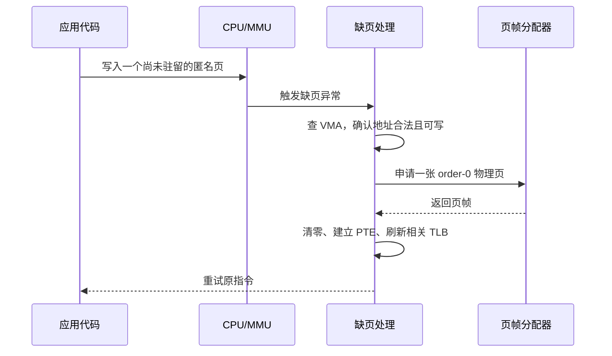

# 内核内存分配

- 写作时间：`2026-03-04 首次提交，2026-03-26 最近修改`
- 当前字符：`9214`

上一课已经把用户态视角下的链条接起来了：`malloc()` 先经过用户态分配器，必要时再用 `brk()` 或 `mmap()` 向内核要一段新的虚拟地址，真正写到页面时才触发缺页异常。但这条链还有最后一个最底层的问题没有回答：缺页进入内核之后，那张真正的物理页帧是从哪里来的？建立 VMA、页表和各种内核对象时，内核自己又是怎样管理内存的？

这一课就把镜头彻底切到内核内部。不过在往下走之前，先把最容易混在一起的四类对象拆开：

1. 用户进程真正要访问的物理页。
2. 内核为了管理这些映射而创建的小对象，例如 VMA、页表页、`task_struct`。
3. 内核自己需要的一大块连续虚拟地址区域。
4. 每个 CPU 各自保留、尽量不共享的那份副本。

下面几节其实就是在分别回答这四类东西“各自由谁分、为什么要分开分”。我们先看 **页帧分配器**，理解缺页路径上“拿一张物理页”的来源；然后看 **SLUB** 怎样把整页再切成 `vm_area_struct`、`task_struct` 这类小对象；接着区分 **vmalloc** 和 **Per-CPU 分配器** 分别解决什么问题；再看 **内存压缩** 怎样在交换之前或之中争取空间；然后讨论 **透明大页** 怎样改变缺页和 TLB 的粒度；最后用 **NUMA 内存策略** 收尾，回答“同样是一张页，应该从哪颗 CPU 附近的内存节点分出来”。

## 页帧分配器

页帧分配器(page frame allocator)是内核管理空闲物理页帧并按页或按连续页块分配它们的机制。

用户态看到的是“页”，内核底层管理的也是“页帧(frame)”。只不过到了这一层，讨论的已经不再是虚拟页号，而是 RAM 里真实存在的物理页帧。Linux 用伙伴系统(Buddy System) 维护这些空闲页帧，并按内存区域(zone)分开管理。zone 反映的是物理内存的可用范围和约束，例如某些老设备只能做低地址 DMA，因此内核需要保留专门的低端区域；而普通用户页大多从 Normal zone 里分配。

这里先别急着把 zone 看成 Linux 的内部术语，它先是在回答一个非常现实的问题：**所有物理页并不完全等价。** 有的设备只能访问低端物理地址，有的页要长期留给内核自己，有的页更适合分给普通用户进程。于是“有没有空闲页”还不够，内核还得知道“哪一类空闲页才适合这次请求”。伙伴系统之上再分 zone，本质上是在把“空闲页很多”这个粗粒度事实，细化成“哪些页能用来满足哪类需求”。

伙伴系统的核心思想是：内核不只维护单页，还维护 2、4、8、16……页这种 2 的幂大小的连续块。这个大小等级叫 order。`order = 0` 表示 1 页，`order = 1` 表示 2 页，`order = 2` 表示 4 页，以此类推。请求到来时，内核先找恰好够大的块；如果只有更大的空闲块，就不断对半分裂；释放时如果相邻的“伙伴”块也空闲，就再把它们合并回更高的 order。

```text
order 3: [8 pages free]
            |
            v split
order 2: [4 pages] [4 pages]
            |
            v split left half
order 1: [2 pages] [2 pages] [4 pages]
            |
            v split left half again
order 0: [1][1] [2 pages] [2 pages] [4 pages]
```

这套机制听起来像“内核自己的分配器细节”，但它恰好就是上一课那条 `mmap()` 链真正落地的地方。一个典型的匿名页缺页，大致沿着这条路径发生：



这里可以把职责分得更硬一点：VMA 回答的是“这段地址按规则能不能这样访问”，页帧分配器回答的是“既然能访问，那张真实物理页从哪里来”。所以“程序第一次写入一块新内存”这件事，在内核里不是直接去“找一个地址”，而是先在缺页处理里确认这次访问落在合法 VMA 上，再向页帧分配器要一张真实的物理页，最后把这张页挂进当前进程的页表。上一课说“物理页通常在第一次访问时才分配”，这里终于把“由谁分配”补齐了。

但这里还可以再往里看半步。很多人第一次学到这里时，会以为“缺页处理只需要分一张用户页就够了”。实际上并不总是这样。如果通向目标页的某一级页表本身还不存在，内核还要先分配新的页表页，然后才能把最终那张用户页挂进去。也就是说，一次看似普通的匿名页缺页，背后可能同时牵动：

1. 页帧分配器分配用户物理页。
2. 页帧分配器分配新的页表页。
3. 后续再由页表项把两者组织成可访问的映射。

用户看到的只是“第一次写这个地址成功了”，但内核看到的是“要把地址翻译路径本身先补齐，再把目标页补齐”。

再往工程实现里走一步，很多低阶页请求甚至不会立刻碰到全局伙伴结构。Linux 会在每个 CPU 上保留一小批本地热页，形成 per-CPU 的页缓存。这样一来，最常见的 `order = 0` 分配可以先在本地 CPU 上快速完成，只有本地缓存见底或者需要更高阶连续块时，才回到全局伙伴系统。换句话说，理论上我们说”缺页去找 buddy”，工程上常见的快路径其实已经掺进了 per-CPU 优化。

## SLUB

伙伴系统擅长管理整页和连续页块，但如果每次只想分配几十字节或几百字节，就直接拿一整页显然太浪费了。内核里恰恰充满了这种小对象：`vm_area_struct`、`dentry`、`inode`、`task_struct`、各种链表节点和协议栈对象都不是”恰好一页”。

slab 分配器的思路是：先从页帧分配器拿若干整页，然后把这些页预先切分成大量固定大小的对象槽位。同一类对象放进同一个 cache，下次再需要同类对象时直接从已切好的槽位里取，不必每次都回到伙伴系统。SLUB 是 Linux 当前主流的 slab 分配器实现，它把从页帧分配器拿到的整页切分成对象槽位，供 `kmalloc()` 和 `kmem_cache` 使用。

`kmalloc(64)` 这类通用请求会落进某个 64 字节大小类的 cache，而专门的 `kmem_cache_create()` 则可以为 `task_struct`、`vm_area_struct` 这种固定结构建立专属 cache。

这层分配器和上一课同样直接相关。`mmap()` 建立一段新映射时，内核不仅要在用户页表里留一个未来可用的地址范围，还要先在内核里分配 VMA 元数据对象；这些元数据本身不是用户页，而是小型内核结构，通常就来自 slab cache。换句话说，用户态一次 `mmap()` 背后，往往同时牵动了两类分配：

1. 立刻分配一个或多个小型内核对象，记录 VMA、页表页或其他管理信息。
2. 将来第一次触页时，再分配真正的用户物理页帧。

把这两件事混在一起，是理解内存分配时最容易犯的错误之一。前者属于“内核元数据对象分配”，后者属于“用户页帧分配”，它们走的不是同一层分配器。前一课里的 `mmap()` 如果被粗糙地理解成“向内核要一块内存”，读者就在这里容易卡住；拆开之后就会看到，它至少同时碰到了“记管理信息”和“将来补用户页”这两条不同路径。

这也是为什么我们更愿意把这课理解成”分配器分层”，而不是“又一堆新名词”。在 Linux 里，伙伴系统更像底层页仓库，回答“能不能给我几张页”；SLUB 更像页之上的对象工厂，回答“我能不能把这些页切成适合内核结构体的小槽位”。二者不是竞争关系，而是上下层关系：SLUB 自己的原料，最终也来自页帧分配器。

如果把前几课里反复出现的“内存对象”按典型来源粗分，可以先记成下面这张表：

| 你看到的东西 | 典型分配来源 | 这一层关心什么 |
|--------------|--------------|----------------|
| 用户匿名页、文件页、页表页 | 页帧分配器 | 一次要拿几张页，物理上是否连续 |
| `vm_area_struct`、`task_struct`、`dentry` | SLUB | 小对象大小是否合适，能否复用已有槽位 |
| 很大的内核缓冲区 | `vmalloc` | 虚拟地址是否需要连续 |
| 每核统计、每核局部副本 | Per-CPU 分配器 | 是否要避免跨 CPU 共享写入 |

这张表的作用不是让你背接口，而是帮你拆开“我看到一块内存”背后的几种完全不同的来源。上一课的 `mmap()` 链如果只讲到“后面会分配内存”，读者很容易把这些层全混在一起；放到这里拆开，链条才会真正稳下来。

## vmalloc

`vmalloc` 是为内核提供“虚拟地址连续、物理页可以不连续”的大块内存分配机制。

为什么前面已经有伙伴系统和 `kmalloc()`，这里还要再专门讲一个 `vmalloc`？因为前面两者都更偏向“先想办法拿到物理上也合适的页”，而这里要解决的问题恰好相反：有时内核只是想在自己的虚拟地址空间里得到一段连续区间，底层物理页分散一些也可以接受。用户态进程本来就天然活在虚拟地址空间里，所以用户看到的连续地址不要求底层物理页连续。内核虽然也有页表，但在很多性能敏感路径上更偏爱物理连续内存；这正是伙伴系统擅长的事情。然而总会有一些内核场景更在意“虚拟上看起来是一整块”，却不要求物理连续，例如很大的内核缓冲区、模块空间或某些调试映射。`vmalloc` 就是为这类需求准备的。

它的做法不是从伙伴系统里硬找一大块物理连续区域，而是先拿若干张分散的物理页，再在内核自己的虚拟地址空间中把这些页拼成一段连续映射。代价是地址翻译更复杂、TLB 行为更差，因此 `vmalloc` 不适合频繁访问的小热路径，也不用于满足用户态匿名页缺页。缺页时给用户补页，主角仍然是页帧分配器，而不是 `vmalloc`。

把 `kmalloc` 和 `vmalloc` 放在一起看会更清楚：

| 接口 | 虚拟地址 | 物理页 | 常见用途 |
|------|----------|--------|----------|
| `kmalloc` | 连续 | 通常也要求连续 | 小到中等、热点、高频访问的内核对象 |
| `vmalloc` | 连续 | 可以不连续 | 很大但不要求物理连续的内核缓冲区 |

这个对比背后的逻辑非常重要。性能敏感路径更怕“地址翻译复杂”和“缓存行为变差”，所以宁可要求物理连续；容量更大的路径则往往接受多一点翻译成本，换取“更容易拿到一块足够大的虚拟连续空间”。

## Per-CPU 分配器

Per-CPU 分配器是为每个 CPU 准备一份彼此独立的内存副本，以减少跨核共享和锁竞争的机制。

这里还要先和前面提到的“每个 CPU 上保留一小批热页”区分一下。前面那个是页帧分配器的快路径优化，解决的是“拿单页太频繁时别老去抢全局伙伴锁”；这里说的 Per-CPU 分配器则是在更高一层回答“这份数据到底要不要让所有 CPU 共享同一份”。并发一章已经看到，多核程序最怕的不是单次操作慢，而是所有核心同时争一把锁、同时写同一条 cache line。内核里很多计数器、统计信息和短生命周期小对象都有这个问题。解决办法之一就是“不要共享同一份”。Per-CPU 分配器给每个 CPU 准备独立区域，让每个核心优先写自己的副本，最后再按需汇总。

它和普通 `kmalloc()` 的区别，不在于“是不是更小”，而在于“是不是按 CPU 隔离”。一个 per-CPU 计数器本质上可能只是几个字节，但它的重要属性不是大小，而是 CPU 0、CPU 1、CPU 2 各自有一份。这样做能显著减少缓存行在核心之间来回弹跳，也避免很多原本需要加锁的共享写入。

如果把它和前面几层放在一起看，差异就更明显了。伙伴系统关心“哪张物理页空着”，SLUB 关心“怎样把一页切成对象”，而 per-CPU 分配器关心的是“这些对象到底应该共享一份，还是每个 CPU 各自留一份”。它并不是单纯又多了一种分配接口，而是在回答并发一章里反复出现的那个问题：为了减少缓存一致性流量，我们能不能从一开始就不要让核心共享同一块写热点数据？

## 内存压缩

内存压缩(memory compression)是在页面被真正换出到慢速存储之前，先尝试把其内容压缩，以更少的物理内存承载更多逻辑页面的机制。

上一课讲 swap 时，可以先把它理解成“匿名页的后备仓库”。但真实系统在决定“是不是要把页真的写到慢速设备上”之前，常常还会多问一步：能不能先压缩一下，尽量别这么早去碰磁盘？常见的两个机制是 zswap 和 zram。zswap 的位置在 swap 路径的入口处：匿名页准备换出时，内核先尝试把页面压缩后放在 RAM 里的 zswap 池中，而不是直接写到后端 swap 设备；只有池子的空间不够了，或者某些页不适合继续留在池里时，才真正写到后端 swap 设备。zram 则更激进，它直接把一块压缩后的 RAM 暴露成块设备，再把这块设备当作 swap 用。数据逻辑上“换出了”，但物理上仍留在内存里，只不过变成了压缩形式。

这类机制不改变上一课那条主链的结构，只是在“匿名页即将去交换区”这一步前面再插入一个压缩缓冲层。它的价值在于：当内存压力中等、页面可压缩性较高时，系统可以少做很多真正的磁盘 I/O；它的代价则是 CPU 压缩和解压的开销，以及压缩池本身也要占用内存。

所以它本质上是在拿“多一些 CPU 计算”交换“少一些慢速存储 I/O”。这笔账在现代机器上经常划算，因为一次压缩和解压的 CPU 时间，往往仍比真的把数据写到磁盘、再从磁盘读回来便宜得多。什么时候不划算？当页面根本不怎么可压缩，或者系统已经是 CPU 紧张而不是内存紧张时，压缩层就可能从帮手变成额外负担。

## 透明大页

透明大页(Transparent Huge Pages, THP) 是内核在尽量不改变应用接口的前提下，用更大的页粒度为映射建立和维护页表的机制。

虚拟内存一课已经看到，大页最直接的好处是让同样数量的 TLB 项覆盖更多地址范围。普通页是 4KB，而 x86-64 上常见的大页是 2MB。透明大页的“透明”，意思是应用程序仍然按普通内存一样去 `malloc()`、去访问地址，是否把 512 张连续的 4KB 页折叠成 1 张 2MB 页，主要由内核在后台判断和维护。

这会直接改变缺页和回收的粒度。如果某段匿名内存足够大、足够连续、访问局部性又稳定，内核可能直接分配一张 2MB 大页，或者在后台把许多 4KB 小页合并起来。好处是页表更小、TLB 命中更容易；代价是一次缺页或回收涉及的数据量更大，内部碎片也可能增加。所以 THP 并不是“永远更好”，而是拿更粗粒度的页来交换更少的翻译开销。

这也是为什么 THP 放在“内核内存分配”而不是“虚拟内存概览”里讲更合适。前一课已经讲了大页对 TLB 的收益，但到了这一课，我们更关心它对分配和回收的副作用：一张 2MB 大页不是“512 张 4KB 页的免费替代品”，它要求更高的连续性，也让一次失败或一次回收牵动更大范围的数据。这意味着 THP 不是单纯的缓存优化，它会重新塑造分配器面对的粒度。

## NUMA 内存策略

NUMA 内存策略是多插槽或多内存节点系统中，决定一个进程或线程应优先从哪个节点分配内存的规则。

基础与概览一章已经见过 NUMA 的硬件背景：CPU 访问本地内存节点更快，访问远端节点更慢。到了内存分配这一层，这个硬件事实会直接改变“同样一张页该从哪里拿”的决策。对于匿名页缺页来说，最常见的默认策略是 first-touch：哪个 CPU 首先触碰这张页，就优先从它所在的本地节点分配物理页。这样做的目的是把“谁在算”和“数据在哪”尽量放近。

但 first-touch 不是唯一选择。有些工作负载希望把页面交错分布到多个节点，以均衡带宽；有些进程则希望强制绑定在特定节点，以换取更稳定的局部性。这些需求就形成了 NUMA 内存策略。它说明了一件很重要的事：就算前面的链条都一样，真正分配物理页时，系统仍然可能因为 CPU 拓扑和内存策略不同而走向不同节点。内存分配不是只看“有没有空页”，还看“哪儿的空页更合适”。

把这一点和上一课的缺页异常合起来看，就能看到 NUMA 真正介入的位置了。程序第一次触碰一个匿名页时，缺页处理不仅要问“是不是该分一张页”，还要问“该从哪个节点分这张页”。因此在 NUMA 机器上，内存分配从来不是纯粹的容量问题，而同时是一个拓扑问题。程序后续为什么快、为什么慢，往往不只是因为“有没有页”，还因为“页离正在运行它的 CPU 远不远”。

一个很常见的场景是：线程 A 在 CPU 0 所在节点上先把一个大数组全部初始化，线程 B 到线程 H 随后在别的节点上长期并行处理这块数组。按 first-touch，这批页很可能主要落在 A 的本地节点；于是后面真正大量使用这些页的线程虽然算力够，却不得不频繁跨节点访问远端内存。源码里看只是“先 memset，再并行计算”，内核里看却是“首次触页已经决定了大部分物理页归属”。这就是 NUMA 策略为什么会直接改写应用性能。

## 小结

| 概念 | 说明 |
|------|------|
| 页帧分配器 | 按页和连续页块管理空闲物理页帧，缺页补页时直接向它申请页 |
| 伙伴系统 | 以 2 的幂大小维护连续页块，通过分裂和合并降低外部碎片 |
| zone | 物理页按硬件约束和用途划分的区域，不同请求可能偏向不同 zone |
| SLUB | 把整页切成大量固定大小小对象的内核分配器，支撑 `kmalloc()` 和 `kmem_cache` |
| `vmalloc` | 为内核提供虚拟连续但物理可不连续的大块映射 |
| Per-CPU 分配器 | 为每个 CPU 维护独立副本，减少共享写入和锁竞争 |
| 内存压缩 | 用 zswap、zram 等机制在真正 swap 之前先压缩匿名页 |
| 透明大页 | 用更大的页粒度减少页表和 TLB 开销，但会带来更粗的分配与回收粒度 |
| NUMA 内存策略 | 在多节点机器上决定页面优先从哪个内存节点分配 |

从程序触发一次缺页到访问最终成功，中间至少会经过三层资源管理：先由缺页处理确认地址合法，再由页帧分配器拿到真实物理页，周围还可能伴随 SLUB 提供元数据对象、页分配快路径里的 per-CPU 热页缓存、NUMA 决定分配节点，以及 THP、压缩和回收共同影响这次分配的成本。到这里，“一块内存在程序运行时怎样真正落地”这条链才算闭合。

---

**Linux 源码入口**：
- [`mm/page_alloc.c`](https://elixir.bootlin.com/linux/latest/source/mm/page_alloc.c) — 伙伴系统与页帧分配
- [`include/linux/mmzone.h`](https://elixir.bootlin.com/linux/latest/source/include/linux/mmzone.h) — zone、free area 等核心结构
- [`mm/slub.c`](https://elixir.bootlin.com/linux/latest/source/mm/slub.c) — SLUB 分配器
- [`mm/vmalloc.c`](https://elixir.bootlin.com/linux/latest/source/mm/vmalloc.c) — `vmalloc` 实现
- [`mm/percpu.c`](https://elixir.bootlin.com/linux/latest/source/mm/percpu.c) — per-CPU 内存分配
- [`mm/zswap.c`](https://elixir.bootlin.com/linux/latest/source/mm/zswap.c) — zswap
- [`drivers/block/zram/`](https://elixir.bootlin.com/linux/latest/source/drivers/block/zram/) — zram 驱动
- [`mm/huge_memory.c`](https://elixir.bootlin.com/linux/latest/source/mm/huge_memory.c) — 透明大页
- [`mm/mempolicy.c`](https://elixir.bootlin.com/linux/latest/source/mm/mempolicy.c) — NUMA 内存策略
