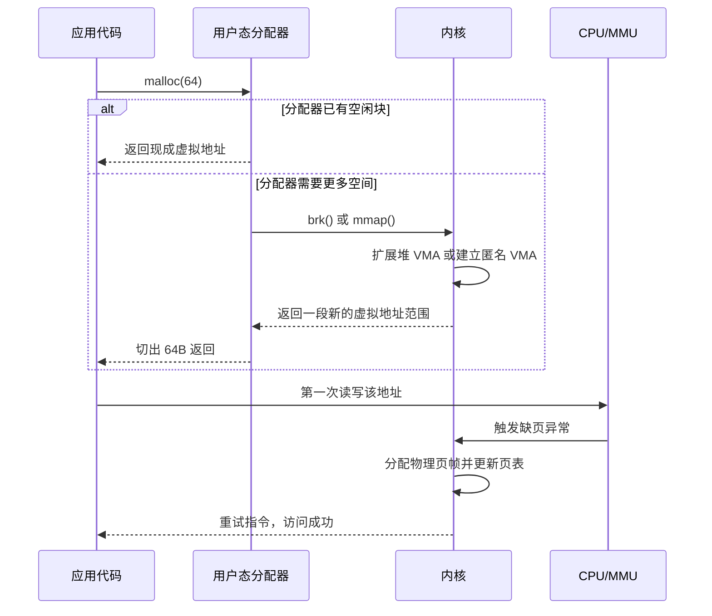

# 内存映射

- 写作时间：`2026-03-30`
- 当前字符：`5474`

上一课讲了虚拟内存的动态行为：按需分页延迟装入，缺页异常补页，页面替换腾空间。但那些讨论都站在内核的角度——"页怎么进来、怎么出去"。这一课切换到程序员的角度：`malloc(64)` 到底什么时候真的分到了内存？`mmap()` 返回地址后为什么还会缺页？进程明明申请成功了，为什么还会被 OOM 杀掉？

## mmap 与 VMA

内存映射(memory mapping)是在进程的虚拟地址空间中建立"一段虚拟地址范围对应什么后备对象、带什么权限"的机制。

`mmap()` 做的第一件事不是分配物理页，而是告诉内核：从某个虚拟地址开始，到某个长度结束，这段区域以后该按什么规则解释。这个"规则"在 Linux 里由 VMA(virtual memory area) 记录。分页一课在介绍 `mm_struct` 时已经见过它的名字，现在来看它的具体结构[^1]：

```c
// include/linux/mm_types.h (simplified)
struct vm_area_struct {
    unsigned long          vm_start;    // region start address
    unsigned long          vm_end;      // region end address (exclusive)
    pgoff_t                vm_pgoff;    // offset within the backing file (in pages)
    struct file           *vm_file;     // backing file, NULL for anonymous mapping
    vm_flags_t             vm_flags;    // permissions + behavior flags (VM_READ, VM_WRITE, VM_EXEC, VM_SHARED, ...)
};
```

一个 VMA 记录三类信息：**地址范围**（`vm_start` 到 `vm_end`）、**访问权限**（`vm_flags`）和**后备对象**（`vm_file`，如果是匿名映射则为 NULL）。进程地址空间中的每一段有意义的区域——代码段、数据段、堆、栈、共享库、文件映射——在内核里都表现为一个 VMA。

POSIX 接口层面，一次匿名映射长这样：

```c
void *p = mmap(NULL, 4096,
               PROT_READ | PROT_WRITE,
               MAP_PRIVATE | MAP_ANONYMOUS,
               -1, 0);
```

这行代码返回一个地址，但并不等于"立刻拿到了一张驻留在 RAM 中的物理页"。它只是建立了一个 VMA：长度 4096 字节、可读可写、私有、匿名。真正的物理页要等第一次访问 `p[0]` 时，才会在缺页异常路径里被补上——这正是上一课讲的按需分页。

## 匿名映射与堆增长

匿名映射(anonymous mapping)是不以普通文件为后备对象的映射，它通常承载堆、线程栈、共享内存段和大块动态分配。

从 C 程序的表面看，动态内存分配的接口是 `malloc()` 和 `free()`。但它们并不直接等于系统调用。用户态分配器（如 glibc 的 ptmalloc）在内核和应用之间多加了一层：



这条链中最关键的一刀是：**虚拟地址的分配**发生在 `brk()` 或 `mmap()` 建立 VMA 的时候，**物理页的分配**发生在第一次真正触碰页面的时候。两者通常不在同一时刻。

`brk()` 把程序的堆顶整体往高地址推，扩展一段连续的堆区域，适合由用户态分配器切成小块。`mmap()` 独立创建一段新的 VMA，不依附于堆边界，适合线程栈、大块 buffer 和文件映射。`free()` 通常也不会立刻把内存还给内核——用户态分配器先把地址记进空闲链表等待复用，只有整块都不再需要时才通过 `munmap()` 交还。

## 文件映射

文件映射(file-backed mapping)是以文件为数据来源的内存映射，进程对这段虚拟地址的访问会通过页缓存(page cache)与底层文件内容发生联系。

一旦后备对象从"匿名"变成"文件"，映射就不只是"给我一块新地址"，而是"把某个文件区间当作一段地址来访问"。访问尚未驻留的文件页时，缺页异常路径会把对应文件页装入页缓存，再把当前进程的页表项指向它。

这里最重要的区分是 `MAP_SHARED` 和 `MAP_PRIVATE`：

| 方式 | 读到的内容 | 写入后的去向 | 其他进程是否可见 |
|------|------------|--------------|------------------|
| `MAP_SHARED` | 文件当前内容 | 先改 page cache，之后回写到文件 | 可见 |
| `MAP_PRIVATE` | 文件当前内容 | 写入时触发写时复制，改到新的匿名页 | 不可见 |

`MAP_SHARED` 下多个进程的页表项指向同一组 page cache 页，修改可被彼此看到，最终回写文件。`MAP_PRIVATE` 复用了进程生命周期一课讲过的写时复制(COW)：初始共享只读页，写入时缺页异常分配私有副本，原文件内容不变。

这个区别直接决定了页面回收时的去路。干净的文件页可以直接丢弃（文件里有权威副本）；`MAP_SHARED` 的脏页需要先回写文件；`MAP_PRIVATE` 的脏页已经变成匿名页，回收时要走交换区。

## 地址空间布局

Linux 进程地址空间布局是把代码、数据、堆、映射区、栈以及内核保留区域按一定规则组织在同一套虚拟地址空间中的方式。

分段一节已经画过 text、data、BSS、heap、stack 的基本模型。在真实的 Linux 进程中，堆和栈之间还有一大片由 `mmap()` 管理的映射区，动态链接库、线程栈、文件映射和匿名大块内存都落在这里：

```text
高地址
┌──────────────────────────────┐
│          内核空间             │
├──────────────────────────────┤
│     主线程栈 / argv / env     │
│              ↓               │
├──────────────────────────────┤
│   线程栈 / 共享库 / 文件映射   │
│ 匿名映射 / 内核提供的辅助页   │
│        （mmap 区）            │
├──────────────────────────────┤
│            heap              │
│              ↑               │
├──────────────────────────────┤
│      .bss / .data / .text    │
└──────────────────────────────┘
低地址
```

地址空间随机化(ASLR, Address Space Layout Randomization)会在每次执行时打乱各区域的起点，但整体结构是稳定的。`/proc/<pid>/maps` 导出的就是这些 VMA 的清单。

## 交换

交换(swap)是在匿名页被回收时把其内容写到后备存储中，以便未来再次访问时能恢复的机制。

上一课讲页面替换时提到，内核必须挑一些页让出去。但不同类型的页，让出去的方式不同：

| 页类型 | 回收时的动作 |
|--------|-------------|
| 干净文件页 | 直接丢弃，需要时从文件重读 |
| 脏文件页 | 先回写文件，之后可回收 |
| 匿名页 | 写入交换区，之后可回收 |

交换区主要服务于匿名页——它们没有文件可以重读，所以必须先把当前内容保存到后备存储中才能释放物理页帧。`MAP_PRIVATE` 的脏页在写时复制后也变成了匿名页，同样走交换路径。

## OOM Killer 与内存 cgroup

OOM Killer(out-of-memory killer)是在回收和交换都无法满足内存需求时，由内核选择进程终止以恢复系统可运行状态的机制。

Linux 默认启用 overcommit：内核允许进程拿到的虚拟地址承诺超过实际物理资源，真正的硬约束到缺页、回收和交换阶段才暴露。当这些手段都不够时，程序可能在某次系统调用中收到 `ENOMEM`，或者在运行中被 OOM Killer 选中并杀掉。

cgroups 一章已经见过 `memory.max` 这类控制文件。内存 cgroup(memory cgroup, memcg) 为一组进程单独记账和限额。即使整台机器还有空闲内存，一个容器也可能因为自身 memcg 的上限已满而先触发回收，最终在组内发生 OOM。这是容器环境中最常见的"宿主机没满，进程却被杀"的原因。

## NUMA 内存策略

NUMA 内存策略(NUMA memory policy)是在多内存节点系统中，决定一个进程的页面优先从哪个节点分配的规则。

基础与概览一章介绍过 NUMA 的硬件背景：CPU 访问本地内存节点比远端节点快。最常见的默认策略是 first-touch：哪个 CPU 首先触碰某页，就优先从它所在的本地节点分配物理页帧，把"谁在算"和"数据在哪"尽量放近。

但 first-touch 不是唯一选择。有些工作负载希望把页面交错分布到多个节点（均衡带宽），有些进程则希望强制绑定在特定节点（稳定局部性）。一个常见的陷阱是：线程 A 在节点 0 上初始化了一个大数组，之后线程 B 到 H 在其他节点上并行处理这块数组。按 first-touch，这批页大部分落在节点 0，后续真正大量使用它们的线程反而要频繁跨节点访问远端内存。内存分配不只是"有没有空页"的问题，还是"页离 CPU 远不远"的拓扑问题。

## 小结

| 概念 | 说明 |
|------|------|
| `mmap()` | 在地址空间中建立映射关系，先建 VMA，物理页稍后按需进入 |
| VMA (`vm_area_struct`) | 记录一段虚拟地址范围的权限和后备对象 |
| 匿名映射 | 无文件后备的映射，承载堆、线程栈、大块 buffer |
| `brk()` | 移动堆顶扩展连续堆区 |
| 文件映射 | 把文件区间映射进地址空间，通过 page cache 访问 |
| `MAP_SHARED` / `MAP_PRIVATE` | 共享文件页 vs 写时复制到私有匿名页 |
| 交换 | 为匿名页提供后备存储 |
| OOM Killer | 回收和交换不足时终止进程 |
| 内存 cgroup | 按进程组单独记账和限额 |
| NUMA 内存策略 | 在多节点机器上决定页面优先从哪个内存节点分配 |

---

[^1]: [`include/linux/mm_types.h#L913`](https://github.com/torvalds/linux/blob/master/include/linux/mm_types.h#L913) — `struct vm_area_struct` 定义
