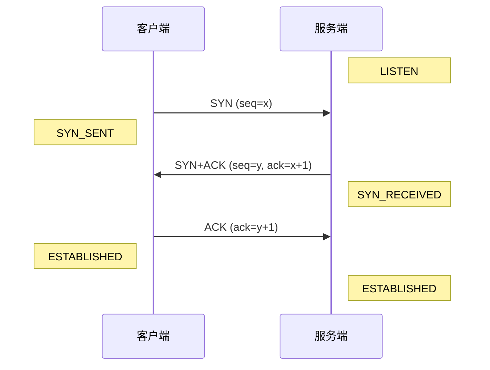
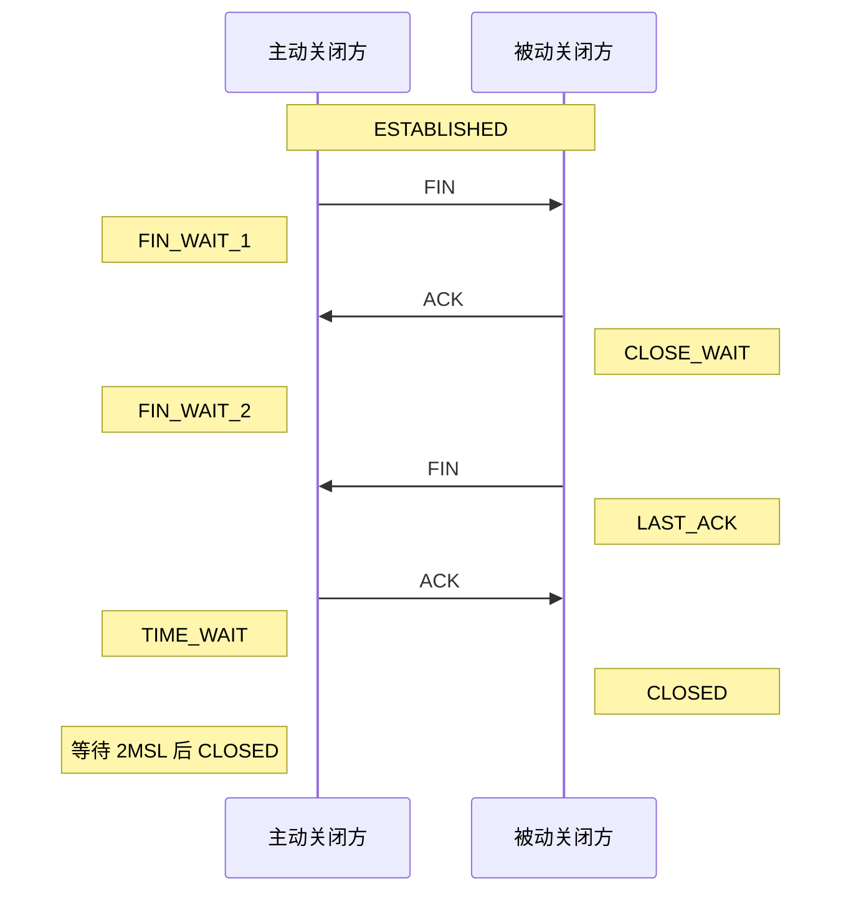

# Socket 与 TCP

- 写作时间：`2026-03-04 首次提交，2026-03-31 最近修改`
- 当前字符：`16372`

事件驱动并发一课中，我们用 `socket()`、`bind()`、`listen()`、`accept()` 四个函数写了 echo server 的多个版本，但当时的重心在并发模型上，socket API 本身只给了一句话的概括。这一课回到这些函数本身：它们做了什么，TCP 连接在建立和关闭过程中经历了哪些状态，内核在背后维护了哪些数据结构。

先从全局画面讲起。网络通信跨越多台机器，但从操作系统的角度看，问题最终归结为两件事：一是给应用程序提供一个统一的接口来收发数据（这就是 socket API），二是在内核中实现网络协议栈来支撑这个接口。

## TCP/IP 与内核

TCP/IP 模型(TCP/IP model)把网络通信分成四层。从操作系统的视角看，这四层有一条清晰的边界：应用层运行在用户空间，传输层、网络层和链路层由内核实现。

| 层 | 职责 | 运行位置 | 典型协议 |
|---|---|---|---|
| 应用层 | 定义数据的格式和含义 | 用户空间 | HTTP、DNS、SMTP |
| 传输层 | 端到端的可靠传输或不可靠传输 | 内核 | TCP、UDP |
| 网络层 | 主机之间的寻址和路由 | 内核 | IP |
| 链路层 | 物理介质上的帧传输 | 内核 + 网卡驱动 | Ethernet、Wi-Fi |

应用程序不直接操作 TCP 头部或 IP 路由表。它通过 socket API 告诉内核"我要连这个地址的这个端口，发这些字节"，内核负责把数据依次封装成 TCP 段、IP 包、以太网帧，通过网卡发出去。接收时过程相反：网卡收到帧后交给驱动程序，驱动程序把帧交给网络层解析 IP 头，网络层把数据交给传输层解析 TCP 头，传输层把有效载荷放入 socket 的接收缓冲区，应用程序调用 `read()` 取走数据。

这个分层结构和文件系统一课讲过的 VFS 有相似的设计思路：VFS 把 ext4、tmpfs、FUSE 等不同的文件系统统一成 `open()`/`read()`/`write()`/`close()` 接口，socket 层把 TCP、UDP、UNIX domain 等不同的通信协议统一成 `socket()`/`bind()`/`connect()`/`read()`/`write()` 接口。两者都是内核提供的抽象层，让应用程序用同一套 fd 操作不同的底层实现。

## Socket API

套接字(socket)是内核提供的通信端点。从应用程序的角度看，socket 就是一个 fd：创建后可以用 `read()`/`write()` 收发数据，用完后 `close()` 关闭，操作方式和普通文件一样。

创建 socket 的系统调用：

```c
#include <sys/socket.h>

int socket(int domain, int type, int protocol);
```

三个参数分别指定地址族(address family)、套接字类型(socket type)和协议。

地址族决定了通信的范围。`AF_INET` 用于 IPv4 网络通信，地址由 IP 地址加端口号组成。`AF_INET6` 用于 IPv6 网络通信，地址格式更长但用法相同。`AF_UNIX`（也叫 `AF_LOCAL`）用于同一台机器上的进程间通信，地址是一个文件路径，数据不经过网络协议栈，内核直接在发送方和接收方的缓冲区之间复制。`AF_UNIX` 是下一课的主角。

套接字类型决定了通信的语义。`SOCK_STREAM` 提供面向连接的字节流(byte stream)：通信双方先建立连接，之后发送的数据保证按序到达、不丢失、不重复。在 `AF_INET` 下，`SOCK_STREAM` 底层使用 TCP 协议。`SOCK_DGRAM` 提供无连接的数据报(datagram)：每次发送一个独立的消息，消息之间互不关联，可能乱序、丢失或重复。在 `AF_INET` 下，`SOCK_DGRAM` 底层使用 UDP 协议。`SOCK_RAW` 是原始套接字(raw socket)，允许应用程序直接构造和解析网络层数据包，通常用于网络诊断工具（如 `ping` 使用 `SOCK_RAW` 发送 ICMP 报文）。

`SOCK_STREAM` 和 `SOCK_DGRAM` 有一个容易混淆的区别：消息边界(message boundary)。TCP 是字节流协议，发送方连续调用两次 `write()`，一次写 40 字节、一次写 60 字节，接收方可能一次 `read()` 就读到全部 100 字节，也可能三次 `read()` 分别读到 30、50、20 字节。TCP 只保证字节的顺序不变，不保留 `write()` 调用的边界。UDP 正好相反：发送方发一个 40 字节的数据报和一个 60 字节的数据报，接收方一定分两次收到，每次完整收到一个。

创建 socket 后，服务端和客户端走不同的流程。事件驱动并发一课的 echo_thread.c 已经展示过服务端的完整代码：`socket()` → `bind()` → `listen()` → `accept()`。这里梳理每一步的作用。

`bind()` 把 socket 绑定到一个具体的地址和端口。服务端需要绑定一个已知端口（比如 HTTP 服务用 80 端口），这样客户端才知道该往哪里连。客户端通常不需要调用 `bind()`，内核会在 `connect()` 时自动分配一个临时端口(ephemeral port)，范围通常是 32768 到 60999。

`listen()` 把 socket 从主动状态切换到被动状态，表示这个 socket 准备接受连接而不是发起连接。它的第二个参数 `backlog` 指定了内核维护的连接队列长度。当多个客户端同时发起连接时，已完成三次握手但还没被 `accept()` 取走的连接会在这个队列中排队。如果队列满了，新的连接请求会被丢弃。

`accept()` 从连接队列中取出一个已完成握手的连接，为它创建一个新的 socket，返回新 socket 的 fd。原来那个监听 socket 不受影响，继续接受后续的连接请求。这就是 echo_thread.c 中 `server_fd` 和 `accept()` 返回的 `client_fd` 是两个不同 fd 的原因：`server_fd` 是监听 socket，负责接受新连接；`client_fd` 是数据 socket，负责和某个具体客户端通信。

客户端的流程要简单得多：`socket()` 创建 socket，然后 `connect()` 发起连接。`connect()` 会触发 TCP 三次握手（下一节详细讨论），成功返回时连接已经建立，之后就可以用 `read()`/`write()` 收发数据了。下面是一个与 echo server 配合使用的 TCP 客户端：

<<< @/network/code/tcp_client.c

运行前需要先启动事件驱动并发一课的任意一个 echo server（端口 9000）。客户端连接后发送一条消息，读回回显数据，然后关闭连接。流程是 `socket()` → `connect()` → `write()` → `read()` → `close()`。

```
服务端                              客户端
socket()                           socket()
   │                                  │
bind()  绑定地址和端口                  │
   │                                  │
listen()  开始监听                     │
   │                                  │
accept()  等待连接    ←──────────   connect()  发起连接
   │                                  │
read()/write()  ←─ 数据交换 ─→  read()/write()
   │                                  │
close()                             close()
```

## TCP 连接管理

TCP 连接从建立到关闭，经历一系列明确的状态。理解这些状态对调试网络问题很重要：当你用 `ss` 看到大量 `TIME_WAIT` 或 `CLOSE_WAIT` 的连接时，需要知道它们是什么意思、是不是正常的。

### 三次握手

TCP 的连接建立通过三次握手(three-way handshake)完成。客户端调用 `connect()` 时，内核自动执行这个过程：



第一步，客户端发送一个 SYN（synchronize）报文，携带一个初始序列号(initial sequence number) x，表示"我想建立连接"。客户端进入 SYN_SENT 状态。

第二步，服务端收到 SYN 后，回复一个 SYN+ACK 报文：SYN 部分携带服务端的初始序列号 y，表示"我也同意建立连接"；ACK 部分确认了客户端的序列号（确认号为 x+1），表示"你的 SYN 我收到了"。服务端进入 SYN_RECEIVED 状态。

第三步，客户端收到 SYN+ACK 后，发送一个 ACK 报文确认服务端的序列号（确认号为 y+1）。至此双方都进入 ESTABLISHED 状态，连接建立完成。`connect()` 在客户端返回，`accept()` 在服务端返回。

为什么需要三次握手，两次不行吗？假设只有两步：客户端发 SYN，服务端回 SYN+ACK 就认为连接建立了。问题在于：客户端之前可能发过一个 SYN，因为网络延迟滞留在路上，后来超时又重新发了一个新的 SYN。如果那个旧 SYN 过了很久才到达服务端，服务端会把它当成一个新的连接请求，分配资源并回复 SYN+ACK。但客户端根本不知道这个"幽灵连接"的存在，服务端的资源就白白浪费了。三次握手的第三步让服务端在收到客户端的最终确认后才真正建立连接，过滤掉了这种过期请求。

### 四次挥手

TCP 连接的关闭通过四次挥手(four-way handshake)完成。任何一方都可以主动关闭，调用 `close()` 时内核自动发起这个过程：



主动关闭方发送 FIN（finish），表示"我不再发送数据了"，进入 FIN_WAIT_1 状态。被动关闭方收到 FIN 后回复 ACK 表示确认，进入 CLOSE_WAIT 状态。此时被动关闭方可能还有数据没发完，所以它并不马上关闭，而是继续发送剩余数据。等被动关闭方也发完了数据，它也发送 FIN，进入 LAST_ACK 状态。主动关闭方收到这个 FIN 后回复最后一个 ACK，进入 TIME_WAIT 状态。

为什么关闭需要四次而不是像建立那样三次？因为 TCP 是全双工(full-duplex)的：两个方向的数据流独立运作。一方发送 FIN 只关闭了自己方向的数据流，另一方仍然可以继续发送数据。所以每个方向各需要一个 FIN 和一个 ACK，总共四步。

### TIME_WAIT

主动关闭方在发送最后一个 ACK 后不会立即进入 CLOSED 状态，而是在 TIME_WAIT 状态停留一段时间。Linux 的等待时间是 60 秒，由内核常量 `TCP_TIMEWAIT_LEN` 定义[^1]。

TIME_WAIT 的存在有两个原因。

第一个原因是保证连接的可靠关闭。如果主动关闭方发送的最后一个 ACK 在网络上丢失了，被动关闭方收不到 ACK，就会重传它的 FIN。如果主动关闭方已经进入 CLOSED 状态，这个重传的 FIN 就没有人处理了，被动关闭方会一直重传直到超时，连接无法干净地关闭。TIME_WAIT 让主动关闭方在这段时间内仍然能接收并回复重传的 FIN。

第二个原因是防止旧连接的数据包干扰新连接。TCP 连接由四元组(4-tuple)标识：源 IP、源端口、目标 IP、目标端口。如果主动关闭方立即关闭后马上建立一个新连接，恰好使用了相同的四元组，旧连接中还在网络上传输的延迟数据包可能被新连接收到，导致数据混乱。TIME_WAIT 等待足够长的时间，确保旧连接的所有数据包都已过期消失。

在高并发短连接的场景下，TIME_WAIT 状态的连接会快速积累。可以用 `ss` 查看：

```console
$ ss -tan state time-wait
State      Recv-Q  Send-Q  Local Address:Port   Peer Address:Port
TIME-WAIT  0       0       127.0.0.1:9000       127.0.0.1:54312
TIME-WAIT  0       0       127.0.0.1:9000       127.0.0.1:54318
```

这通常不是异常。TIME_WAIT 是 TCP 的正常行为，每个处于 TIME_WAIT 的连接占用的内核内存很少（约 168 字节）。但如果你重启服务器后发现 `bind()` 失败并报错 `EADDRINUSE`（address already in use），通常就是因为旧进程的连接还处于 TIME_WAIT 状态。这种情况用 `SO_REUSEADDR` 选项解决，后面马上会讲。

:::thinking CLOSE_WAIT 积累意味着什么？
`ss` 中出现大量 TIME_WAIT 是 TCP 协议的正常现象，但大量 CLOSE_WAIT 几乎总是应用程序的 bug。

CLOSE_WAIT 表示"对方已经关闭了连接（发来了 FIN），但我方还没有调用 `close()`"。正常情况下，应用程序在 `read()` 返回 0（表示对端关闭）后应该尽快关闭自己的 socket。如果 CLOSE_WAIT 持续积累，说明应用程序没有正确处理连接关闭的逻辑，socket fd 在泄漏。

两者的区别在于：TIME_WAIT 无论代码写得多好都会出现，它是协议机制的一部分；CLOSE_WAIT 是应用程序忘了关 socket 的结果。如果你在排查连接泄漏问题，先看 CLOSE_WAIT 的数量，这比看 TIME_WAIT 有效得多。
:::

## 内核数据结构

应用程序调用 `socket()` 拿到一个 fd，但在内核中，一个网络连接涉及三层数据结构。`struct socket` 对接 VFS 层，`struct sock` 承载传输协议的状态，`struct sk_buff` 表示在内核中流动的数据包。

### struct socket

`struct socket` 是 BSD socket 层的核心结构，定义在 `include/linux/net.h` 中[^2]。它把网络连接接入了 VFS 体系：

```c
// include/linux/net.h (simplified)
struct socket {
    socket_state            state;    // SS_UNCONNECTED / SS_CONNECTED / ...
    short                   type;     // SOCK_STREAM / SOCK_DGRAM / SOCK_RAW
    struct file            *file;     // 指向 VFS 的 struct file
    struct sock            *sk;       // 指向传输层的 struct sock
    const struct proto_ops *ops;      // 协议操作表（bind / connect / accept / ...）
};
```

文件系统一课讲过，进程通过 fd 表找到 `struct file`，`struct file` 中的 `f_op` 指向操作函数表。socket 的 `struct file` 使用的是 `socket_file_ops`，它把 `read` 和 `write` 操作转发到 socket 的 `recvmsg` 和 `sendmsg`。这就是 `read()`/`write()` 能直接操作 socket fd 的原因：VFS 层看到的是一个普通的 `struct file`，但背后的操作函数指向了网络协议栈。

`ops` 是协议操作表，类型为 `struct proto_ops`。不同的地址族有不同的操作表：`AF_INET` 的 TCP 使用 `inet_stream_ops`，UDP 使用 `inet_dgram_ops`，`AF_UNIX` 使用 `unix_stream_ops`。当应用程序调用 `connect()` 时，内核最终调用 `socket->ops->connect()`，由具体协议的实现来处理。

### struct sock

`struct sock` 是传输层的核心结构，定义在 `include/net/sock.h` 中[^3]。它存储了一个连接的完整传输状态：

```c
// include/net/sock.h (simplified)
struct sock {
    struct sock_common  __sk_common;     // 哈希表节点、引用计数
    struct sk_buff_head sk_receive_queue; // 接收队列
    struct sk_buff_head sk_write_queue;   // 发送队列
    int                 sk_rcvbuf;        // 接收缓冲区大小上限
    int                 sk_sndbuf;        // 发送缓冲区大小上限
    struct proto       *sk_prot;          // 协议操作（tcp_prot / udp_prot）
    wait_queue_head_t   sk_wq;            // 等待队列
    // ...
};
```

`sk_receive_queue` 和 `sk_write_queue` 分别是接收和发送数据的队列，队列中存储的元素是 `sk_buff`（下面会讲）。`sk_wq` 是等待队列，调度一课讲过这个机制：当应用程序调用 `read()` 但接收队列为空时，内核把线程挂到 `sk_wq` 上睡眠；网络数据到达后，内核把数据放入 `sk_receive_queue`，然后唤醒 `sk_wq` 上的线程。事件驱动并发一课的 epoll 也利用了这个等待队列：epoll 通过 `ep_poll_callback` 回调函数注册到 socket 的等待队列上，数据到达时回调被触发，对应的 `epitem` 被加入就绪链表。

TCP 连接还有一个更具体的结构 `struct tcp_sock`，它通过 C 语言结构体嵌套的方式扩展了 `struct sock`，增加了 TCP 特有的字段：序列号、确认号、拥塞窗口、重传定时器等。继承链是 `tcp_sock` → `inet_connection_sock` → `inet_sock` → `sock`，每一层添加对应协议层的状态。

### struct sk_buff

`struct sk_buff`（通常缩写为 skb）是内核中表示一个网络数据包的结构，定义在 `include/linux/skbuff.h` 中[^4]。每个收到的包和每个待发送的包都用一个 skb 表示：

```c
// include/linux/skbuff.h (simplified)
struct sk_buff {
    struct sk_buff      *next, *prev;  // 链表指针（用于挂在收发队列中）
    struct sock         *sk;           // 所属的 socket
    unsigned char       *head;         // 缓冲区起始
    unsigned char       *data;         // 有效数据起始
    unsigned char       *tail;         // 有效数据结束
    unsigned char       *end;          // 缓冲区结束
    unsigned int         len;          // 有效数据长度
    // ...
};
```

skb 的设计解决了一个效率问题。一个数据包在内核中从链路层往上传递到传输层时，每一层需要去掉自己的头部（以太网头 → IP 头 → TCP 头）。如果每次都把有效载荷复制到新的缓冲区，开销会很大。skb 的做法是把数据留在原地，只移动 `data` 指针：链路层处理完后把 `data` 往后移过以太网头的长度，这样 `data` 就指向了 IP 头的起始位置；网络层处理完后再往后移过 IP 头，`data` 指向 TCP 头；传输层再移过 TCP 头，`data` 指向应用层载荷。发送时过程相反：每一层往前移 `data` 指针，在现有数据前面添加自己的头部。数据始终在同一块内存中，只是 `data` 指针在移动。

```
接收方向（剥离头部）：data 指针向后移动

┌──────┬──────┬──────┬─────────┬───────┐
│      │ ETH  │  IP  │   TCP   │payload│
└──────┴──────┴──────┴─────────┴───────┘
 head    data                     tail    链路层：data 指向以太网头

┌──────┬──────┬──────┬─────────┬───────┐
│      │ ETH  │  IP  │   TCP   │payload│
└──────┴──────┴──────┴─────────┴───────┘
 head           data              tail    网络层：data 跳过以太网头，指向 IP 头

┌──────┬──────┬──────┬─────────┬───────┐
│      │ ETH  │  IP  │   TCP   │payload│
└──────┴──────┴──────┴─────────┴───────┘
 head                  data       tail    传输层：data 跳过 IP 头，指向 TCP 头
```

三层结构的关系：进程通过 fd 找到 `struct file`，`struct file` 通过 `private_data` 找到 `struct socket`，`struct socket` 通过 `sk` 指针找到 `struct sock`，`struct sock` 的收发队列中挂着 `struct sk_buff` 链表。

## Socket 选项

`setsockopt()` 和 `getsockopt()` 用于设置和查询 socket 选项：

```c
int setsockopt(int sockfd, int level, int optname,
               const void *optval, socklen_t optlen);
```

`level` 指定选项所属的协议层（`SOL_SOCKET` 表示通用 socket 层，`IPPROTO_TCP` 表示 TCP 层），`optname` 是具体的选项名称。下面介绍几个在实际开发中最常用的选项。

### SO_REUSEADDR

上面讲 TIME_WAIT 时提到，重启服务器后 `bind()` 可能因为旧连接仍处于 TIME_WAIT 而失败，报 `EADDRINUSE` 错误。`SO_REUSEADDR` 允许新的 socket 绑定到仍处于 TIME_WAIT 状态的地址和端口上：

```c
int opt = 1;
setsockopt(fd, SOL_SOCKET, SO_REUSEADDR, &opt, sizeof(opt));
```

几乎所有 TCP 服务器都应该在 `bind()` 之前设置这个选项。不设置的话，服务器每次重启都要等 TIME_WAIT 过期（60 秒）才能绑定成功。回头看 echo_thread.c，它没有设置 `SO_REUSEADDR`，所以快速重启时会遇到 `bind()` 失败的问题。

### TCP_NODELAY

TCP 默认启用了 Nagle 算法(Nagle's algorithm)。它的逻辑是：如果发送方有少量数据要发送（比如只有几个字节），并且之前发送的数据还没收到 ACK，Nagle 算法就不立即发送这些小数据，而是等到 ACK 到达或者攒够一个完整的 TCP 段再发。这样做减少了网络上小包的数量，提高了带宽利用率。

但对于延迟敏感的应用（如远程终端、在线游戏、实时 API），这种等待是不可接受的。用户按一个键，如果 Nagle 算法把这几个字节的数据攒着不发，用户就会感到明显的输入延迟。`TCP_NODELAY` 选项禁用 Nagle 算法，让每次 `write()` 都尽快发送：

```c
int opt = 1;
setsockopt(fd, IPPROTO_TCP, TCP_NODELAY, &opt, sizeof(opt));
```

### SO_SNDBUF 与 SO_RCVBUF

这两个选项分别设置 socket 的发送缓冲区和接收缓冲区大小。内核实际分配的大小是设置值的两倍，因为需要为 skb 的元数据预留空间[^5]。

```c
int size = 256 * 1024;  // 256 KB
setsockopt(fd, SOL_SOCKET, SO_SNDBUF, &size, sizeof(size));
setsockopt(fd, SOL_SOCKET, SO_RCVBUF, &size, sizeof(size));
```

缓冲区大小影响吞吐量。TCP 的理论最大吞吐量受带宽延迟积(Bandwidth-Delay Product, BDP)限制。BDP 等于链路带宽乘以往返时间(Round-Trip Time, RTT)。以一条带宽 1Gbps、RTT 100ms 的跨洋链路为例，BDP = 1Gbps × 100ms = 12.5MB。如果发送缓冲区小于 12.5MB，发送方在缓冲区填满后就必须停下来等待 ACK，无法把链路带宽用满。

Linux 默认启用了缓冲区自动调节(autotuning)，内核会根据网络状况动态调整缓冲区大小。`net.ipv4.tcp_rmem` 和 `net.ipv4.tcp_wmem` 这两个 sysctl 参数控制了自动调节的范围，格式是"最小值 默认值 最大值"：

```console
$ sysctl net.ipv4.tcp_rmem
net.ipv4.tcp_rmem = 4096  131072  6291456
```

在大多数场景下自动调节已经够用，不需要手动设置 `SO_SNDBUF`/`SO_RCVBUF`。但如果你的应用场景需要在高延迟链路上传输大量数据，并且观察到吞吐量明显低于链路带宽，可以考虑增大 `tcp_rmem`/`tcp_wmem` 的最大值。

## TCP 拥塞控制

TCP 拥塞控制(congestion control)是 TCP 协议中管理数据发送速率的机制，目的是避免发送方向网络注入过多数据导致路由器丢包。

如果每个 TCP 连接都不加节制地发送数据，网络中的路由器缓冲区会被填满，开始丢包。丢包触发重传，重传的数据加剧拥塞，更多的包被丢弃，形成恶性循环。1986 年互联网就发生过这样的拥塞崩溃(congestion collapse)：网络吞吐量骤降到正常水平的千分之一。Van Jacobson 随后提出了 TCP 拥塞控制的基本框架 [Jacobson 1988]。

拥塞控制的核心概念是拥塞窗口(congestion window, cwnd)。发送方在任意时刻能发送的未确认数据量不能超过 cwnd。cwnd 的值由拥塞控制算法动态调整：网络通畅时增大 cwnd 以提高吞吐量，检测到拥塞时缩小 cwnd 以减轻负载。cwnd 与接收方通告的接收窗口(receive window, rwnd)共同决定了实际的发送窗口：发送方取两者中的较小值作为自己的发送上限。

### Reno

TCP Reno 是经典的拥塞控制算法，它把一个 TCP 连接的生命周期分成几个阶段。

连接刚建立时进入慢启动(slow start)阶段：cwnd 从一个较小的值（Linux 默认是 10 个最大段大小(Maximum Segment Size, MSS)）开始，每收到一个 ACK 就把 cwnd 增加一个 MSS。因为一轮 RTT 内收到的 ACK 数量和 cwnd 成正比，所以 cwnd 实际上在指数增长。这个阶段叫"慢启动"并不是因为增长慢，而是因为它从一个很小的窗口开始，相对于一开始就用满带宽而言是"慢"的。

当 cwnd 增长到慢启动阈值(slow start threshold, ssthresh)时，算法切换到拥塞避免(congestion avoidance)阶段：cwnd 改为线性增长，每经过一个 RTT 增加一个 MSS。增长速度放慢，小心地探测网络的承载极限。

如果发送方连续收到三个相同序列号的重复 ACK，Reno 判定有数据包丢失，执行快速重传(fast retransmit)：立即重发丢失的包，不等超时定时器触发。然后进入快速恢复(fast recovery)：cwnd 减半并从新值开始线性增长，而不是回到初始值重新慢启动。

Reno 的本质是通过丢包来推测拥塞：不丢包就继续加速，丢了包就减半。在高带宽、高延迟的网络上，这个策略的问题很突出。cwnd 减半后需要很多个 RTT 才能重新爬升到原来的水平，而每个 RTT 可能就是几十甚至上百毫秒。链路越长、带宽越大，恢复得越慢。

### CUBIC

CUBIC 是 Linux 自 2.6.19 以来的默认拥塞控制算法。它针对高 BDP 网络做了优化，用一个三次函数(cubic function)来决定 cwnd 的增长方式。三次函数的形状使得 cwnd 在远离上次丢包时的值时快速增长，在接近时放慢速度。增长曲线呈 S 形：先快后慢再快。这让 CUBIC 在高 BDP 网络上能更快地利用可用带宽，同时在接近拥塞点时更谨慎。

### BBR

BBR(Bottleneck Bandwidth and Round-trip propagation time)是 Google 在 2016 年提出的拥塞控制算法，思路和 Reno、CUBIC 完全不同。

Reno 和 CUBIC 都是基于丢包的(loss-based)：它们把丢包当作拥塞的信号。但丢包是一个滞后的信号。路由器有缓冲区，数据包先在缓冲区排队，缓冲区满了才开始丢包。这意味着在丢包发生时，路由器缓冲区已经被塞满了，RTT 已经因为排队延迟而显著增加了，拥塞已经很严重了。基于丢包的算法总是在拥塞发生之后才做出反应。

BBR 是基于模型的(model-based)：它直接测量瓶颈带宽(bottleneck bandwidth)和最小 RTT(round-trip propagation time)这两个网络参数，然后据此计算最优的发送速率。BBR 的目标是让发送速率等于瓶颈带宽，同时不填满路由器缓冲区。不填满缓冲区意味着不产生排队延迟，RTT 保持在最小值附近。

可以用 `ss -ti` 查看当前连接使用的拥塞控制算法和 cwnd 值：

```console
$ ss -ti dst 93.184.216.34
State  Recv-Q  Send-Q  Local Address:Port  Peer Address:Port
ESTAB  0       0       10.0.0.1:54312      93.184.216.34:80
     cubic wscale:7,7 rto:204 rtt:1.5/0.75 cwnd:10 send 77.9Mbps ...
```

`sysctl` 可以查看和切换系统默认的拥塞控制算法：

```console
$ sysctl net.ipv4.tcp_congestion_control
net.ipv4.tcp_congestion_control = cubic

$ sysctl net.ipv4.tcp_available_congestion_control
net.ipv4.tcp_available_congestion_control = reno cubic
```

## 小结

这一课从事件驱动并发一课引出的 socket API 出发，逐层深入到了 TCP 协议的内部。

Socket 把网络通信抽象成了 fd 操作：`socket()` 创建端点，`bind()`/`listen()`/`accept()` 构成服务端流程，`connect()` 构成客户端流程，`read()`/`write()` 收发数据。内核通过 `struct socket` → `struct sock` → `struct sk_buff` 三层结构支撑了这个抽象。TCP 连接的建立（三次握手）和关闭（四次挥手）经过一系列明确的状态转换，其中 TIME_WAIT 是正常的协议行为，CLOSE_WAIT 则通常意味着应用程序有 bug。Socket 选项（`SO_REUSEADDR`、`TCP_NODELAY`、`SO_SNDBUF`/`SO_RCVBUF`）让应用程序能调整 TCP 的行为以适应不同场景。拥塞控制算法在更高的层面上管理发送速率：Reno 和 CUBIC 基于丢包反馈，BBR 基于带宽和延迟的直接测量。

下一课讨论同一台机器上的进程间通信。AF_UNIX socket 是其中一种方式，但管道和共享内存在特定场景下有各自的优势。怎么在它们之间做选择，是下一课要回答的问题。

---

## 参考文献

- [Jacobson 1988] Van Jacobson. "Congestion Avoidance and Control." *ACM SIGCOMM Computer Communication Review*, 18(4), 1988.

---

[^1]: `TCP_TIMEWAIT_LEN` 定义在 [`include/net/tcp.h`](https://github.com/torvalds/linux/blob/master/include/net/tcp.h) 中，值为 `60*HZ`（60 秒）。严格来说这不是 2MSL（RFC 793 定义 MSL 为 2 分钟），而是 Linux 选择的一个实用值。

[^2]: [`include/linux/net.h`](https://github.com/torvalds/linux/blob/master/include/linux/net.h) — `struct socket` 定义

[^3]: [`include/net/sock.h`](https://github.com/torvalds/linux/blob/master/include/net/sock.h) — `struct sock` 定义

[^4]: [`include/linux/skbuff.h`](https://github.com/torvalds/linux/blob/master/include/linux/skbuff.h) — `struct sk_buff` 定义

[^5]: `net/core/sock.c` 中的 `sock_setsockopt()` 实现会把 `SO_SNDBUF` 设置的值乘以 2。注释说明这是为了给 skb 元数据预留空间。
