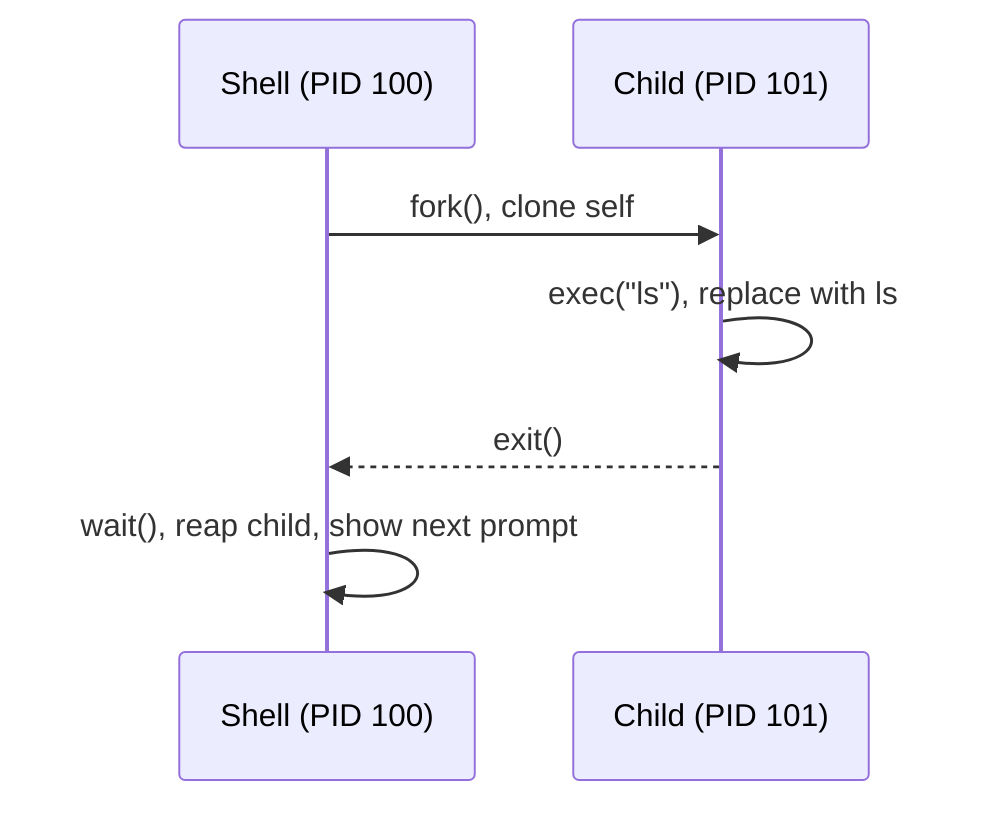

# 进程生命周期

上一章最后几课把镜头停在用户态和内核态的边界线上：用户程序怎样通过系统调用进入内核，硬件事件又怎样通过异常和中断把控制权交回内核。现在我们把镜头从“怎样越过边界”再往前推一步：当这条边界已经建立好之后，内核怎样把用户态世界真正拉起来，进程又怎样从创建一路走到退出？这正是进程管理这一章要回答的问题。

机器启动后，内核不会直接执行 `ls` 这样的用户命令。它会先完成自身初始化，然后启动第一个用户态进程，也就是进程标识符(Process ID, PID) 为 1 的进程。这个进程继续把用户空间逐步建立起来：启动系统服务、准备登录环境、让 shell 出现在终端里等待输入。直到这时，我们敲下 `ls -l`，shell 才开始为这个命令创建和回收子进程。

整条链路可以先记成：`kernel -> PID 1 -> 登录程序 -> shell -> ls`。

当 shell 启动一个普通命令时，它不能直接"变成" `ls`。进程模型决定了它需要三步：

1. 复制自己（fork）
2. 让副本变成 ls（exec）
3. 等 ls 执行完（wait）



再看 `ls | grep .zig`，两个命令同时运行，`ls` 的输出直接流入 `grep` 的输入。连接它们的是**文件描述符与管道**。

这三步加上连接它们的机制，就是本篇的全部内容。先有**进程**这个管理单位，内核才能记录"谁在运行、谁是谁的父子、谁占了哪些资源"。系统要把用户空间拉起来，就必须先启动**第一个用户态进程**，也就是 PID 1。shell 自己也是普通进程，所以它要启动新命令，仍然要通过 **fork** 复制出一个子进程，再用 **exec** 把这个副本替换成目标程序。目标程序结束后，父进程必须用 **wait** 回收它，否则系统里就会留下僵尸。进程不仅要被创建和回收，还要接到终端、文件和其他进程上，这就引出了**文件描述符与管道**。

这一章会沿着同一条主线继续往前走。本课先看单个进程怎样被创建、替换和回收。只要系统里同时存在多个进程，它们就会彼此打断，这就引出了**信号**。多个相关进程要作为一个整体和终端交互，于是有了**进程组与会话**。进程越来越多时，内核还必须决定谁先运行，这就是**CPU 调度**和 **Linux 调度器**要解决的问题。等"单个进程怎么活"和"多个进程怎么共存"都讲清楚之后，我们再进入**命名空间**和 **cgroups**，看 Linux 怎样隔离和限制整组进程。

## 进程

进程(process)是程序的一次运行实例。程序(program)是磁盘上的一个文件（比如 `/usr/bin/ls`），它是静态的，只有代码和初始数据。同一个程序可以同时运行多次，每次运行产生一个独立的进程，各自拥有独立的地址空间、文件描述符表和运行状态。打开两个终端分别运行 `vim`，就是两个进程在执行同一个 `/usr/bin/vim` 程序。

程序只有代码和数据，进程还需要内核为它维护运行时状态（当前执行到哪一行、打开了哪些文件、分配了多少内存……）。这些状态存放在哪里？内核要怎么描述"一个正在运行的程序"？这就引出进程控制块。

进程控制块(PCB, Process Control Block)是操作系统为每个进程维护的数据结构，记录进程的全部运行时状态。Linux 的 PCB 叫 `task_struct`，定义在 `include/linux/sched.h`。

命名为 `task` 而非 `process`，是因为 **Linux 内核不区分进程和线程，只有一个统一概念：task（任务）**。每个可调度的执行单元，无论"进程"还是"线程"，都是一个 `task_struct`。两者的区别仅在于 `clone()` 时传的标志位决定共享多少资源：

| 创建方式 | 地址空间 | 文件描述符表 | 通常叫做 |
|----------|----------|-------------|---------|
| `fork()` / `clone(无共享标志)` | 复制 | 复制 | 进程 |
| `clone(CLONE_VM \| CLONE_FILES \| CLONE_THREAD \| ...)` | 共享 | 共享 | 线程 |

真实的 `task_struct` 有几百个字段，下面是简化到核心字段的版本：

```c
// include/linux/sched.h (simplified)
struct task_struct {
    /* ---- Identity ---- */
    pid_t                   pid;            // task ID (unique per task, including threads)
    pid_t                   tgid;           // thread group ID (shared by all threads in a process)

    /* ---- State ---- */
    unsigned int            __state;        // TASK_RUNNING / TASK_INTERRUPTIBLE / TASK_DEAD / ...
    int                     exit_code;      // exit code, read by wait()

    /* ---- CPU Context ---- */
    struct thread_struct    thread;         // registers, stack pointer; saved/restored on context switch

    /* ---- Scheduling ---- */
    int                     prio;           // dynamic priority
    const struct sched_class *sched_class;  // scheduler class (CFS / RT / Deadline)
    struct sched_entity     se;             // CFS scheduling entity (contains vruntime)

    /* ---- Memory ---- */
    struct mm_struct        *mm;            // virtual address space (page tables, VMAs); NULL for kernel threads

    /* ---- Files ---- */
    struct files_struct     *files;         // file descriptor table
    struct fs_struct        *fs;            // working directory, root directory

    /* ---- Credentials ---- */
    const struct cred       *cred;          // uid / gid / capabilities

    /* ---- Signals ---- */
    struct signal_struct    *signal;        // signal handlers, pending signal queue

    /* ---- Family Relationships ---- */
    struct task_struct      *parent;        // parent process
    struct list_head        children;       // children list
    struct list_head        sibling;        // sibling list (linked to parent's children)

    /* ---- Isolation & Resource Limits ---- */
    struct nsproxy          *nsproxy;       // Namespace (PID/Mount/Network/UTS/IPC)
    struct css_set          *cgroups;       // cgroup set this task belongs to
};
```

:::expand pid 与 tgid
由于 Linux 的 task 模型，线程也是 task，每个 task 都有自己的 `pid`。但 POSIX 要求同一进程的所有线程调用 `getpid()` 返回相同值，因此引入了 `tgid`：

```
进程（主线程）: pid=100, tgid=100
  ├── 线程 1:   pid=101, tgid=100
  └── 线程 2:   pid=102, tgid=100
```

| 用户态 API | 返回的内核字段 | 含义 |
|-----------|--------------|------|
| `getpid()` | `tgid` | 进程 ID（线程组共享） |
| `gettid()` | `pid` | 线程 ID（每个 task 唯一） |
:::

**进程 = 代码 + 数据 + 内核为它维护的所有状态**。`task_struct` 就是内核对"一个正在运行的程序"的完整描述。后续章节涉及的信号、调度、namespace 等概念，都对应这个结构体中的具体字段。

`task_struct` 描述了内核怎么追踪进程，但进程自己的内存长什么样？每个进程拥有独立的虚拟地址空间(virtual address space)，内核通过页表(page table)保证进程之间互相看不到对方的内存：

```
High Address
┌──────────────────┐
│      Stack       │ ← local vars, call frames, grows down
│        ↓         │
│                  │
│        ↑         │
│       Heap       │ ← dynamic alloc (malloc/Zig allocator), grows up
├──────────────────┤
│ Uninitialized    │ ← BSS (globals, zero-initialized)
│ Data (BSS)       │
├──────────────────┤
│ Initialized      │ ← Data (globals, initialized)
│ Data (Data)      │
├──────────────────┤
│   Text (Code)    │ ← executable instructions, read-only
└──────────────────┘
Low Address
```

`fork()` 创建子进程时，会复制这整个地址空间（通过 Copy-on-Write 优化，实际只复制页表，不复制物理内存，后文 fork 一节详述）。

进程从创建到销毁还会经历若干状态。关键的转换：

```
              fork()
                │
                ▼
          ┌───────────┐  scheduled   ┌───────────┐
          │   Ready   │ ──────────→  │  Running  │
          │           │              │           │
          │           │  ←────────── │           │
          └───────────┘  time slice  └─────┬─────┘
                          expired      │       │
                               wait    │       │ exit()
                              for I/O  │       │
                                       ▼       ▼
                                 ┌───────────┐ ┌───────────┐
                                 │ Sleeping  │ │  Zombie   │
                                 │           │ │           │
                                 └─────┬─────┘ └─────┬─────┘
                                       │             │
                                  I/O complete  parent wait()
                                       │             │
                                       ▼             ▼
                                  back to Ready  resources freed,
                                                 process gone
```

:::thinking "就绪"到底是什么意思？
状态图里的"就绪"不是一个抽象概念，它在内核里有精确的含义：**进程的 `task_struct->__state` 被设为 `TASK_RUNNING`，并且 `task_struct` 被挂在 CPU 的运行队列(run queue)上。**

注意一个反直觉的命名：Linux 内核用 `TASK_RUNNING` 同时表示"正在 CPU 上执行"和"就绪、等待被调度"这两种状态。区分它们的不是 `__state` 字段，而是进程是否实际占有 CPU。运行队列上可能有 10 个 `TASK_RUNNING` 的进程，但只有 1 个真正在执行，其余 9 个就是"就绪"。

一个进程怎么变成就绪？**只有一种原因：它之前在等某个东西，那个东西完成了。** 具体场景：

- **`read()` 的数据到了**：进程之前调 `read()` 等磁盘，内核把它的 `__state` 设为 `TASK_INTERRUPTIBLE` 并从运行队列移除。磁盘数据到达后，内核中断处理程序把 `__state` 改回 `TASK_RUNNING`，重新挂回运行队列。进程下一步要处理这块数据，但 CPU 正在跑别的进程，所以它排队。
- **`sleep(5)` 到时间了**：定时器中断触发，内核发现倒计时归零，把进程 `__state` 改回 `TASK_RUNNING`，挂回运行队列。
- **`pthread_mutex_lock()` 的锁被释放了**：持有者解锁时，内核唤醒等待队列上的进程，`__state` 改回 `TASK_RUNNING`。
- **`waitpid()` 等待的子进程退出了**：子进程 `exit()` 时内核唤醒父进程，父进程重新就绪。

所以"就绪"就是：**进程要执行的下一条指令不依赖任何外部事件，纯粹是 CPU 还没轮到它。** 调度器的 `pick_next_task()` 遍历运行队列，选中一个进程，它就从"就绪"变成"运行"。
:::

- **就绪 → 运行**：调度器选中这个进程，分配 CPU
- **运行 → 就绪**：时间片(time slice)用完，让出 CPU
- **运行 → 睡眠**：进程主动等待某件事（磁盘 I/O、网络数据、锁……）
- **运行 → 僵尸**：进程调用 `exit()` 退出，但父进程还没调用 `wait()` 回收
- **僵尸 → 消失**：父进程调用 `wait()` 读取退出状态，内核回收 PCB

:::expand 上下文切换的开销
每次状态转换涉及 CPU 从一个进程切到另一个进程，这就是上下文切换(context switch)。内核要做两件事：

1. **保存/恢复寄存器**：把当前进程的通用寄存器、程序计数器、栈指针等保存到它的 `task_struct->thread`，再从下一个进程的 `task_struct->thread` 恢复。这部分由汇编代码 `__switch_to` 完成，本身很快，纳秒级。

2. **切换页表**：把 CPU 的页表基址寄存器（x86 上是 CR3）指向新进程的页表。这会导致 TLB(Translation Lookaside Buffer) 失效。TLB 是 CPU 缓存的"虚拟地址 → 物理地址"映射，切换页表后这些缓存全部作废，后续每次内存访问都要重新查页表，直到 TLB 逐渐"暖"起来。

真正昂贵的不是寄存器保存那几十条指令，而是 TLB 失效和 CPU 缓存(L1/L2/L3)变冷带来的间接开销。新进程访问的数据大概率不在缓存里，要从主存重新加载。一次上下文切换的直接开销在微秒级（1-10μs），但缓存变冷导致的后续性能下降可能持续数百微秒。

这就是为什么 Linux 的 CFS 调度器不会让时间片太短。切换太频繁，大量 CPU 时间会浪费在"暖缓存"上，而不是执行真正的计算。
:::

僵尸进程(zombie process)是一个常见问题：进程已经死了，但 PCB 还占着内核内存，等父进程来收尸。如果父进程从不调用 `wait()`，僵尸会一直存在。这就是为什么 shell 必须正确回收子进程。

## 第一个用户态进程

第一个用户态进程是内核在完成自身初始化后启动的第一个运行在用户态的进程，它的 PID 固定为 1。

这一步是系统从"只有内核"走向"用户空间开始运转"的分界线。内核已经完成了内存管理、调度器、设备驱动等基础准备，但如果它停在这里，系统里仍然没有任何登录程序、没有 shell、也没有后台服务。内核必须把控制权交给一个用户态进程，由它继续把剩下的用户空间拉起来。

在现代 Linux 发行版中，这个 PID 1 通常是 `systemd`。历史上常见的是 SysV `init`，在容器里，PID 1 甚至可能就是应用程序本身。内核要求的是"系统里必须有一个 PID 1 来接住整个用户空间"，并不规定这个进程必须叫 `systemd`。

在很多发行版里，你都可以直接看到这一点：

```bash
$ ps -p 1 -o pid,ppid,comm,args
    PID    PPID COMMAND         COMMAND
      1       0 systemd         /sbin/init
```

`PPID` 是父进程的 PID。这里 `PPID = 0`，表示 PID 1 不是某个普通用户态进程的子进程。它是内核启动用户空间时直接拉起来的第一个进程。

shell 通常不是内核直接启动的。更常见的路径是：PID 1 先启动一个在终端上等待用户登录的程序，再由它执行密码验证程序，最后由密码验证程序执行 shell。于是 shell 只是进程树里较晚出现的一个普通节点，而不是用户空间的起点。

```bash
$ pstree -p
systemd(1)---login(980)---bash(1024)---pstree(1103)
```

有了这个角色分工，PID 1 还会承担一个很重要的责任。系统里总会出现"父进程先退出，但子进程还活着"的情况。内核不能让这些进程失去管理者，所以它会把它们重新挂到 PID 1 名下。这样，无论原来的父进程是否还活着，系统里始终都有一个进程负责接住这些子进程，并在它们退出时完成最后的回收。

## fork

`fork()` 把当前进程完整复制一份。代码、栈、变量、程序计数器，全部复制。复制完成后，内存里有两个一模一样的进程，运行同一个程序，执行到同一行代码。

停一下，这件事值得仔细想。如果 shell（PID 100）调用了 fork()，结果就是内存里多了一个 PID 101，它也是 shell。不是别的程序，就是 shell 自己的副本。

```
fork() 之前：
  内存里只有一个进程（PID 100），正在运行 shell 的代码

fork() 执行：
  内核把 PID 100 的一切复制了一份，新进程是 PID 101
  PID 101 运行的也是 shell 的代码，执行位置和 PID 100 完全一样

fork() 返回：
  PID 100（原件）的 fork() 返回 101  →  pid = 101
  PID 101（副本）的 fork() 返回 0    →  pid = 0
```

两个进程各自拿到不同的返回值，然后各自继续往下执行。这就是"一次调用，两次返回"。

```zig
const std = @import("std");
const posix = std.posix;

pub fn main() !void {
    const pid = try posix.fork();
    // ← from this line on, two processes are executing the same code
    //   each has a different value for pid

    if (pid == 0) {
        // PID 101 (the copy) enters here because its return value is 0
        std.debug.print("I am child, PID = {}\n", .{std.posix.getpid()});
    } else {
        // PID 100 (the original) enters here because its return value is 101 (non-zero)
        std.debug.print("I am parent, child PID = {}\n", .{pid});
    }
}
```

if 和 else 都是 shell 的代码，执行它们的也都是 shell 进程。只不过一个是原件，一个是副本。副本 shell 走进 if 分支后，通常会调用 exec 把自己替换成别的程序（比如 `ls`）。从那一刻起它才不再是 shell。

为什么这样设计返回值？
- 子进程想知道父亲是谁，随时可以调用 `getppid()`，不依赖 fork 的返回值
- 父进程需要知道刚创建的子进程是谁（才能 wait 它），只有 fork 的返回值能告诉它

`fork()` 之后，两个进程是完全独立的。各自有独立的地址空间和文件描述符表。副本对自己的任何修改（关闭文件、改变量、切目录）不会影响原件。

前面说"fork 复制整个地址空间"。但如果父进程用了 1GB 内存，fork 就要复制 1GB 吗？

要理解 Copy-on-Write(COW)，得先搞清楚地址空间和页表的关系。内存布局一节展示了进程的虚拟地址，那些地址（比如 `0x7ffd1234`）不是物理内存上的真实位置，而是**虚拟地址**。每个进程都以为自己独占了一整块连续的内存，但这是操作系统制造的幻觉。

操作系统把内存按固定大小分块管理。物理内存被切成**页(page)**，通常 4KB 一页，虚拟地址空间也按同样大小切成虚拟页。内核为每个进程维护一张**页表(page table)**，记录"虚拟页 → 物理页"的映射：

```
Process A's view:                  Physical Memory:
                                  ┌────────────────┐
virt page 0  ──→  page table A ──→│ phys page 5    │
virt page 1  ──→  page table A ──→│ phys page 2    │
virt page 2  ──→  page table A ──→│ phys page 9    │
                                  │ ...            │
Process B's view:                 │                │
                                  │                │
virt page 0  ──→  page table B ──→│ phys page 7    │
virt page 1  ──→  page table B ──→│ phys page 3    │
```

翻译虚拟地址时，硬件（MMU）把地址拆成两部分：

```
virtual address 0x12345678
├── upper 20 bits: 0x12345  → virtual page #, look up page table
└── lower 12 bits: 0x678    → page offset, kept as-is

page table: virtual page 0x12345 → physical page 0xABCDE

physical address = physical page # + offset = 0xABCDE678
```

说白了，"地址空间"并不是一块实际的内存，而是一组**页表映射**。"复制整个地址空间"实际上只需要复制页表（几 KB ~ 几 MB），不需要复制物理页。

COW 的做法：fork 时，内核让父子进程的页表**指向同一批物理页**，并把这些页都标记为**只读**：

```
after fork():
┌──────────────────┐     ┌──────────────────┐
│     Parent       │     │      Child       │
│ page table ──────┼──┬──┼────── page table │
└──────────────────┘  │  └──────────────────┘
                      ▼
            ┌───────────────────────┐
            │ shared physical page(s)│  ← marked read-only
            └───────────────────────┘

kernel copies the page only when either side writes.
```

当父进程或子进程试图**写入**某一页时，CPU 触发**缺页异常(page fault)**。内核在异常处理中发现这是一个 COW 页，于是：

1. 分配一页新的物理内存
2. 把原页的内容复制过去
3. 更新写入方的页表，指向新页，标记为可读写
4. 另一方的页表不变，仍指向原页

从此，父子进程在这一页上各写各的，互不影响。没被写过的页永远共享，永远不会被复制。

这个设计非常精妙。fork + exec 的典型场景下，子进程调用 fork 后马上调用 exec 替换整个地址空间。exec 会丢弃子进程的所有页表映射，加载新程序的代码和数据。fork 时共享的那些页从头到尾都没被子进程写过，一次物理复制都没发生。fork 的真实开销只是：复制页表 + 复制 `task_struct` 等内核数据结构，通常在微秒级别。

## exec

fork 之后，内存里有两个一模一样的 shell。但要的不是两个 shell，要的是一个 ls。把副本 shell 变成 ls，就是 exec 做的事。

`exec()` 用新程序替换当前进程的地址空间。调用成功后，原来的代码不复存在，exec 不会返回。只有失败时才返回错误。

```zig
const std = @import("std");
const posix = std.posix;

pub fn main() !void {
    const args = [_:null]?[*:0]const u8{ "ls", "-l", null };
    const envp = std.c.environ;

    // exec succeeds → current process becomes ls, code below never executes
    // exec fails → returns error
    return posix.execvpeZ("ls", &args, envp);
}
```

`execvpeZ` 这个名字来自 C 标准库的 exec 家族命名规则，每个字母开关一个功能：

| 字母 | 含义 |
|------|------|
| `v` | 参数以数组（vector）传入，对应 C 的 `char *argv[]` |
| `p` | 按 PATH 搜索命令（不带 `p` 的版本要求传绝对路径） |
| `e` | 显式传环境变量（environment），不带 `e` 的版本继承当前环境 |
| `Z` | Zig 特有后缀，表示参数是 null-terminated 指针（`[*:0]const u8`） |

Zig 标准库中的 exec 函数：

| 函数 | 特点 |
|------|------|
| `execvpeZ` | 参数和环境变量都是 `[*:null]?[*:0]const u8`（null 结尾的指针数组） |
| `execvpe` | 参数是切片 `[]const [*:0]const u8` |
| `execveZ` | 最底层，直接对应系统调用，不搜 PATH，要求传绝对路径 |

:::thinking fork 和 exec 为什么是两个独立的系统调用，而不是一个 create_process("ls", args) 一步到位？
Windows 就是这样做的（`CreateProcess()`），但 Unix 选择把"创建进程"和"加载程序"拆成两步。考虑 shell 要实现 `ls > output.txt`（把 ls 的输出重定向到文件）。如果只有 `CreateProcess`，API 就需要一个"重定向 stdout"的参数。如果还要支持切换工作目录、关闭某个文件描述符、改变环境变量……参数列表会无限膨胀。

fork + exec 分离后，程序员可以在两者之间插入**任意系统调用**来配置子进程：

```zig
const pid = try posix.fork();

if (pid == 0) {
    // between fork and exec, any syscall can be called here
    // these calls modify the child's own state, not the parent's

    posix.close(posix.STDOUT_FILENO);                                    // close stdout
    _ = try posix.open("output.txt", .{ .ACCMODE = .WRONLY, .CREAT = true }, 0o644);  // open file (takes lowest free fd, i.e. 1)
    try posix.chdir("/tmp");                                             // change working directory

    // configuration done, replace with target program
    return posix.execvpeZ("ls", &.{ "ls", "-l" }, std.c.environ);
}
```

fork + exec 的分离，把"配置子进程"从一个函数的参数列表，变成了一段可以写任意代码的区间。任何系统调用都可以用来配置子进程，不需要 API 设计者预先考虑所有场景。这是 Unix 进程模型的核心设计决策。后文会看到，管道的实现也是这个原理。
:::

fork 和 exec 也可以独立使用。

**fork() 不接 exec()**：复制当前进程，继续跑同一个程序：

- **Redis RDB 持久化**：Redis 调用 `fork()` 创建子进程。子进程继承了父进程的全部内存数据（得益于 COW，几乎零开销），然后把数据快照写入磁盘。父进程继续响应客户端请求，完全不阻塞。
- **Apache prefork 模型**：主进程启动时 `fork()` 出一批 worker 子进程，每个 worker 继承了已打开的监听 socket，直接 `accept()` 处理请求，不需要 exec 任何别的程序。

**exec() 不接 fork()**：替换当前进程自身，不创建新进程：

很多服务的启动脚本并不是真正的服务程序，它只负责配置环境，然后用 `exec` 把自己替换成真正的服务：

```bash
#!/bin/bash
# /usr/local/bin/myapp-wrapper

export DATABASE_URL="postgres://localhost/mydb"
export LOG_LEVEL="info"
cd /opt/myapp

# exec replaces the current shell process with the real application
# from this line on, this shell script ceases to exist, PID unchanged, process becomes myapp
exec ./myapp --config production.toml
```

如果不加 `exec`，`./myapp` 会作为 shell 的子进程运行，wrapper 脚本的 shell 进程仍然活着、占着资源、白白等在那里。加了 `exec` 后，进程数少一个，信号传递也更直接（`kill` wrapper 的 PID 就是直接 kill myapp）。Docker 的 entrypoint 脚本几乎都用这个模式：先做初始化，最后 `exec "$@"` 把 PID 1 让给真正的应用程序，这样容器的信号处理才能正确工作。

终端登录也是同样的模式：`getty` 监听终端，收到输入后 `exec login`（getty 消失，变成 login）；`login` 验证密码后 `exec /bin/bash`（login 消失，变成 bash）。整个链条中 PID 始终是同一个，每一步都用 exec 而不是 fork+exec，因为前一个程序的使命已经结束，没有理由让它继续存在。

## wait

fork 创建了子进程，exec 让子进程变成了目标程序。但故事还没完，子进程执行完之后，谁来收拾？

`waitpid()` 等待指定子进程结束，读取退出状态并回收 PCB 资源：

```zig
const std = @import("std");
const posix = std.posix;

pub fn main() !void {
    const pid = try posix.fork();

    if (pid == 0) {
        return posix.execvpeZ("ls", &.{"ls"}, std.c.environ);
    } else {
        const result = posix.waitpid(pid, 0);

        if (posix.W.IFEXITED(result.status)) {
            const exit_code = posix.W.EXITSTATUS(result.status);
            std.debug.print("子进程退出码: {}\n", .{exit_code});
        }
    }
}
```

wait 做三件事：

1. **回收资源**：子进程退出后变成僵尸，PCB 占着内核内存，等 wait 来收
2. **获取退出状态**：父进程需要知道子进程是正常退出还是被信号杀死
3. **同步**：shell 需要等命令执行完才显示下一个提示符

如果父进程不调用 wait，子进程就一直是僵尸。这里可以回头看前面 PID 1 的意义：系统里必须始终有一个进程接住那些失去父进程的子进程。如果父进程自己先退出了，子进程就变成孤儿进程(orphan process)。内核会把它重新挂到 PID 1 名下，由 PID 1 在它退出时完成最后的回收。

:::thinking waitpid 怎么跨进程等到子进程退出？
关键在于：父子进程虽然各自独立，但它们的 `task_struct` 都在内核的同一块内存里。回看本篇开头的 `task_struct`，`parent` 指针和 `children` 链表维护着家族关系，`exit_code` 存放退出码，`__state` 记录进程状态。waitpid 的整个机制就建立在这些字段上。

**父进程调用 waitpid** ：内核遍历父进程的 `children` 链表，找目标子进程。如果子进程还在运行，内核把父进程状态设为 `TASK_INTERRUPTIBLE`（可中断睡眠），父进程让出 CPU，不再被调度。

**子进程退出** ：子进程调用 `exit()` 时，内核执行 `do_exit()`：把退出码写入 `task_struct.exit_code`，把进程状态设为 `EXIT_ZOMBIE`。然后检查父进程是否在等待队列上睡眠，如果是，唤醒它。

**父进程被唤醒** ：内核从子进程的 `task_struct.exit_code` 读取退出状态，通过 waitpid 的返回值交给父进程，然后释放子进程的 `task_struct`，僵尸消失。

```c
// kernel/exit.c (simplified)
do_exit(code):
    tsk->exit_code = code
    tsk->exit_state = EXIT_ZOMBIE
    if parent is sleeping on wait_chldexit:
        wake_up(parent)

do_waitpid(pid):
    child = find_child(current, pid)
    if child->exit_state != EXIT_ZOMBIE:
        sleep_on(current->wait_chldexit)  // block until child exits
    status = child->exit_code
    release_task(child)                   // free task_struct
    return status
```

两个进程确实像平行时空，但内核是这两个时空的上帝视角。它能同时看到所有 `task_struct`，在子进程退出时主动通知睡眠中的父进程。跨进程等待的本质不是父进程"穿越"到子进程，而是内核作为中间人，在一方退出时唤醒另一方。
:::

到这里，fork → exec → wait 三步走完了。进程的生命周期本身并不复杂。但一个进程不仅要被创建和回收，还要接到终端、文件和其他进程上。shell 执行 `ls | grep foo` 时，`ls` 的输出怎么流到 `grep` 的输入？这就需要文件描述符和管道。

## 文件描述符与管道

文件描述符(file descriptor, fd) 是进程访问文件、设备和管道的统一接口，即一个非负整数，作为进程文件描述符表的下标。

每个进程有一张文件描述符表(file descriptor table)，是一个数组。数组的下标（0、1、2、3...）就是 fd，每个槽位指向一个内核中的文件或设备对象。fd 0、1、2 分别是 stdin（标准输入）、stdout（标准输出）、stderr（标准错误）的约定名称。内核不知道"标准输入"这个概念，它只知道 fd 编号。之所以 fd 0 叫 stdin，纯粹是 Unix 的**约定**：所有程序默认从 fd 0 读输入，向 fd 1 写输出，向 fd 2 写错误信息。

```
Process file descriptor table
┌────┬──────────────────────┐
│ 0  │  → /dev/pts/0        │  ← stdin
├────┼──────────────────────┤
│ 1  │  → /dev/pts/0        │  ← stdout
├────┼──────────────────────┤
│ 2  │  → /dev/pts/0        │  ← stderr
├────┼──────────────────────┤
│ 3  │  → /home/user/a.txt  │
├────┼──────────────────────┤
│ 4  │  (free)              │
└────┴──────────────────────┘
```

三个关键操作：

**`open(path)`** 在 fd 表中找到**最小的空闲**槽位，让它指向指定的文件或设备，返回这个槽位的编号。上图中如果 `open("b.txt")`，返回 fd 4。

**`close(fd)`** 释放一个 fd 槽位，让它变成空闲。

**`dup2(old_fd, new_fd)`** 把 new_fd 槽位的指向改成和 old_fd 相同。如果 new_fd 原来指向某个文件，先关闭它。效果："让 fd new_fd 指向 old_fd 所指向的东西。" dup = duplicate（复制），2 表示接受 2 个参数（早期的 `dup()` 只接受一个参数，返回最小可用 fd 作为副本）。

这三个操作组合起来就能实现重定向。exec 一节的 `ls > output.txt` 正是这个原理：

```
// pseudocode
fork()
// in the child process:
close(1)                    // close stdout, fd 1 becomes free
open("output.txt", ...)     // takes lowest free fd → gets fd 1
exec("ls")                  // ls writes to fd 1, which now goes to output.txt
```

ls 完全不知道自己的输出被重定向了。它照常 `write(1, ...)` 写 fd 1，但 fd 1 已经不是终端而是文件。这里再次体现了 Unix 设计的优雅：程序不需要知道输出去了哪里，fd 抽象屏蔽了一切细节。

fork 时，子进程得到父进程 fd 表的**副本**。两张表初始内容相同，但各自独立：子进程关闭 fd 3 不影响父进程的 fd 3。不过，两个 fd 指向的是**同一个内核文件对象**（共享文件偏移量和状态标志）。

```
after fork():

Parent fd table          Kernel file objects         Child fd table
┌────┬─────────┐                                 ┌────┬─────────┐
│ 0  │ → ──────┼──→ PTY slave ←───────────────┼──│ 0  │
│ 1  │ → ──────┼──→ PTY slave ←───────────────┼──│ 1  │
│ 2  │ → ──────┼──→ PTY slave ←───────────────┼──│ 2  │
└────┴─────────┘                                 └────┴─────────┘
      ↕ independent fd table                         ↕ independent fd table
  child close(1) doesn't affect parent    but both fd 0 point to the same PTY
```

有了文件描述符和 fork 的交互规则，就可以理解管道的实现了。

管道(pipe)是一个内核维护的单向字节缓冲区，通过两个文件描述符访问：一个只能写（写端），一个只能读（读端）。写端写入的数据在读端按相同顺序读出。

`pipe()` 系统调用创建一根管道，返回两个 fd：

```c
int fds[2];
pipe(fds);
// fds[0] = read end
// fds[1] = write end
```

管道的目的是在两个进程之间传递数据。但 `pipe()` 是在一个进程里调用的，读端和写端都属于同一个进程，自己写给自己读没有意义。它的价值在于和 fork 结合：fork 后父子进程各自继承了这两个 fd，指向同一根管道。各自关闭不需要的端，就建立了一条从一个进程到另一个进程的数据通道。

这里有一个容易踩坑的地方。管道的两端各有一个引用计数（因为 fork 会复制 fd）。关闭一个 fd 只是减少对应端的引用计数。

**所有写端关闭后**，读端的 `read()` 在读完缓冲区剩余数据后返回 0（EOF）。读者知道不会再有新数据了。

**所有读端关闭后**，写端的 `write()` 触发 SIGPIPE 信号（默认终止进程）。没人读了，写了也白写，内核直接通知写者停下。

这两条规则决定了 shell 在管道操作中的一个关键要求：**父进程必须关闭自己不用的管道端。** 如果父进程保持写端打开，读端的进程永远等不到 EOF，命令永远不结束。这是很多人写 shell 时会犯的错误。

把 fork、exec、文件描述符、管道组合在一起，看 shell 执行 `ls | grep .zig` 的完整过程：

```zig
const linux = std.os.linux;

var pipe_fds: [2]i32 = undefined;
_ = linux.pipe(&pipe_fds);  // create pipe

// --- first child: ls ---
const rc1 = linux.fork();
const pid1: i32 = @bitCast(@as(u32, @truncate(rc1)));
if (pid1 == 0) {
    _ = linux.close(pipe_fds[0]);                      // don't need read end
    _ = linux.dup2(pipe_fds[1], 1);                    // stdout → pipe write end
    _ = linux.close(pipe_fds[1]);                      // original fd redundant after dup2
    _ = linux.execve("/bin/ls", &.{ "ls", null }, @ptrCast(init.environ.block.slice.ptr));
    linux.exit(1);
}

// --- second child: grep ---
const rc2 = linux.fork();
const pid2: i32 = @bitCast(@as(u32, @truncate(rc2)));
if (pid2 == 0) {
    _ = linux.close(pipe_fds[1]);                      // don't need write end
    _ = linux.dup2(pipe_fds[0], 0);                    // stdin → pipe read end
    _ = linux.close(pipe_fds[0]);                      // original fd redundant after dup2
    _ = linux.execve("/bin/grep", &.{ "grep", ".zig", null }, @ptrCast(init.environ.block.slice.ptr));
    linux.exit(1);
}

// --- parent (shell) ---
_ = linux.close(pipe_fds[0]);   // close both pipe ends
_ = linux.close(pipe_fds[1]);   // otherwise grep's read end never gets EOF
var status1: u32 = undefined;
var status2: u32 = undefined;
_ = linux.waitpid(pid1, &status1, 0);
_ = linux.waitpid(pid2, &status2, 0);
```

用 ls 子进程的视角，逐步看 fd 表发生了什么变化：

```
1. fork() 之后，子进程继承了父进程的 fd 表：

   fd 0 → tty (stdin)
   fd 1 → tty (stdout)          ← ls 会往这里写
   fd 2 → tty (stderr)
   fd 3 → pipe 读端文件对象      ← pipe() 创建的
   fd 4 → pipe 写端文件对象      ← pipe() 创建的

2. close(pipe_fds[0])，关掉读端（ls 只需要写）：

   fd 0 → tty (stdin)
   fd 1 → tty (stdout)
   fd 2 → tty (stderr)
   fd 3 → [空]
   fd 4 → pipe 写端文件对象

3. dup2(pipe_fds[1], 1)，把 fd 1 指向 fd 4 所指的文件对象：

   fd 0 → tty (stdin)
   fd 1 → pipe 写端文件对象      ← 原来指向 tty，现在指向管道写端
   fd 2 → tty (stderr)
   fd 3 → [空]
   fd 4 → pipe 写端文件对象      ← 和 fd 1 指向同一个对象

4. close(pipe_fds[1])，关掉原来的 fd 4（fd 1 已经指向写端了，fd 4 多余）：

   fd 0 → tty (stdin)
   fd 1 → pipe 写端文件对象      ← ls 往 fd 1 写，数据就进了管道
   fd 2 → tty (stderr)
   fd 3 → [空]
   fd 4 → [空]
```

所以"重定向"的本质是：`dup2` 把 fd 1 这个槽位原来指向的 tty 文件对象换成了管道写端文件对象。ls 照常 `write(1, ...)` 往 fd 1 写，但数据不再去终端，而是进了管道缓冲区。grep 那边同理，`dup2(pipe_fds[0], 0)` 把 fd 0 从 tty 换成管道读端，`read(0, ...)` 读到的就是管道里的数据而不是键盘输入。

每个 close 都有原因：

| 谁 | 关闭什么 | 原因 |
|----|---------|------|
| ls | 读端 | ls 只写不读 |
| ls | 写端原 fd | dup2 后 stdout 已经是写端，原 fd 多余 |
| grep | 写端 | grep 只读不写 |
| grep | 读端原 fd | dup2 后 stdin 已经是读端，原 fd 多余 |
| shell | 读端 + 写端 | 父进程不参与管道数据传输；不关写端，grep 等不到 EOF |

这就是开篇提到的 `ls | grep .zig` 背后的完整机制。每一步都用的是前面各节介绍的系统调用，没有任何额外的魔法。

## 小结

| 概念 | 说明 |
|------|------|
| 进程(Process) | 程序的运行实例，拥有独立的地址空间、文件描述符表、PCB |
| PCB / `task_struct` | 内核为每个进程维护的数据结构，记录 PID、状态、寄存器、内存、文件等 |
| 进程状态 | 就绪 → 运行 → 睡眠/僵尸，由调度器和系统调用驱动转换 |
| 第一个用户态进程 | 内核完成初始化后启动的第一个用户态进程，PID 固定为 1，用来把用户空间继续拉起来 |
| `fork()` | 复制当前进程，子进程返回 0，父进程返回子进程 PID |
| Copy-on-Write | fork 只复制页表，写入时才复制物理页，fork+exec 几乎零开销 |
| `exec()` | 用新程序替换当前进程的地址空间，成功后不返回 |
| fork-exec 分离 | 把"配置子进程"从 API 参数变成一段可写任意代码的区间 |
| `wait()` | 等待子进程结束，回收僵尸进程，读取退出状态；孤儿进程最终由 PID 1 接手回收 |
| 文件描述符(fd) | 非负整数，进程访问文件、设备和管道的统一接口 |
| `dup2()` | 把一个 fd 槽位重定向到另一个 fd 指向的对象 |
| 管道(pipe) | 内核维护的单向字节缓冲区，通过一对 fd（读端/写端）访问 |

内核先把用户空间拉起来，shell 只是这棵进程树里较晚出现的一个普通进程。它并不"运行"命令，而是先 `fork()` 出自己的副本，在副本中配置好环境（重定向文件描述符、连接管道），再 `exec()` 成目标程序。子进程退出后，父进程用 `wait()` 回收它；如果父进程先退出，最后接手的是 PID 1。管道也不是什么特殊的通信机制，它只是一个内核缓冲区加两个文件描述符，和 `fork()` + `dup2()` 组合后就实现了进程间的数据流。

---

**Linux 源码入口**：
- [`kernel/fork.c`](https://elixir.bootlin.com/linux/latest/source/kernel/fork.c)：`copy_process()`，fork 的核心实现
- [`fs/exec.c`](https://elixir.bootlin.com/linux/latest/source/fs/exec.c)：`do_execveat_common()`，exec 的核心实现
- [`kernel/exit.c`](https://elixir.bootlin.com/linux/latest/source/kernel/exit.c)：`do_exit()` / `do_wait()`，退出与回收
- [`fs/pipe.c`](https://elixir.bootlin.com/linux/latest/source/fs/pipe.c)：`do_pipe2()`，管道创建
