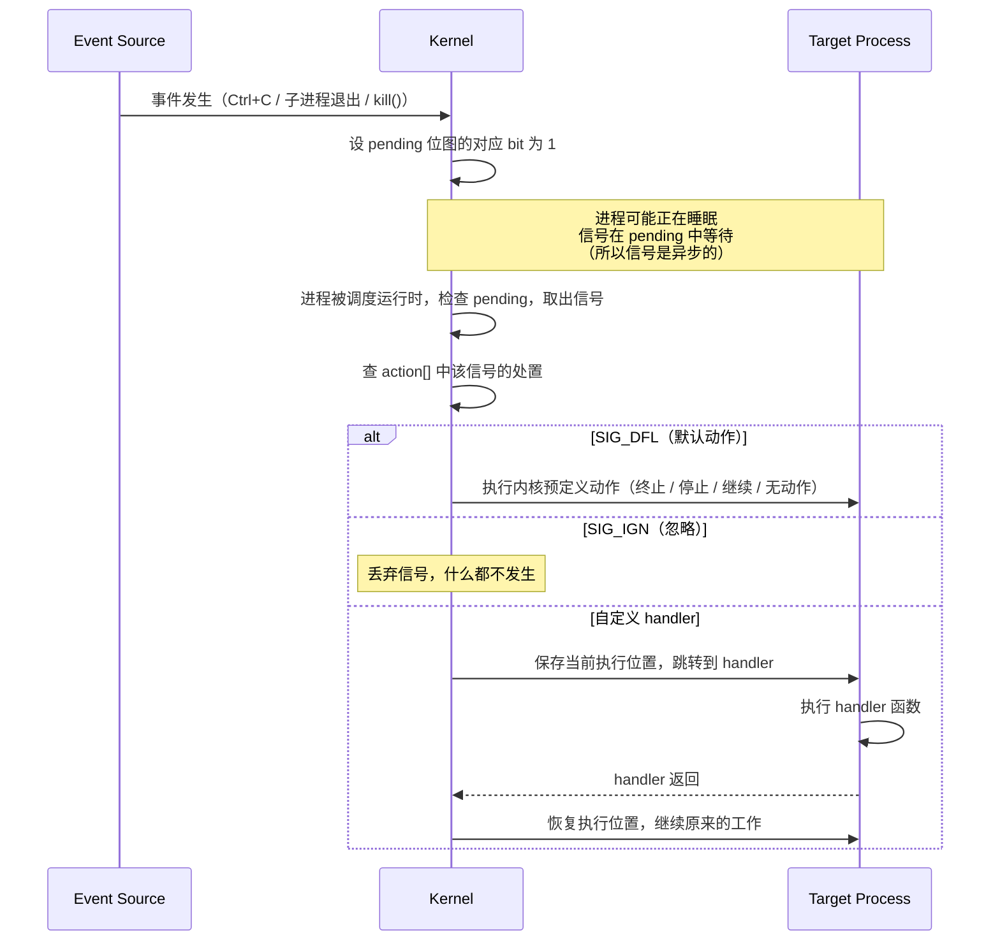
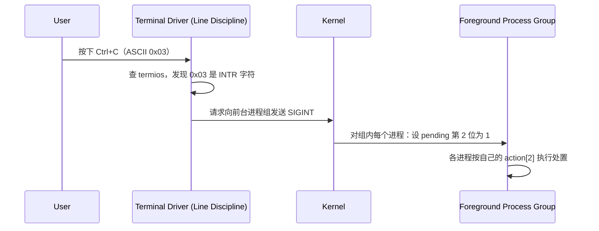

# 信号

- 写作时间：`2026-02-27 首次提交，2026-03-29 最近修改`
- 当前字符：`11743`

上一课讲了进程的创建、执行和回收，但进程在运行过程中，有时需要被外部打断。来看这样一个场景：在终端运行 `sleep 100`，然后按 Ctrl+C，程序立刻退出了。

```
$ sleep 100
^C
$
```

但 `sleep` 正在睡觉，它没有在读键盘输入，也没有在检查"用户是不是按了什么键"。它就是在那儿等着，什么都不做。一个什么都不做的进程，怎么会知道按了 Ctrl+C？

让它自己来检查？`sleep` 的工作就是"等着不动"，不会运行任何检查代码。内核直接杀死它？如果程序正在写文件写到一半，直接杀死会导致文件损坏。核心问题是：**需要从外部打断一个进程的执行流，而且要让它有机会响应。**

硬件世界解决过同样的问题：**中断**(interrupt)。网卡收到数据包时通过电信号打断 CPU，CPU 跳到预先注册的处理代码执行。**信号**(signal) 是这个思路搬到进程层面，不是设备打断 CPU，而是内核打断进程。内核在进程的待处理集合中标记一个信号，下次该进程被调度运行时，强制跳转到处理代码。

信号就是这个机制。先看**信号机制**本身——内核用什么数据结构记录信号、怎么投递。进程收到信号后有三种选择：默认动作、忽略、自定义处理函数，这就是**处置**。Ctrl+C 是怎么变成 SIGINT 的？这条路径经过**终端驱动**。信号不只来自键盘，**信号来源**有三种：终端、内核、其他进程。fork 和 exec 时信号的处置怎么传递给子进程？这就是**信号继承**规则。最后，信号机制最重要的应用之一：父进程通过 **SIGCHLD** 知道子进程退出了，从而及时回收僵尸。

## 信号机制

信号(signal)是内核强制打断进程执行流、让进程有机会响应异步事件的机制。

信号在内核中用两样东西表示，都存在每个进程的 `task_struct` 中：

**处置数组：每个信号一个槽位。**

```c
// simplified
struct k_sigaction  action[64];
```

64 元素的数组，下标是信号编号。`action[2]` 存的是 SIGINT（编号 2）的处置：`SIG_DFL`、`SIG_IGN`、或一个 handler 函数指针。进程调用 `sigaction(SIGINT, ...)` 时，内核做的事就是写 `action[2]`。

**待处理位图：每个信号一个 bit。**

```c
sigset_t  pending;   // bitmap: bit N = 1 means signal N is pending
```

当内核要给进程发 SIGINT 时，把 `pending` 的第 2 位设为 1。进程从内核态返回用户态时（系统调用返回、中断处理完毕），内核检查 `pending` 位图。如果有位为 1，取出对应的信号编号，查 `action[]` 中的处置，按结果执行。



停一下，注意这个设计的精妙之处：信号的"发送"和"处理"是解耦的。发送方只是在位图上设一个 bit，不需要等接收方在线。接收方在下次被调度时才检查位图。这就是为什么信号是异步的。

## 处置

处置决定信号到达时进程怎么响应。每个信号都有一个当前处置。

进程启动时，所有信号的处置都是 `SIG_DFL`（默认）。默认动作由内核为每个信号预定义，不同信号的默认动作不同：

| 默认动作 | 说明 | 信号举例 |
|----------|------|----------|
| 终止 (Term) | 进程退出 | SIGINT, SIGTERM, SIGPIPE, SIGHUP |
| 终止 + 核心转储 (Core) | 退出并生成 core dump | SIGQUIT, SIGSEGV, SIGABRT |
| 停止 (Stop) | 暂停进程（可恢复） | SIGTSTP, SIGSTOP, SIGTTIN, SIGTTOU |
| 继续 (Cont) | 恢复已停止的进程 | SIGCONT |
| 无动作 | 信号被丢弃 | SIGCHLD, SIGURG |

进程可以用 `sigaction()` 把某个信号的处置改为：

- **忽略**（`SIG_IGN`）：信号到达时什么都不做，静默丢弃
- **自定义 handler**（函数指针）：信号到达时跳转到指定函数执行
- 改回**默认**（`SIG_DFL`）

注意"忽略"和上表中的"无动作"的区别。SIGCHLD 的默认动作是"无动作"，这和主动设置 `SIG_IGN` 看似一样，但含义不同：默认是"我没管过这个信号"，`SIG_IGN` 是"我明确选择忽略它"。对于 SIGCHLD，两者甚至有行为差异：`SIG_IGN` 会让子进程被自动回收，不产生僵尸。

**SIGKILL (9) 和 SIGSTOP (19) 的处置永远锁定为内核默认动作。** 无论进程怎么调用 sigaction，这两个信号都不受影响。这是操作系统的安全兜底，确保管理员始终能终止或暂停任何进程。

Shell 开发中最常遇到的信号：

| 信号 | 编号 | 默认动作 | 触发场景 |
|------|------|----------|----------|
| SIGHUP | 1 | 终止 | 控制终端断开（关闭终端窗口） |
| SIGINT | 2 | 终止 | 用户按 Ctrl+C |
| SIGQUIT | 3 | 核心转储 | 用户按 Ctrl+\\ |
| SIGKILL | 9 | 终止 | `kill -9`，不可捕获 |
| SIGPIPE | 13 | 终止 | 写入无读端的管道 |
| SIGTERM | 15 | 终止 | `kill` 命令的默认信号 |
| SIGCHLD | 17 | 无动作 | 子进程终止或停止 |
| SIGCONT | 18 | 继续 | `fg` / `bg` 恢复暂停进程 |
| SIGSTOP | 19 | 停止 | 不可捕获的暂停 |
| SIGTSTP | 20 | 停止 | 用户按 Ctrl+Z |

> 编号为 x86_64 Linux 上的值。Zig 代码中使用 `SIG.INT`、`SIG.CHLD` 等常量，不要硬编码数字。

`sigaction()` 是修改处置的系统调用。它接受三个参数：信号编号、新的处置、以及一个用于保存旧处置的输出参数。注册处置时需要指定三样东西：

1. **handler**：处置方式。`SIG_DFL`（默认）、`SIG_IGN`（忽略）、或自定义函数指针。
2. **mask**：handler 执行期间要额外阻塞哪些信号。当内核调用 handler 时，会自动阻塞触发信号本身（比如 SIGINT handler 执行期间，再来一个 SIGINT 不会打断它）。mask 让你指定除此之外还要阻塞哪些信号。被阻塞的信号不会丢失，暂时挂在 `pending` 里，等 handler 返回后再递送。大多数情况下不需要额外阻塞任何信号。
3. **flags**：控制信号处理的行为细节。最重要的是 `SA_RESTART`。

进程正在执行慢速系统调用（如 `read` 等待用户输入）时，如果收到信号，内核会**中断系统调用**去执行 handler。handler 返回后：

- **没有 SA_RESTART**：系统调用返回 `EINTR` 错误，程序必须自己重试
- **设置了 SA_RESTART**：内核自动重新执行被中断的系统调用，对程序透明

Shell 读取用户输入用的是 `read`（慢速系统调用），如果不设 `SA_RESTART`，每次信号都会打断读取，需要额外的重试逻辑。

## 终端驱动

终端驱动(terminal driver)是内核中负责处理终端输入输出的模块。它不只搬运数据，还通过行规程(line discipline)拦截特殊字符并触发控制动作。Ctrl+C 变成 SIGINT 的过程就发生在终端驱动中。

Ctrl+C 本身只是一个键盘输入，产生 ASCII 码 `0x03`（ETX，End of Text）。它和信号之间没有硬连线的关系。连接它们的是行规程。行规程维护一张映射表（存在 `termios` 结构体中），其中有一项：

```
INTR character = 0x03 (Ctrl+C)
```

当行规程收到 `0x03`，它不会把这个字节传给正在读终端的进程，而是通知内核：向终端的**前台进程组**发送 SIGINT。

这个映射是可以改的。`stty intr ^X` 可以把 INTR 字符改成 Ctrl+X，之后按 Ctrl+C 就只是普通输入，按 Ctrl+X 才发 SIGINT。Ctrl+C 和 SIGINT 之间不是固定的，是终端驱动的配置决定的。这个细节很容易被忽略。

行规程识别的特殊字符：

| 字符 | 默认按键 | 行规程的动作 |
|------|----------|-------------|
| INTR | Ctrl+C | 向前台进程组发 SIGINT |
| QUIT | Ctrl+\\ | 向前台进程组发 SIGQUIT |
| SUSP | Ctrl+Z | 向前台进程组发 SIGTSTP |
| EOF | Ctrl+D | 通知读端"输入结束" |
| ERASE | Backspace | 删除前一个字符 |



:::expand 终端与伪终端

"终端驱动"和内核、shell 是什么关系？硬件设备不能直接和用户程序对话，中间需要内核模块负责翻译，这就是**驱动(driver)**：

```
User programs (shell, cat, vim ...)
─────────────────────────────────────
            Kernel
  ┌───────────────────────────┐
  │  Drivers                  │
  │  · Keyboard driver        │ ← translates scancodes to key events
  │  · NIC driver             │ ← translates packets to socket data
  │  · Disk driver            │ ← translates block I/O to file read/write
  │  · Terminal driver        │ ← translates key bytes to input stream + control actions
  └───────────────────────────┘
─────────────────────────────────────
Hardware (keyboard, NIC, disk, serial ...)
```

终端驱动特殊在哪？大多数驱动只做数据搬运（网卡驱动把字节从网卡搬到内核缓冲区），但终端驱动多了行规程这一层，它会拦截特殊字符触发控制动作。

历史上终端是独立的物理设备（如 DEC VT100），自带键盘和屏幕，通过串口线连接主机。现在没有物理终端了。iTerm2、GNOME Terminal 这些终端模拟器是普通 GUI 程序，在屏幕上画一个窗口来模拟过去物理终端的行为。

内核用**伪终端(PTY, pseudo-terminal)**，即一对虚拟文件描述符，来连接终端模拟器和终端驱动，模拟过去的串口连接。终端模拟器写入 PTY 的一端，终端驱动从另一端读取。

按下键盘到 shell 收到输入的完整路径：

```
Physical keyboard
  → Keyboard driver (kernel): scancodes → key events
    → GUI system (X11 / Wayland / macOS): key events → characters
      → Terminal emulator (iTerm2 etc., userspace): writes characters to PTY
        → Terminal driver + line discipline (kernel): handles special chars, buffers normal chars
          → shell (userspace): read() gets input
```

终端驱动不知道也不关心输入来自物理键盘、SSH 连接还是一段脚本，它只处理从 PTY 收到的字节流。终端是一个**抽象层**，不绑定任何具体硬件。

:::

每个终端有一个"前台进程组"(foreground process group)。当 shell 启动一个命令（如 `sleep 5`），Ctrl+C 产生的 SIGINT 发给前台进程组里的**所有进程**。

> 进程组和会话的完整机制见[进程组与会话](03-process-group)。

## 信号来源

Ctrl+C 只是信号的来源之一。发信号的来源一共有三种，但本质相同：**只有内核能发信号。**

**终端驱动。** 上一节讲过。用户按下特殊按键，行规程识别后通知内核发信号。这条路径只能产生几个固定的信号（SIGINT、SIGQUIT、SIGTSTP），而且只发给前台进程组。

**内核自身。** 内核在处理某些事件时，主动给相关进程发信号：

| 内核事件 | 产生的信号 | 目标进程 |
|----------|-----------|---------|
| 子进程退出或停止 | SIGCHLD | 父进程 |
| 进程访问非法内存 | SIGSEGV | 出错的进程自己 |
| 进程执行非法指令 | SIGILL | 出错的进程自己 |
| 写入无读端的管道 | SIGPIPE | 写端进程 |
| 定时器到期 | SIGALRM | 设定定时器的进程 |

**其他进程。** 任何进程都可以通过 `kill()` 系统调用给另一个进程发信号（需要权限，通常要求同一用户或 root）：

```zig
// send SIGTERM to PID 1234
std.os.linux.kill(1234, std.posix.SIG.TERM);
```

Shell 里的 `kill` 命令就是这个系统调用的封装：

```
$ kill 1234        # send SIGTERM (default)
$ kill -9 1234     # send SIGKILL
```

三种来源归结为同一件事。真正在 `pending` 位图上设 bit 的都是内核代码。终端驱动是内核的一部分，直接调用内核内部的信号发送函数（`send_sig_info()`）。用户进程不在内核中，必须通过 `kill()` 系统调用跨越用户态/内核态边界，请求内核执行同一个函数。

## 信号继承

shell 会忽略 SIGINT（这样 Ctrl+C 不会杀死 shell 自己）。但 shell 需要 fork + exec 来启动子进程。**shell 忽略了 SIGINT，fork 出来的子进程也忽略 SIGINT 吗？**

这个问题非常关键。答案要从 fork 和 exec 分别做了什么来推导。

fork 把当前进程复制一份。信号相关的两样东西，内核做了不同的决策：

**处置数组 `action[64]`：复制。** 子进程得到一份独立的副本，初始值和父进程一样。父进程的 `action[2]` 是 SIG_IGN，子进程的 `action[2]` 也是 SIG_IGN。之后各改各的，互不影响。理由：处置代表进程"遇到信号时该怎么做"的策略，子进程作为副本，继承同样的策略是合理的起点。

**待处理位图 `pending`：不复制，从全 0 开始。** pending 里的信号是别人发给父进程的，是父进程的"待办事项"。子进程是一个新的进程，还没有人给它发过信号，从空白开始更合理。

exec 则不同，它替换进程的整个地址空间。考虑 `action[]` 中三种值在 exec 后的命运：

**SIG_DFL 和 SIG_IGN**：常量 0 和 1，不依赖旧程序的任何代码。地址空间换了对它们没有影响。exec 后保持不变。

**自定义 handler**：函数指针，指向旧程序代码段中某个函数的地址。exec 之后旧程序的代码不存在了，这个指针指向未知位置。内核在 exec 时**必须**把所有自定义 handler 重置为 SIG_DFL。

这不是一条需要记忆的规则。它是从 exec 的行为（替换地址空间导致旧的函数指针失效）直接推导出来的。

把这两条规则应用到 shell：shell 忽略 SIGINT（`action[2]` = SIG_IGN），然后 fork + exec：

1. fork：子进程复制了 `action[2]` = SIG_IGN
2. exec：SIG_IGN 是常量，不受地址空间替换的影响，保持不变
3. 子进程执行的 `sleep` 也忽略 SIGINT。用户按 Ctrl+C，sleep 无反应。**这是一个 bug。**

**修复**：子进程在 fork 后、exec 前，把 SIGINT 重置为 SIG_DFL。fork 和 exec 之间是一段可以写任意代码的区间（上一篇 fork-exec 分离一节的核心论点），在这里重置处置：

```zig
const pid = try posix.fork();

if (pid == 0) {
    // child calls sigaction — modifies its own disposition array
    const dfl = posix.Sigaction{
        .handler = .{ .handler = posix.SIG.DFL },
        .mask = posix.sigemptyset(),
        .flags = 0,
    };
    posix.sigaction(posix.SIG.INT, &dfl, null);

    return posix.execvpeZ(cmd, argv, envp);
}
```

这是所有 shell 都必须做的事。`bash`、`zsh` 的源码中都有类似逻辑。

注意：如果 shell 用的是自定义 handler（而非 SIG_IGN）来处理 SIGINT，就不需要手动重置，自定义 handler 在 exec 时会被内核自动重置为 SIG_DFL（函数指针失效，必须重置）。但 shell 的标准做法是用 SIG_IGN（收到 SIGINT 时 shell 不需要执行任何逻辑，只需要不死），所以必须手动重置。

## SIGCHLD

SIGCHLD 是"内核自己发信号"的一个重要实例。子进程退出后变成僵尸，父进程必须调用 `waitpid()` 回收。但父进程怎么知道子进程退出了？

**内核在子进程退出时，主动向父进程发送 SIGCHLD。** 内核在执行子进程的 `exit()` 时，找到它的父进程，在父进程的 `pending` 位图中把 SIGCHLD（第 17 位）设为 1。

一种做法是注册 SIGCHLD handler，在里面调用 `waitpid`：

```zig
fn sigchld_handler(sig: i32) callconv(.c) void {
    _ = sig;
    // loop with WNOHANG to reap all exited children
    while (true) {
        const result = posix.waitpid(-1, posix.W.NOHANG);
        if (result.pid == 0) break;  // no more exited children
    }
}
```

但这有一个严重问题：**async-signal-safety**。

:::expand async-signal-safety

信号 handler 可以在程序的**任何时刻**被调用，包括 `malloc` 执行到一半、持有锁的时候。如果 handler 里也调用 `malloc`，就会死锁或破坏堆。这是个坑，很多人栽在这里。

POSIX 定义了一个 "async-signal-safe" 函数列表，**只有这些函数才能在 handler 中安全调用**：

| 可以调用 | 不可以调用 |
|----------|-----------|
| `write()` | `printf()` / `std.debug.print()` |
| `waitpid()` | `malloc()` / `free()` |
| `_exit()` | 任何分配内存的操作 |
| 设置全局 flag | 获取锁 |

:::

更安全的做法：handler 里只设一个标志，主循环中检查标志并回收：

```zig
// global flag (volatile to prevent compiler from optimizing out reads)
var got_sigchld: bool = false;

fn sigchld_handler(sig: i32) callconv(.c) void {
    _ = sig;
    @as(*volatile bool, @ptrCast(&got_sigchld)).* = true;
}

// in the main loop
if (@as(*volatile bool, @ptrCast(&got_sigchld)).*) {
    @as(*volatile bool, @ptrCast(&got_sigchld)).* = false;
    while (true) {
        const result = posix.waitpid(-1, posix.W.NOHANG);
        if (result.pid == 0) break;
        // handle child exit status...
    }
}
```

> SIGCHLD handler 在需要后台进程管理时才有意义。同步 `waitpid`（阻塞等待子进程）够用的场景下不需要。

## 小结

| 概念 | 说明 |
|------|------|
| 信号(Signal) | 内核强制打断进程执行流的异步通知机制 |
| 处置 | 收到信号时的动作：默认 / 忽略 / 自定义 handler |
| `sigaction()` | 注册信号处理器 |
| SA_RESTART | 被信号中断的慢速系统调用自动重启 |
| SIGKILL / SIGSTOP | 不可捕获、不可忽略的信号 |
| 终端驱动 | 内核中处理终端 I/O 的模块，行规程拦截特殊字符触发信号 |
| 前台进程组 | Ctrl+C 发给整个前台进程组，不是单个进程 |
| fork 继承 | 子进程继承信号处置，pending 从零开始 |
| exec 重置 | 自定义 handler 重置为 SIG_DFL，SIG_IGN 保持不变 |
| SIGCHLD | 子进程状态变化时内核通知父进程 |
| async-signal-safety | handler 中只能调用有限的安全函数 |

信号不只是"杀进程"的工具，它是内核与进程之间、进程与进程之间的通知协议。Shell 必须主动管理信号的处置和继承，否则 Ctrl+C 会杀死 shell 自身，或者子进程会意外继承 shell 的信号策略。

---

**Linux 源码入口**：
- [`kernel/signal.c`](https://elixir.bootlin.com/linux/latest/source/kernel/signal.c) — `do_send_sig_info()`：信号发送的核心路径
- [`kernel/signal.c`](https://elixir.bootlin.com/linux/latest/source/kernel/signal.c) — `get_signal()`：信号递送，检查 pending 并执行处置
- [`fs/exec.c`](https://elixir.bootlin.com/linux/latest/source/fs/exec.c) — `flush_signal_handlers()`：exec 时重置信号处理器

:::practice 开始写 zish
学完进程生命周期和信号这两课，你已经掌握了 fork/exec/wait、管道、信号处置和继承规则。这些正是实现一个 Shell 的基础 REPL 所需要的全部知识。

前往 [zish-01：基础 REPL](/zish/01-repl) 开始实践。
:::

