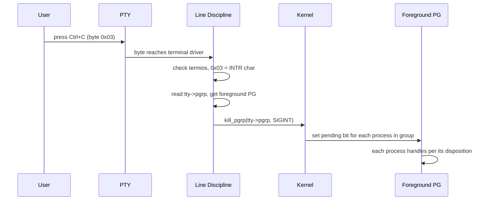
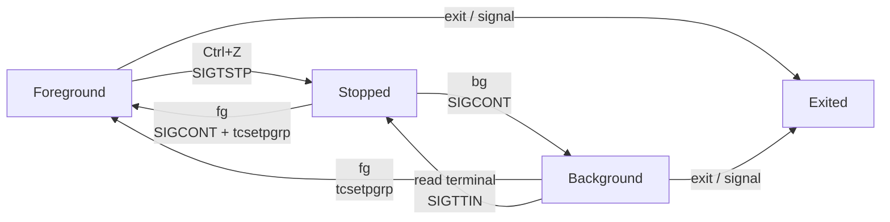
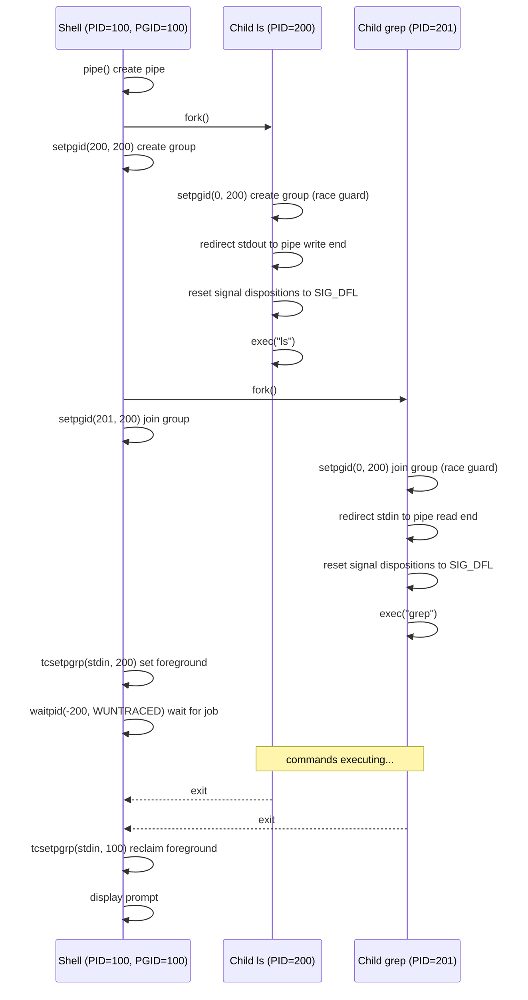

# 进程组与会话

- 写作时间：`2026-02-27 首次提交，2026-03-26 最近修改`
- 当前字符：`17014`

上一课的信号是发给单个进程的。但日常操作中，我们经常需要同时控制一组进程。来看这样一个场景——在终端运行一个管道，然后按 Ctrl+C：

```
$ sleep 100 | cat
^C
$
```

两个进程同时退出了。原因：Ctrl+C 让终端驱动向**前台进程组**(foreground process group)发送 SIGINT，组内所有进程都收到信号。

但这引出三个问题：

1. 谁创建了这个"进程组"？
2. 为什么 `sleep` 和 `cat` 在同一个组里？
3. shell 自己在不在这个组里？

回答这三个问题需要四个概念。**进程组**把进程绑在一起，Ctrl+C 发出的信号才能同时到达组内所有进程。但谁决定哪个组接收键盘信号？这就是**控制终端**的职责——它记录谁是前台。进程组加控制终端，就构成了 **Job Control**：fg/bg/Ctrl+Z 的完整机制。多个进程组需要一个更大的容器来管理，这就是**会话**——终端关闭时，会话内所有进程都会收到通知。最后讨论一个边界情况：**孤儿进程组**。

这些概念构成三级层次：会话 > 进程组 > 进程。控制终端绑在会话上，指向其中一个进程组作为前台。

## 进程组

进程组(process group)是一组共享同一个 PGID(Process Group ID) 的进程。PGID 等于组长的 PID。组长就是第一个加入（或创建）这个组的进程。

回到开头的问题：`sleep 100 | cat` 加 Ctrl+C，两个进程同时退出。如果没有进程组，终端驱动要怎么做？它需要维护一个"当前前台进程列表"，在进程创建和退出时更新它，这会引入复杂的同步问题。进程组解决了三个问题：

**原子性**。终端驱动只知道一个 PGID。按 Ctrl+C 时，行规程执行一次 `kill(-pgid, sig)`。进程组把"谁属于前台"这个信息下放到每个进程自己的 PGID 字段里，终端驱动只需要记住一个数字。

**管道一致性**。`ls | sort | head` 是一个 job，三个进程应该作为一个整体被管理。用户按 Ctrl+C 期望三个都停，按 Ctrl+Z 期望三个都暂停。进程组让 shell 把一条管道中的所有进程放进同一个组，实现统一控制。

**前台/后台区分**。终端只有一个"前台进程组"。其他进程组都是后台。这个区分让 shell 能同时管理多个 job：前台 job 能读写终端，后台 job 不能读终端（否则多个 job 同时读 stdin 会混乱）。

```
Process Group (PGID = 200)
├── sleep  PID=200  ← leader (PGID == PID)
└── cat    PID=201
```

那么 `sleep 100 | cat` 的进程组是谁创建的？答案是 shell。shell 每启动一个 job（无论是单个命令还是一条管道），都会为它创建一个新的进程组。以 `ls | grep foo` 为例：

1. shell fork 出子进程 A（PID 300）来执行 `ls`，fork 出子进程 B（PID 301）来执行 `grep`
2. 第一个子进程 A 的 PID（300）作为整个 job 的 PGID
3. shell 调用 `setpgid(300, 300)` 和 `setpgid(301, 300)`，把 A 和 B 都放进 PGID=300 的组
4. 子进程 A 和 B 也分别调用 `setpgid(0, 300)` 把自己放进这个组

为什么 shell 和子进程**都要调用** `setpgid`？这里有一个容易忽略的竞态(race condition)。fork 返回后，不确定是父进程先执行还是子进程先执行。如果只有 shell 调用，子进程可能在 shell 来得及设置之前就执行了 exec，那时它还在 shell 的进程组里。如果只有子进程调用，shell 可能在子进程设置之前就调用了 `tcsetpgrp`（后文控制终端一节会讲），把一个还不存在的进程组设为前台。两边都调用，谁先执行都能正确建组。后执行的那个调用会发现 PGID 已经对了，相当于空操作。

相关系统调用：

| 调用 | 作用 |
|------|------|
| `setpgid(pid, pgid)` | 把进程 pid 放进 pgid 进程组。pid=0 表示自己。pgid=0 表示用 pid 自身的 PID 做 PGID（即创建新组并当组长） |
| `getpgid(pid)` | 查询进程 pid 的 PGID |
| `getpgrp()` | 等价于 `getpgid(0)`，查询自己的 PGID |

`kill()` 系统调用的第一个参数如果传**负数**，内核把它解释为 PGID，向该组的所有进程发信号：

```c
kill(-300, SIGINT);   // send SIGINT to all processes in PGID=300
```

用户进程通过 `kill()` 系统调用来发信号。行规程(line discipline)是内核代码，不需要走系统调用，它直接调用内核内部的 `kill_pgrp()` 函数，效果相同：向整个前台进程组发信号，不是逐个发。

:::expand 内核表示

PGID 的存储路径是 `task_struct->signal->pids[PIDTYPE_PGID]`，涉及三个数据结构：

```c
// include/linux/sched.h
struct task_struct {
    struct signal_struct  *signal;    // shared by thread group
    // ...
};

// include/linux/sched/signal.h
struct signal_struct {
    struct pid  *pids[PIDTYPE_MAX];  // index: PID / TGID / PGID / SID
    // ...
};

// include/linux/pid.h
enum pid_type {
    PIDTYPE_PID,   // 0 — process ID
    PIDTYPE_TGID,  // 1 — thread group ID
    PIDTYPE_PGID,  // 2 — process group ID  ← the one we care about
    PIDTYPE_SID,   // 3 — session ID
    PIDTYPE_MAX,	 // 4 — not a real type; C idiom: placed at end of enum as array size
};

struct pid {
    refcount_t          count;            // reference count
    unsigned int        level;            // namespace nesting depth
    spinlock_t          lock;
    struct hlist_head   tasks[PIDTYPE_MAX]; // reverse list: all tasks pointing to this pid
    struct upid         numbers[];        // numeric values in each namespace layer
};
```

每个进程对应一个 `task_struct`。`task_struct` 的 `signal->pids[]` 数组存放了这个进程的一组不同类型的 ID。同属于一个进程组的进程，它们的 `pids[PIDTYPE_PGID]` 是相同的，都指向**同一个** `struct pid` 实例：

```
task_struct (sleep, PID=200)          task_struct (cat, PID=201)
  └→ signal->pids[PGID] ──┐            └→ signal->pids[PGID] ──┐
                           │                                    │
                           ▼                                    ▼
                       ┌──────────────────────────────────────────┐
                       │ struct pid  (represents PGID=200)        │
                       │   tasks[PGID]: sleep ←→ cat             │
                       │   numbers[0].nr = 200                   │
                       └──────────────────────────────────────────┘
```

所以进程组不是一个单独的内核对象。说白了，所谓进程组，就是一群 `pids[PIDTYPE_PGID]` 相同的进程。`setpgid()` 做的事就是改写进程的 `pids[PIDTYPE_PGID]` 的值，让它指向另一个 `struct pid`。改完之后这个进程就属于新的进程组了。

:::

## 控制终端

控制终端(controlling terminal)是进程所关联的终端设备，在内核中是一个 PTY 从端设备对象。每个终端窗口对应一个控制终端，存储在 `task_struct->signal->tty` 字段里，是一个指向 `struct tty_struct` 的指针。同一个终端窗口中的所有进程共享这个指针。

前面讲了进程组把进程绑在一起。但终端里同时有多个进程组：一个前台组，若干后台组。按 Ctrl+C 只杀前台，不影响后台。终端驱动怎么知道谁是前台？答案就在 `tty_struct` 里。

控制终端的作用体现在 `struct tty_struct` 的两个关键字段上：

```c
// include/linux/tty.h (simplified)
struct tty_struct {
    struct pid  *pgrp;     // foreground process group (pgrp = Process GRouP)
    struct pid  *session;  // owning session
    // ...
};
```

**pgrp：路由键盘信号。** 用户按 Ctrl+C 时，行规程需要知道信号该发给谁。它从 `tty->pgrp` 取出前台进程组，调用 `kill_pgrp(tty->pgrp, SIGINT)` 发信号。终端驱动不知道"哪些进程在前台"，它只知道 `tty->pgrp` 这一个指针。

**session：终端断开时通知会话。** 关闭终端窗口时，内核从 `tty->session` 找到 session leader，向它发送 SIGHUP。会话的细节在后文展开。

进程组和控制终端这两块拼图都有了。现在可以画出 Ctrl+C 从键盘到进程的完整路径，每一步都是前面讲过的机制在起作用：



shell 通过 `tcsetpgrp` 设置前台进程组。tc 是 **t**erminal **c**ontrol（终端控制）的缩写。`tcsetpgrp` 就是 "terminal control: set process group"。

`tty->pgrp` 是谁设置的？是 shell。shell 通过以下系统调用操作控制终端上的 `pgrp` 字段：

| 调用 | 作用 |
|------|------|
| `tcsetpgrp(fd, pgid)` | 改写 `tty->pgrp` 的值，把前台进程组设为 pgid |
| `tcgetpgrp(fd)` | 读取 `tty->pgrp` 的值，查询当前前台进程组 |

第一个参数 fd 要求是一个指向控制终端的文件描述符。shell 的 fd 0、1、2 都指向同一个 PTY 从端设备（后文会话一节会解释为什么），传哪个都行，效果完全一样。它们背后是同一个 `struct tty_struct`。用 `STDIN_FILENO`（fd 0）只是约定俗成的写法。

shell 启动一个前台命令时：

1. 为命令创建新进程组（`setpgid`）
2. 调用 `tcsetpgrp(STDIN_FILENO, child_pgid)` 把 `tty->pgrp` 改为新进程组
3. `waitpid` 等待命令结束
4. 命令结束后，调用 `tcsetpgrp(STDIN_FILENO, shell_pgid)` 把 `tty->pgrp` 改回自己

第 4 步容易遗漏。如果不做，终端的前台进程组指向一个已经不存在的 PGID，下一次 Ctrl+C 的信号会发给错误的目标（或者没有目标）。

如果一个后台进程试图从终端读取输入，又会发生什么？

终端驱动检测到读取者的 PGID 和 `tty->pgrp` 不一致，说明它不是前台进程组的成员。终端驱动不会让它读到数据，而是向该进程的进程组发送 **SIGTTIN**（Terminal Input）。SIGTTIN 的默认动作是停止(Stop)进程。

```
$ cat &             ← cat runs in background
[1] 500
$
[1]+  Stopped         cat
```

`cat` 试图读 stdin，收到 SIGTTIN，被停止。

类似地，后台进程试图写入终端时，如果终端设置了 `TOSTOP` 标志，内核向其发送 **SIGTTOU**（Terminal Output），同样停止进程。默认情况下 `TOSTOP` 未设置，后台进程可以直接写终端（所以后台 job 的输出会突然出现在屏幕上）。

这两个信号的意义是：**保证同一时刻只有一个 job 在读终端**。否则多个 job 同时读 stdin，谁读到哪个字节就变成不确定的了。

## Job Control

Job control 是 shell 利用进程组和控制终端，在一个终端内管理多个 job（前台、后台、停止）的机制。

一个典型场景：正在编译大项目 `make -j8`，编译要跑五分钟，但突然想看一下 `git log`。终端被 `make` 占着，打的字全被 `make` 吃掉了。开一个新终端窗口当然可以，但 job control 让你不用开新窗口就能切换任务。进程组把进程绑在一起，控制终端的 `tty->pgrp` 记录谁是前台。下面看 shell 怎么用这两个机制实现 fg/bg/Ctrl+Z。

按 Ctrl+Z：

```
$ make -j8
^Z
[1]+  Stopped                 make -j8
$
```

`make` 停住了，shell 回来了。Ctrl+Z 和 Ctrl+C 的路径几乎相同（回顾控制终端一节的 Ctrl+C 路径图），区别只在信号类型：Ctrl+C 发 SIGINT（终止），Ctrl+Z 发 SIGTSTP（Terminal Stop，区别于 SIGSTOP，SIGTSTP 可以被进程捕获）。行规程调用 `kill_pgrp(tty->pgrp, SIGTSTP)`，前台进程组的所有进程收到 SIGTSTP，默认动作是进入 Stopped 状态。进程还在，但不再运行。

shell 怎么知道进程停了？`waitpid` 有一个标志 `WUNTRACED`，加上这个标志后，`waitpid` 不仅在子进程退出时返回，在子进程被停止时也会返回。shell 检查返回状态发现是 Stopped，就把前台还给自己（`tcsetpgrp`），在内部的 job 表里记一笔，打印 `[1]+  Stopped`，然后显示提示符。

`make` 停着，`git log` 也查完了，想让它继续编译。有两种选择。

**fg** 把 job 拉回前台继续运行：

```
$ fg %1
make -j8        ← back to foreground, terminal occupied by make
```

shell 做了两件事：调用 `tcsetpgrp(STDIN_FILENO, make_pgid)` 把 `tty->pgrp` 改成 `make` 的进程组，然后调用 `kill(-make_pgid, SIGCONT)` 向整个进程组发送 SIGCONT，让 Stopped 的进程恢复运行。然后 shell 调用 `waitpid` 等待这个 job 结束（或再次被 Ctrl+Z 停住）。

**bg** 让 job 在后台继续运行：

```
$ bg %1
[1]+ make -j8 &    ← running in background, shell returns immediately
$                   ← you can continue typing other commands
```

shell 只做了一件事：调用 `kill(-make_pgid, SIGCONT)` 发 SIGCONT 让进程恢复。注意 shell **没有**调用 `tcsetpgrp`。`tty->pgrp` 还是 shell 自己，键盘信号还是发给 shell。`make` 在后台默默运行，不占终端。

所以 fg 和 bg 的区别就是**一个 `tcsetpgrp`**：fg 把前台交给 job，bg 不交。这个差异很小，但理解它意味着理解了整个 job control 的核心。

除了先运行再 Ctrl+Z，也可以一开始就让命令在后台运行。末尾加 `&` 告诉 shell：创建进程组、启动命令，但**不调用 `tcsetpgrp`**，前台留给 shell。这和"先前台运行再 bg"的最终效果一样，只是跳过了中间的 Stopped 状态。

`jobs` 打印 shell 内部的 job 表，不涉及任何系统调用。shell 维护一个数据结构，记录每个 job 的编号、PGID、状态（Running / Stopped）和命令行文本。`%1`、`%2` 就是这个 job 编号，fg 和 bg 用它来指定操作哪个 job。



每条箭头上方标注的是用户操作或事件，下方是 shell/内核实际执行的系统调用或信号。回顾上面的讲解，每条箭头都应该能说出具体机制。

注意最后一条边：后台 job 如果试图读终端（控制终端一节讲的 SIGTTIN），会被停止，进入 Stopped 状态。这时候可以用 fg 把它拉到前台再继续。

把前面各节的知识组合起来，看 shell 执行一条管道命令 `ls | grep foo` 的完整过程：



Shell 在启动时必须忽略三个信号：

| 信号 | 为什么忽略 |
|------|-----------|
| SIGTSTP | 用户按 Ctrl+Z 时，shell 不能被暂停（否则谁来恢复它？） |
| SIGTTOU | shell 把前台交给子进程组后，自己就变成后台了。前台 job 结束后，shell 需要调 `tcsetpgrp` 收回前台，但此刻 shell 还在后台。`tcsetpgrp` 内部通过 ioctl 修改终端属性，内核把这视为对终端的写操作，会向后台调用者发 SIGTTOU。不忽略的话，shell 恰恰在收回前台的那一刻把自己卡死 |
| SIGTTIN | POSIX 对 job control shell 的推荐防护。正常情况下 shell 把前台交出去后阻塞在 `waitpid`，不会读终端，SIGTTIN 不会触发。但忽略它可以防止未来加功能时意外触发 |

加上 SIGINT，shell 启动时至少忽略四个信号。子进程在 fork 后、exec 前要把这些信号全部重置为 SIG_DFL。

前台 job 退出后，shell 必须立即调用 `tcsetpgrp(STDIN_FILENO, shell_pgid)` 把前台进程组设回自己。如果不做这一步，终端的前台进程组指向一个已经不存在的 PGID，下一次 Ctrl+C 的信号会发给错误的目标（或者没有目标）。

## 会话

会话(session)是包含多个进程组的更大容器，由 session leader 创建，绑定一个控制终端。SID(Session ID) 等于 session leader 的 PID，session leader 通常是 shell 进程。

换个角度想：一个 shell 窗口里可能有多个 job：一个前台、若干后台。这些 job（进程组）加上 shell 自己，构成一个会话。为什么需要这一层？关闭终端窗口时，所有 job 都应该收到 SIGHUP。内核需要知道"哪些进程组属于这个终端"，会话就是这个跟踪单位。

```
┌─────────────────────────────────────────────────────┐
│ Session (SID = 100)                                 │
│                                                     │
│  ┌──────────────────┐  ┌──────────────────────────┐  │
│  │ Process Group    │  │ Process Group            │  │
│  │ PGID=100         │  │ PGID=300                 │  │
│  │                  │  │                          │  │
│  │  bash (PID=100)  │  │  sleep (PID=300, leader) │  │
│  │  (session        │  │  cat   (PID=301)         │  │
│  │   leader)        │  │                          │  │
│  └──────────────────┘  └──────────────────────────┘  │
│                                                      │
│  ┌──────────────────────────┐                        │
│  │ Process Group PGID=400   │                        │
│  │                          │                        │
│  │  find (PID=400, leader)  │  ← background job      │
│  └──────────────────────────┘                        │
└─────────────────────────────────────────────────────┘
```

三级层次：会话包含多个进程组，进程组包含多个进程。

进程调用 `setsid()` 创建一个新会话。调用后：

1. 调用者成为新会话的 session leader
2. 调用者成为新进程组的组长（PGID = PID = SID）。为什么要同时创建进程组？因为每个进程必须属于某个进程组，而旧的进程组属于旧会话，调用者需要一个属于新会话的进程组来容身
3. 内核把调用者的 `signal->tty` 设为 NULL。新会话没有控制终端。旧的控制终端属于旧会话（那个 `tty_struct` 的 `session` 字段指向旧 session leader），不会带到新会话来。要获得控制终端，需要在 `setsid()` 之后主动 `open("/dev/pts/N")`（见下文终端模拟器启动序列的第 3、4 步）

限制：已经是进程组组长的进程不能调用 `setsid()`。原因是 `setsid()` 会创建一个新进程组，PGID = 调用者的 PID。但组长的 PID 已经等于当前的 PGID，老的进程组里可能还有其他成员在用这个 PGID。如果再创建一个同样 PGID 的新组，内核就无法区分新组和老组了。

打开一个终端窗口（如 iTerm2）时，这些机制全部串联起来：

1. 终端模拟器创建一对 PTY(pseudo-terminal)
2. 终端模拟器 fork 一个子进程
3. 子进程调用 `setsid()`，创建新会话，自己成为 session leader
4. 子进程调用 `open("/dev/pts/N")` 获得从端的 fd。**这一步同时触发了控制终端的自动绑定**，不需要额外的系统调用

:::thinking open() 怎么就自动绑定了控制终端？
内核在 open 时检查四个条件，全部满足就自动绑定：

1. 打开的是**终端设备**（不是普通文件）。不限于 `/dev/pts/N`，虚拟控制台（`/dev/tty1`）、串口（`/dev/ttyS0`）都算
2. 调用者是 **session leader**
3. 调用者**还没有控制终端**
4. 没有传 `O_NOCTTY` 标志

四个条件缺一不可。`setsid()` 创建了满足条件 2 和 3 的状态，紧接着 `open` 终端设备就触发绑定。如果不想要这个行为（比如 daemon 进程），open 时加 `O_NOCTTY` 即可跳过。
:::
5. 子进程用 `dup2` 把这个 fd 复制到 0、1、2 三个位置（见下文解释）
6. 子进程 exec 执行 shell（如 bash、zsh）
7. 从此，shell 的 stdin/stdout/stderr 都指向 PTY 从端，shell 是这个会话的 session leader

上面第 4、5 步把 PTY 从端连接到 shell 的标准 I/O。子进程需要用 `open` 打开 PTY 从端，再用 `dup2` 把它复制到 fd 0/1/2：

```
setsid()                        // create new session, detach from old terminal
int fd = open("/dev/pts/0")     // open PTY slave, suppose returns fd=3
                                // kernel: caller is session leader without controlling terminal
                                //       → auto-bind /dev/pts/0 as controlling terminal
dup2(fd, 0)                     // fd table[0] → /dev/pts/0  (stdin)
dup2(fd, 1)                     // fd table[1] → /dev/pts/0  (stdout)
dup2(fd, 2)                     // fd table[2] → /dev/pts/0  (stderr)
close(fd)                       // fd=3 no longer needed, close it
exec("bash")                    // replace with shell, fd table preserved
```

`open` 返回最小空闲 fd（这里是 3），`dup2` 把它复制到 0、1、2，然后关掉原始 fd。exec 后，shell 的 fd 0/1/2 全部指向 PTY 从端。shell 调用 `read(0, ...)` 读用户输入，实际是在读 PTY 从端。shell 调用 `write(1, ...)` 输出内容，实际是在写 PTY 从端。终端模拟器从主端读到这些内容，显示在屏幕上。

```
Process fd table (shell after exec)
┌────┬──────────────────────┐
│ 0  │  → /dev/pts/0        │ ← stdin: reads user input from here
├────┼──────────────────────┤
│ 1  │  → /dev/pts/0        │ ← stdout: writes output here
├────┼──────────────────────┤
│ 2  │  → /dev/pts/0        │ ← stderr: writes errors here
└────┴──────────────────────┘
         all point to the same PTY slave
```

这就是为什么控制终端一节说"shell 的 fd 0、1、2 都指向同一个 PTY 从端设备"。`tcsetpgrp` 的第一个参数传 fd 0、1、2 哪个都行，因为它们背后是同一个 `struct tty_struct`。

## 孤儿进程组

孤儿进程组(orphan process group)是指与同会话中其他进程组之间不再有父子关系的进程组。POSIX 的精确定义：一个进程组，如果组内**每个成员**的父进程要么也在组内，要么不在同一个会话中，则该组是孤儿进程组。没有任何外部进程能对它做 `waitpid` 或发送 `SIGCONT`。

考虑这个场景：

```bash
$ bash              # start child shell (PID=500)
$ sleep 100 &       # start background job in child shell
[1] 501
$ sleep 200         # run foreground command in child shell
^Z                  # Ctrl+Z suspends sleep 200
[2]+  Stopped       sleep 200
$ exit              # exit child shell
```

子 shell 退出了，但 `sleep 200`（PID=502）还处于 Stopped 状态。它的进程组里没有任何进程的父进程还在同一个会话中活跃。谁来恢复它？没有人能对它执行 `fg`。这个进程组变成了孤儿进程组。

当一个进程组变成孤儿进程组时，如果组内有任何处于 Stopped 状态的进程，内核会：

1. 向该组发送 **SIGHUP**（通知"你的控制方已经不在了"）
2. 紧接着发送 **SIGCONT**（让 Stopped 的进程恢复运行，以便响应 SIGHUP）

SIGHUP 的默认动作是终止进程。所以通常结果是：Stopped 的孤儿进程被唤醒，然后立即被 SIGHUP 杀死。

为什么要先 SIGHUP 再 SIGCONT？这个顺序不是随意的。如果只发 SIGCONT，Stopped 的进程恢复运行后没有人管理它（没有 shell 能 fg/bg 它），它会成为一个失控的进程。如果只发 SIGHUP，进程处于 Stopped 状态收不到信号（Stopped 的进程不处理信号，除了 SIGKILL 和 SIGCONT）。所以必须两个都发：SIGHUP 标记为待处理，SIGCONT 让进程恢复，恢复后处理 pending 的 SIGHUP 然后退出。

## 小结

| 概念 | 说明 |
|------|------|
| 进程组(Process Group) | 共享同一个 PGID 的进程集合，PGID = 组长的 PID |
| 会话(Session) | 包含多个进程组，绑定一个控制终端，SID = session leader 的 PID |
| 控制终端(Controlling Terminal) | 会话与用户交互的通道，负责发送键盘信号 |
| 前台进程组(Foreground Process Group) | 终端上当前接收键盘信号的进程组 |
| `setpgid()` | 设置进程的 PGID |
| `setsid()` | 创建新会话 |
| `tcsetpgrp()` / `tcgetpgrp()` | 设置/查询终端的前台进程组 |
| SIGTTIN / SIGTTOU | 后台进程读/写终端时被停止 |
| Job Control | shell 通过进程组 + 信号 + tcsetpgrp 管理前台/后台/停止三个状态 |
| 孤儿进程组(Orphan Process Group) | 与同会话其他进程组无父子连线的组，内核发 SIGHUP + SIGCONT |

进程组、会话、控制终端三个概念构成一个三级层次结构。终端驱动只和一个 PGID 交互，shell 通过 `setpgid` 和 `tcsetpgrp` 两个系统调用在这个层次结构上操作，就实现了完整的 job control。fg/bg/jobs 不是魔法，它们各自只做一两个系统调用。

**Linux 源码入口**：
- [`kernel/exit.c`](https://elixir.bootlin.com/linux/latest/source/kernel/exit.c) — `exit_notify()` → `kill_orphaned_pgrp()`：孤儿进程组处理
- [`kernel/sys.c`](https://elixir.bootlin.com/linux/latest/source/kernel/sys.c) — `setpgid()`、`setsid()`：进程组和会话的创建
- [`drivers/tty/tty_jobctrl.c`](https://elixir.bootlin.com/linux/latest/source/drivers/tty/tty_jobctrl.c) — `tty_check_change()`：SIGTTIN/SIGTTOU 检查

:::practice 给 zish 加上 Job Control
学完本课，你已经知道进程组、控制终端和 Job Control 是怎么回事了。现在可以给 zish 加上 fg/bg/jobs、Ctrl+Z 和后台命令支持。

前往 [zish-02：Job Control](/zish/02-job-control) 继续实践。
:::

