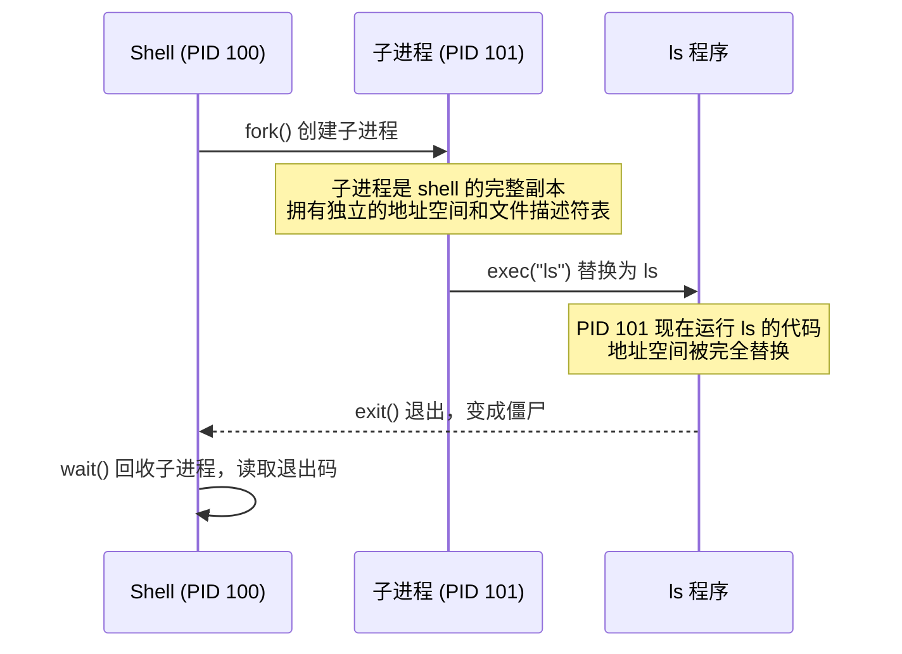

# 进程生命周期

> **核心问题**：操作系统怎么表示一个正在运行的程序？怎么创建和销毁它？

---

## 1. 程序和进程的区别

程序(Program)是磁盘上的一个文件（比如 `/usr/bin/ls`），它是静态的——只有代码和初始数据。

**进程(Process)是程序的一次运行实例**。同一个程序可以同时运行多次，每次运行产生一个独立的进程，各自拥有独立的地址空间、文件描述符表和运行状态。例如打开两个终端分别运行 `vim`，就是两个进程在执行同一个 `/usr/bin/vim` 程序。

程序只有代码和数据，而进程还需要内核为它维护运行时状态（当前执行到哪一行、打开了哪些文件、分配了多少内存……）。这些状态存放在哪里？

---

## 2. 进程的数据结构：PCB

内核为每个进程维护一个 PCB（Process Control Block，进程控制块）。Linux 中的实现叫 `task_struct` 而非 `process_struct`，定义在 `include/linux/sched.h`（sched = scheduler，调度器）。

命名为 `task` 是因为 **Linux 内核不区分进程和线程，只有一个统一概念：task（任务）**。每个可调度的执行单元——无论「进程」还是「线程」——都是一个 `task_struct`。两者的区别仅在于 `clone()` 时传的标志位决定共享多少资源：

| 创建方式 | 地址空间 | 文件描述符表 | 通常叫做 |
|----------|----------|-------------|---------|
| `fork()` / `clone(无共享标志)` | 复制 | 复制 | 进程 |
| `clone(CLONE_VM \| CLONE_FILES \| CLONE_THREAD \| ...)` | 共享 | 共享 | 线程 |

PCB 是教科书的通用术语，`task_struct` 是 Linux 的具体命名，反映了「一切皆 task」的设计决策。

真实的 `task_struct` 有几百个字段，下面是简化到核心字段的版本：

```c
// include/linux/sched.h（简化）
struct task_struct {
    /* ---- 标识 ---- */
    pid_t                   pid;            // task ID（每个 task 唯一，含线程）
    pid_t                   tgid;           // 线程组 ID（同进程所有线程共享）

    /* ---- 状态 ---- */
    unsigned int            __state;        // TASK_RUNNING / TASK_INTERRUPTIBLE / TASK_DEAD / ...
    int                     exit_code;      // 退出码，wait() 读取的值

    /* ---- CPU 上下文 ---- */
    struct thread_struct    thread;         // 寄存器、栈指针，上下文切换时保存/恢复

    /* ---- 调度 ---- */
    int                     prio;           // 动态优先级
    const struct sched_class *sched_class;  // 调度器类（CFS / RT / Deadline）
    struct sched_entity     se;             // CFS 调度实体（含 vruntime）

    /* ---- 内存 ---- */
    struct mm_struct        *mm;            // 虚拟地址空间（页表、VMA），内核线程为 NULL

    /* ---- 文件 ---- */
    struct files_struct     *files;         // 文件描述符表
    struct fs_struct        *fs;            // 工作目录、根目录

    /* ---- 凭证 ---- */
    const struct cred       *cred;          // uid / gid / capabilities

    /* ---- 信号 ---- */
    struct signal_struct    *signal;        // 信号处理函数、待处理信号队列

    /* ---- 亲属关系 ---- */
    struct task_struct      *parent;        // 父进程
    struct list_head        children;       // 子进程链表
    struct list_head        sibling;        // 兄弟链表（挂在父进程的 children 上）

    /* ---- 隔离与资源限制 ---- */
    struct nsproxy          *nsproxy;       // Namespace（PID/Mount/Network/UTS/IPC）
    struct css_set          *cgroups;       // 所属 cgroup 集合
};
```

**`pid` 与 `tgid`** 需要展开说明。由于 Linux 的 task 模型，线程也是 task，每个 task 都有自己的 `pid`。但 POSIX 要求同一进程的所有线程调用 `getpid()` 返回相同值，因此引入了 `tgid`：

```
进程（主线程）: pid=100, tgid=100
  ├── 线程 1:   pid=101, tgid=100
  └── 线程 2:   pid=102, tgid=100
```

| 用户态 API | 返回的内核字段 | 含义 |
|-----------|--------------|------|
| `getpid()` | `tgid` | 进程 ID（线程组共享） |
| `gettid()` | `pid` | 线程 ID（每个 task 唯一） |

**进程 = 代码 + 数据 + 内核为它维护的所有状态**。`task_struct` 就是内核对「一个正在运行的程序」的完整描述。后续章节涉及的信号、调度、namespace 等概念，都对应这个结构体中的具体字段。

---

## 3. 进程的内存布局

每个进程有自己独立的虚拟地址空间(Virtual Address Space)，内核通过页表(Page Table)保证进程之间互相看不到对方的内存：

```
高地址
┌────────────────┐
│    栈 Stack    │ ← 局部变量、函数调用帧，向下增长
│      ↓         │
│                │
│      ↑         │
│    堆 Heap     │ ← 动态分配（malloc/Zig 的 allocator），向上增长
├────────────────┤
│ 未初始化数据   │ ← BSS 段（全局变量，初始为 0）
│ (BSS)          │
├────────────────┤
│ 已初始化数据   │ ← Data 段（全局变量，有初始值）
│ (Data)         │
├────────────────┤
│ 代码 Text      │ ← 可执行指令，只读
└────────────────┘
低地址
```

`fork()` 创建子进程时，会复制这整个地址空间（通过 COW 优化，实际只复制页表，不复制物理内存）。

---

## 4. 进程的状态转换

一个进程从创建到销毁，经历以下状态：

```
                    fork()
                      │
                      ▼
                ┌──────────┐    被调度器选中
                │ 就绪      │ ─────────────→ ┌──────────┐
                │ (Ready)  │                │ 运行      │
                │          │ ←───────────── │ (Running) │
                └──────────┘   时间片用完    └─────┬─────┘
                                              │       │
                                   等待 I/O   │       │ exit()
                                   或事件     │       │
                                              ▼       ▼
                                        ┌───────────┐  ┌───────────┐
                                        │ 睡眠      │  │ 僵尸      │
                                        │ (Sleeping)│  │ (Zombie)  │
                                        └─────┬────┘  └─────┬────┘
                                              │              │
                                        I/O 完成        父进程 wait()
                                              │              │
                                              ▼              ▼
                                          回到就绪        资源回收，
                                                         进程彻底消失
```

关键的状态转换：
- **就绪 → 运行**：调度器选中这个进程，分配 CPU
- **运行 → 就绪**：时间片(Time Slice)用完，让出 CPU
- **运行 → 睡眠**：进程主动等待某件事（磁盘 I/O、网络数据、锁……）
- **运行 → 僵尸**：进程调用 `exit()` 退出，但父进程还没调用 `wait()` 回收
- **僵尸 → 消失**：父进程调用 `wait()` 读取退出状态，内核回收 PCB

僵尸进程(Zombie Process)是一个常见问题：进程已经死了，但 PCB 还占着内核内存，等父进程来收尸。如果父进程从不调用 `wait()`，僵尸会一直存在——这就是为什么 shell 必须正确回收子进程。

---

## 5. 问题：Shell 到底在做什么？

当你在终端输入 `ls -l` 并按下回车，发生了什么？

Shell 本身是一个进程。操作系统的进程模型决定了：**一个进程不能直接变成另一个程序**。Shell 需要通过三个系统调用(System Call)来启动新程序：

| 系统调用 | 作用 |
|----------|------|
| `fork()` | 复制当前进程，创建一个子进程 |
| `exec()` | 把当前进程替换为新程序 |
| `wait()` | 等待子进程结束，回收资源 |

执行流程：



---

## 6. fork()：把自己复制一份

`fork()` 不是"创建一个新进程"。它做的事情是：**把当前进程完整复制一份。** 代码、栈、变量、程序计数器，全部复制。复制完成后，内存里有两个一模一样的进程，运行的是同一个程序，执行到同一行代码。

如果 shell（PID 100）调用了 fork()，结果就是内存里多了一个 PID 101，它也是 shell。不是别的程序，就是 shell 自己的副本。

```
fork() 之前：
  内存里只有一个进程（PID 100），正在运行 shell 的代码

fork() 执行：
  内核把 PID 100 的一切复制了一份，新进程是 PID 101
  PID 101 运行的也是 shell 的代码，执行位置和 PID 100 完全一样

fork() 返回：
  PID 100（原件）的 fork() 返回 101  →  pid = 101
  PID 101（副本）的 fork() 返回 0    →  pid = 0
```

两个 shell 进程各自拿到不同的返回值，然后各自继续往下执行。这就是"一次调用，两次返回"。

```zig
const std = @import("std");
const posix = std.posix;

pub fn main() !void {
    const pid = try posix.fork();
    // ← 从这一行开始，有两个 shell 进程在执行同一段代码
    //    每个进程的 pid 变量值不同

    if (pid == 0) {
        // PID 101（副本）走这里，因为它拿到的返回值是 0
        std.debug.print("I am child, PID = {}\n", .{std.posix.getpid()});
    } else {
        // PID 100（原件）走这里，因为它拿到的返回值是 101（非零）
        std.debug.print("I am parent, child PID = {}\n", .{pid});
    }
}
```

if 和 else 都是 shell 的代码，执行它们的也都是 shell 进程。只不过一个是原件，一个是副本。副本 shell 走进 if 分支后，通常会调用 exec 把自己替换成别的程序（比如 `ls`）。从那一刻起它才不再是 shell。

为什么这样设计返回值？
- 子进程想知道父亲是谁，随时可以调用 `getppid()`，不依赖 fork 的返回值
- 父进程需要知道刚创建的子进程是谁（才能 wait 它），只有 fork 的返回值能告诉它

`fork()` 之后，两个进程是完全独立的。各自有独立的地址空间和文件描述符表。副本对自己的任何修改（关闭文件、改变量、切目录）不会影响原件。

---

## 7. 为什么 fork 和 exec 是分开的？

你可能会问：为什么不设计一个 `create_process("ls", args)` 一步到位？

Windows 就是这样做的（`CreateProcess()`），但 Unix 选择把「创建进程」和「加载程序」拆成两步。核心原因是：**这种拆分给程序员更大的 API 设计自由度**。

考虑 shell 要实现 `ls > output.txt`（把 ls 的输出重定向到文件）。如果只有 `CreateProcess`，API 就需要一个「重定向 stdout」的参数。如果还要支持切换工作目录、关闭某个文件描述符、改变环境变量……参数列表会无限膨胀。

fork + exec 分离后，程序员可以在两者之间插入**任意系统调用**来配置子进程：

```zig
const pid = try posix.fork();

if (pid == 0) {
    // fork 之后、exec 之前——程序员可以在这里调用任意系统调用
    // 这些调用修改的是子进程自己的状态，不影响父进程

    posix.close(posix.STDOUT_FILENO);                                    // 关闭 stdout
    _ = try posix.open("output.txt", .{ .ACCMODE = .WRONLY, .CREAT = true }, 0o644);  // 打开文件（自动占用最小可用 fd，即 1）
    try posix.chdir("/tmp");                                             // 切换工作目录

    // 配置完毕，替换为目标程序
    return posix.execvpeZ("ls", &.{ "ls", "-l" }, std.c.environ);
}
```

**fork + exec 的分离，把「配置子进程」这件事从一个函数的参数列表，变成了一段可以写任意代码的区间。** 任何系统调用都可以用来配置子进程，不需要 API 设计者预先考虑所有场景。这是 Unix 进程模型的核心设计决策。

这种设计让管道实现也变得自然：

```zig
const pipe_fd = try posix.pipe();

const pid1 = try posix.fork();
if (pid1 == 0) {
    // 子进程 1: ls —— 把 stdout 接到管道写端
    posix.close(pipe_fd[0]);
    try posix.dup2(pipe_fd[1], posix.STDOUT_FILENO);
    return posix.execvpeZ("ls", &.{"ls"}, std.c.environ);
}

const pid2 = try posix.fork();
if (pid2 == 0) {
    // 子进程 2: grep —— 把 stdin 接到管道读端
    posix.close(pipe_fd[1]);
    try posix.dup2(pipe_fd[0], posix.STDIN_FILENO);
    return posix.execvpeZ("grep", &.{ "grep", ".zig" }, std.c.environ);
}
```

### fork 和 exec 也可以独立使用

上面讲的是 fork + exec **组合**的好处。但更关键的是：它们各自独立就有用。

**fork() 不接 exec()** —— 复制当前进程，继续跑同一个程序：

- **Redis RDB 持久化**：Redis 调用 `fork()` 创建子进程。子进程继承了父进程的全部内存数据（得益于 COW，几乎零开销），然后把数据快照写入磁盘。父进程继续响应客户端请求，完全不阻塞。
- **Apache prefork 模型**：主进程启动时 `fork()` 出一批 worker 子进程，每个 worker 继承了已打开的监听 socket，直接 `accept()` 处理请求——不需要 exec 任何别的程序。

**exec() 不接 fork()** —— 替换当前进程自身，不创建新进程：

*例 1：Wrapper 脚本*

很多服务的启动脚本并不是真正的服务程序，它只负责配置环境，然后用 `exec` 把自己替换成真正的服务：

```bash
#!/bin/bash
# /usr/local/bin/myapp-wrapper

# 设置环境变量
export DATABASE_URL="postgres://localhost/mydb"
export LOG_LEVEL="info"

# 切换工作目录
cd /opt/myapp

# exec 替换当前 shell 进程为真正的应用程序
# 从这一行开始，这个 shell 脚本不复存在——PID 不变，进程变成了 myapp
exec ./myapp --config production.toml
```

如果不加 `exec`，`./myapp` 会作为 shell 的子进程运行，wrapper 脚本的 shell 进程仍然活着、占着资源、白白等在那里。加了 `exec` 后，进程数少一个，信号传递也更直接（`kill` wrapper 的 PID 就是直接 kill myapp）。

Docker 的 entrypoint 脚本几乎都用这个模式——先做初始化，最后 `exec "$@"` 把 PID 1 让给真正的应用程序，这样容器的信号处理才能正确工作。

*例 2：login 程序*

当你通过终端登录 Linux 时：

```
getty → exec login → 验证密码 → exec /bin/bash
```

1. `getty` 监听终端，收到输入后 `exec login`（getty 消失，变成 login）
2. `login` 验证用户密码，设置 UID/GID 等，然后 `exec /bin/bash`（login 消失，变成 bash）

整个链条中，PID 始终是同一个。没有 fork，没有创建新进程——只是同一个进程不断"变身"成下一个程序。每一步都用 exec 而不是 fork+exec，因为前一个程序的使命已经结束，没有理由让它继续存在。

---

## 8. Copy-on-Write：fork 的性能优化

前面说「fork 复制整个地址空间」，这到底是什么意思？要理解 COW，得先搞清楚地址空间和页表的关系。

### 虚拟地址空间与页表

第 3 节展示了进程的内存布局——栈、堆、数据段、代码段。但那些地址（比如变量 `x` 在 `0x7ffd1234`）不是物理内存上的真实位置，而是**虚拟地址**。每个进程都以为自己独占了一整块连续的内存，但这是操作系统制造的幻觉。

最直接的做法是逐地址映射：给每个虚拟地址记录它对应的物理地址。但 4GB 地址空间 = 2^32 个字节地址，每条映射至少 4 字节，映射表本身就要 16GB——比它管理的内存还大。

所以操作系统把内存按固定大小分块管理。真实的物理内存被切成**页(Page)**，通常 4KB（2^12 字节）一页，虚拟地址空间也按同样大小切成**虚拟页**。一条映射记录覆盖整页 4096 个地址，映射表从 2^32 条缩减到 2^20 条（约 4MB），规模可控。

内核为每个进程维护一张**页表(Page Table)**，记录「虚拟页 → 物理页」的映射：

```
进程 A 的视角：                    物理内存：
                                  ┌───────────┐
虚拟页 0  ──→  页表 A  ──→       │ 物理页 5  │
虚拟页 1  ──→  页表 A  ──→       │ 物理页 2  │
虚拟页 2  ──→  页表 A  ──→       │ 物理页 9  │
                                  │ ...       │
进程 B 的视角：                    │           │
                                  │           │
虚拟页 0  ──→  页表 B  ──→       │ 物理页 7  │
虚拟页 1  ──→  页表 B  ──→       │ 物理页 3  │
```

翻译虚拟地址时，硬件（MMU）把地址拆成两部分：

```
虚拟地址 0x12345678
├── 高 20 位: 0x12345  → 虚拟页号，查页表，得到物理页号
└── 低 12 位: 0x678    → 页内偏移，直接保留

页表: 虚拟页 0x12345 → 物理页 0xABCDE

物理地址 = 物理页号 拼接 偏移 = 0xABCDE678
```

同一页内的 4096 个字节在物理内存中也是连续存放的，所以页内偏移不需要翻译——只有页号需要通过页表转换。

进程 A 和进程 B 都可以访问「虚拟地址 0x1000」，但通过各自的页表，它们实际读写的是不同的物理页——这就是进程间内存隔离的原理。

所以，「地址空间」并不是一块实际的内存，而是一组**页表映射**。

### fork 复制的是什么

理解了这一点，就能看清「复制整个地址空间」的含义：

- **天真的做法**：把父进程的每一页物理内存都复制一份，给子进程建一张新页表指向这些副本。如果父进程用了 1GB 内存 = 262144 页，就要复制 262144 页。
- **实际开销**：只复制页表本身（几 KB ~ 几 MB），不复制物理页。

### Copy-on-Write 怎么做到的

fork 时，内核不复制任何物理页，而是让父子进程的页表**指向同一批物理页**，并把这些页都标记为**只读**：

```
fork() 后：
┌──────────────┐     ┌──────────────┐
│ 父进程       │     │ 子进程       │
│ 页表 ────────┼──┬──┼──── 页表     │
└──────────────┘  │  └──────────────┘
                  ▼
          ┌────────────────┐
          │ 共享的物理页   │  ← 标记为只读
          └────────────────┘

只有当某一方写入时，内核才真正复制那一页。
```

当父进程或子进程试图**写入**某一页时，CPU 触发**缺页异常(Page Fault)**。内核在异常处理中发现这是一个 COW 页，于是：

1. 分配一页新的物理内存
2. 把原页的内容复制过去
3. 更新写入方的页表，指向新页，标记为可读写
4. 另一方的页表不变，仍指向原页

从此，父子进程在这一页上各写各的，互不影响。没被写过的页永远共享，永远不会被复制。

### 为什么 fork + exec 几乎零开销

fork + exec 的典型场景下，子进程调用 fork 后马上调用 exec 替换整个地址空间。exec 会丢弃子进程的所有页表映射，加载新程序的代码和数据。也就是说，fork 时共享的那些页从头到尾都没被子进程写过——一次物理复制都没发生。

fork 的真实开销只是：复制页表 + 复制 `task_struct` 等内核数据结构，通常在微秒级别。

---

## 9. exec()：程序替换

`exec()` 用新程序替换当前进程的地址空间。调用成功后，原来的代码不复存在——exec 不会返回。只有失败时才返回错误。

```zig
const std = @import("std");
const posix = std.posix;

pub fn main() !void {
    const args = [_:null]?[*:0]const u8{ "ls", "-l", null };
    const envp = std.c.environ;

    // exec 成功 → 当前进程变成 ls，下面的代码永远不执行
    // exec 失败 → 返回 error
    return posix.execvpeZ("ls", &args, envp);
}
```

`execvpeZ` 这个名字来自 C 标准库的 exec 家族命名规则，每个字母开关一个功能：

| 字母 | 含义 |
|------|------|
| `v` | 参数以数组（vector）传入，对应 C 的 `char *argv[]` |
| `p` | 按 PATH 搜索命令（不带 `p` 的版本要求传绝对路径） |
| `e` | 显式传环境变量（environment），不带 `e` 的版本继承当前环境 |
| `Z` | Zig 特有后缀，表示参数是 null-terminated 指针（`[*:0]const u8`） |

Zig 标准库中的 exec 函数：

| 函数 | 特点 |
|------|------|
| `execvpeZ` | 参数和环境变量都是 `[*:null]?[*:0]const u8`（null 结尾的指针数组） |
| `execvpe` | 参数是切片 `[]const [*:0]const u8` |
| `execveZ` | 最底层，直接对应系统调用，不搜 PATH，要求传绝对路径 |

---

## 10. wait()：回收子进程

父进程调用 `waitpid()` 等待子进程结束，读取退出状态并回收资源：

```zig
const std = @import("std");
const posix = std.posix;

pub fn main() !void {
    const pid = try posix.fork();

    if (pid == 0) {
        return posix.execvpeZ("ls", &.{"ls"}, std.c.environ);
    } else {
        const result = posix.waitpid(pid, 0);

        if (posix.W.IFEXITED(result.status)) {
            const exit_code = posix.W.EXITSTATUS(result.status);
            std.debug.print("子进程退出码: {}\n", .{exit_code});
        }
    }
}
```

为什么需要 wait：

1. **回收资源**：子进程退出后变成僵尸，PCB 占着内核内存，等 wait 来收
2. **获取退出状态**：父进程需要知道子进程是正常退出还是被信号杀死
3. **同步**：shell 需要等命令执行完才显示下一个提示符

如果父进程不调用 wait，子进程就一直是僵尸。如果父进程自己先退出了，子进程变成孤儿(Orphan)，被 PID 1（init/systemd）收养，由 PID 1 负责 wait。

---

## 11. 完整示例：最简 Shell

```zig
const std = @import("std");
const posix = std.posix;

pub fn main() !void {
    const stdin_file = std.fs.File.stdin();
    const stdout_file = std.fs.File.stdout();
    var stdin_buf: [4096]u8 = undefined;
    var stdout_buf: [4096]u8 = undefined;
    var stdin = stdin_file.reader(&stdin_buf);
    var stdout = stdout_file.writer(&stdout_buf);

    var line_buf: [1024]u8 = undefined;

    while (true) {
        // 1. 打印提示符（必须 flush，否则 buffer 不输出）
        stdout.interface.print("mysh> ", .{}) catch break;
        stdout.interface.flush() catch break;

        // 2. 读取一行输入
        const line = stdin.interface.takeDelimiterExclusive('\n') catch break;

        if (line.len == 0) continue;

        // 3. 解析命令：原地写 \0，构造 null-terminated 参数数组
        var args: [64]?[*:0]const u8 = @splat(null);
        var argc: usize = 0;

        // 把行内容复制到 line_buf 以便原地修改
        if (line.len >= line_buf.len) continue;
        @memcpy(line_buf[0..line.len], line);
        line_buf[line.len] = 0;

        var i: usize = 0;
        while (i < line.len) {
            while (i < line.len and line_buf[i] == ' ') : (i += 1) {}
            if (i >= line.len) break;
            args[argc] = @ptrCast(&line_buf[i]);
            argc += 1;
            while (i < line.len and line_buf[i] != ' ') : (i += 1) {}
            if (i < line.len) {
                line_buf[i] = 0;
                i += 1;
            }
        }

        if (argc == 0) continue;

        // 4. fork + exec + wait
        const pid = try posix.fork();

        if (pid == 0) {
            // 子进程：执行命令
            const err = posix.execvpeZ(args[0].?, @ptrCast(&args), std.c.environ);
            std.debug.print("exec failed: {}\n", .{err});
            posix.exit(1);
        } else {
            // 父进程：等待子进程
            _ = posix.waitpid(pid, 0);
        }
    }
}
```

> **注意**：上述代码为演示 fork/exec/wait 的概念，解析部分做了简化（不处理引号、转义等）。

---

## 12. 本章小结

| 概念 | 说明 |
|------|------|
| 进程(Process) | 程序的运行实例，拥有独立的地址空间、文件描述符表、PCB |
| PCB / `task_struct` | 内核为每个进程维护的数据结构，记录 PID、状态、寄存器、内存、文件等 |
| 进程状态 | 就绪 → 运行 → 睡眠/僵尸，由调度器和系统调用驱动转换 |
| `fork()` | 复制当前进程，子进程返回 0，父进程返回子进程 PID |
| `exec()` | 用新程序替换当前进程的地址空间，成功后不返回 |
| `wait()` | 等待子进程结束，回收僵尸进程，读取退出状态 |
| fork-exec 分离 | 把「配置子进程」从 API 参数变成一段可写任意代码的区间 |
| Copy-on-Write | fork 只复制页表，写入时才复制物理页，fork+exec 几乎零开销 |

**核心洞察**：Shell 并不「运行」命令。它 fork 出自己的副本，在副本中配置好环境（重定向、管道等），然后 exec 成目标程序。fork 和 exec 的分离，把进程配置的自由度从 API 参数扩展到了任意代码——这是 Unix 进程模型最重要的设计决策。

---

**Linux 源码入口**：
- [`kernel/fork.c`](https://elixir.bootlin.com/linux/latest/source/kernel/fork.c) — `copy_process()`：fork 的核心实现
- [`fs/exec.c`](https://elixir.bootlin.com/linux/latest/source/fs/exec.c) — `do_execveat_common()`：exec 的核心实现
- [`kernel/exit.c`](https://elixir.bootlin.com/linux/latest/source/kernel/exit.c) — `do_exit()` / `do_wait()`：退出与回收

---

下一篇：[`02_signal.md`](02_signal.md) — 信号：进程之间怎么发通知？
