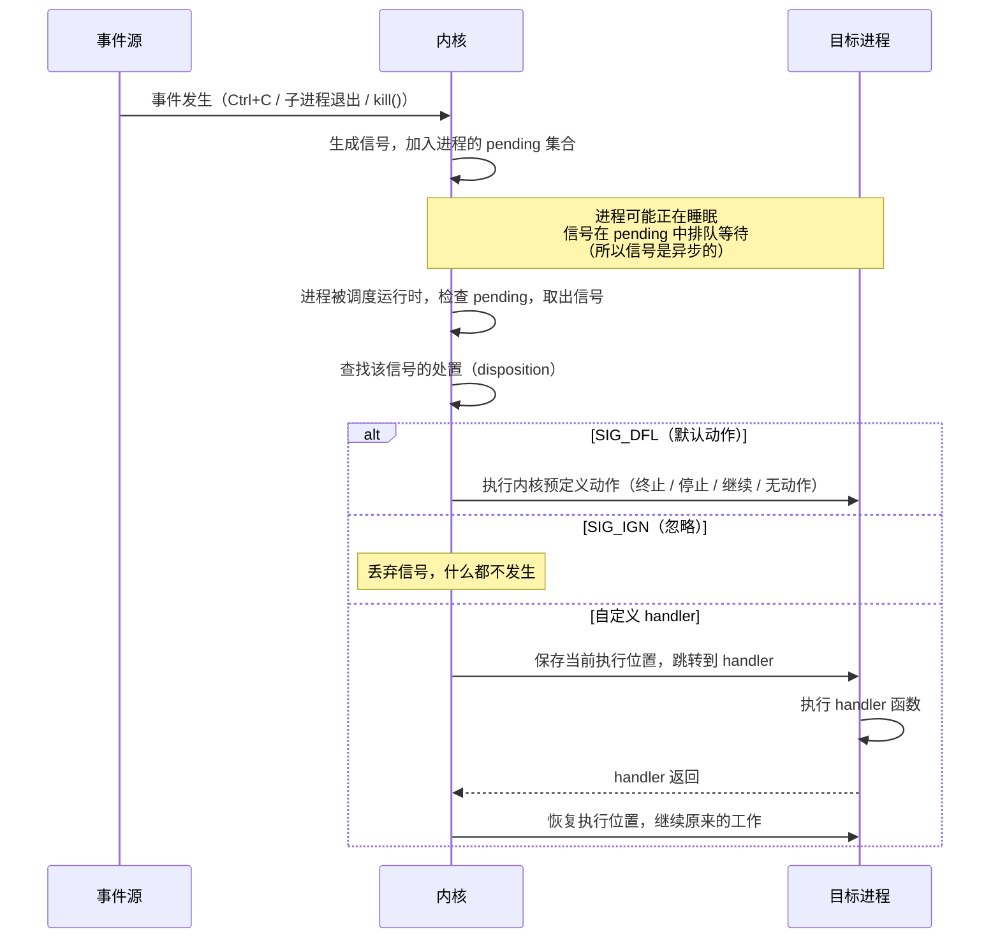
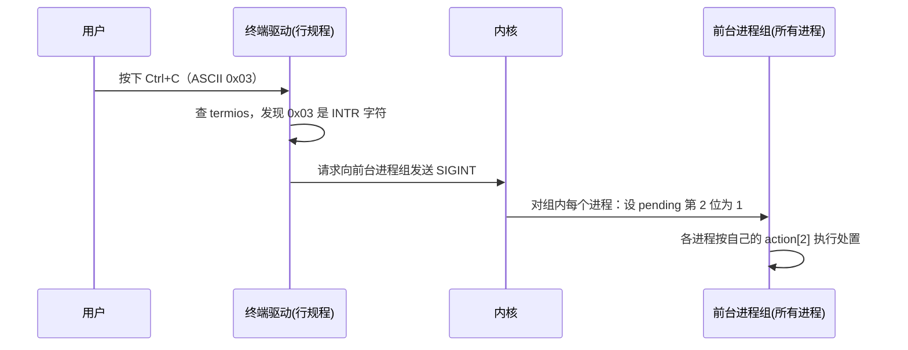

# 信号

> **核心问题**：进程之间怎么发通知？Ctrl-C 做了什么？

---

## 1. 信号是什么

### 问题：怎么打断一个正在运行的进程？

你一定做过这件事：在终端里运行了一个命令，不想等了，按 Ctrl+C，程序停了。

```
$ sleep 100
^C              ← 按 Ctrl+C，sleep 立刻退出
$
```

这看起来理所当然，但停下来想想：`sleep` 正在睡觉，它没有在读键盘输入，也没有在检查"用户是不是按了什么键"。它就是在那儿等着，什么都不做。

**一个什么都不做的进程，怎么会知道你按了 Ctrl+C？**

回忆第一课：每个进程有独立的地址空间，进程之间互相看不到对方的内存。你不能直接修改 `sleep` 的某个变量让它退出。而 `sleep` 自己又不会主动检查任何东西。

那有没有什么间接办法？

**让它自己来检查？** 比如让每个程序每隔一段时间检查一下"有没有人要我停"。但 `sleep` 的整个工作就是"等着不动"，它不会运行任何检查代码。就算它愿意检查，多久查一次？每秒？那按 Ctrl+C 后要等一秒才响应。每毫秒？那 CPU 全浪费在检查上了。而且你不能要求世界上每个程序都加上这段检查逻辑。

**内核直接杀死它？** 内核当然有能力终止任何进程。但如果程序正在写文件写到一半，直接杀死会导致文件损坏。程序需要一个机会来做清理，比如保存数据、关闭文件、通知合作方。

核心问题浮现了：**你需要从外部打断一个进程的执行流，而且要让它有机会响应。** 进程自己不会主动检查，内核直接杀死又太粗暴。需要一个中间方案。

### 解法：软件中断

硬件世界解决过同样的问题。想象 CPU 正在执行你的打字程序，这时网卡收到了一个数据包。CPU 怎么知道数据来了？让 CPU 每隔一小段时间去检查网卡？那和前面说的轮询一样浪费。

硬件的解决方案叫**中断(Interrupt)**。网卡通过一根专门的电线给 CPU 发一个电信号。CPU 收到信号后，不管正在干什么，立刻暂停当前的工作，跳到一段预先注册好的处理代码去执行，处理完再回来继续。

信号(Signal)就是这个思路搬到了进程层面。不是设备打断 CPU，而是**内核打断进程**：

1. 用户按 Ctrl+C
2. 内核记下"要给这个进程发一个 SIGINT 信号"
3. 下次这个进程被调度运行时，内核不让它继续原来的代码，而是强制跳转到一段处理代码
4. 处理完后，进程恢复原来的执行

进程不需要主动检查任何东西，内核替它做了"打断"这件事。

**信号 = 内核强制打断进程执行流、让进程有机会响应异步事件的机制。** 这个"内核打断进程"的本质，决定了信号机制的很多特性（后续各节会逐一展开）：

- 信号是**异步**的，因为你不知道 Ctrl+C 什么时候会来
- 信号能打断正在等待的进程。`sleep` 正在等，照样能被打断
- 信号处理代码有严格限制，因为它在任何时刻打断正常代码，必须很小心（第 7 节详述）
- 必须有一个不可拦截的信号（SIGKILL），万一进程故意不响应，管理员需要最后手段

### 信号在内核中的数据结构

第一课介绍了 `task_struct`（进程控制块）。信号机制在每个进程的 `task_struct` 中用到两样东西（都在内核内存中，用户进程无法直接读写，只能通过系统调用修改）：

**处置数组：每个信号一个槽位**

```c
// 简化表示，实际内核通过指针间接访问
struct k_sigaction  action[64];
```

这是一个 64 元素的数组，下标就是信号编号。`action[2]` 存的是 SIGINT（编号 2）的处置：`SIG_DFL`、`SIG_IGN`、或一个 handler 函数指针。进程调用 `sigaction(SIGINT, ...)` 时，内核做的事就是写 `action[2]`。

**待处理位图：每个信号一个 bit**

```c
sigset_t  pending;   // 位图，第 N 位为 1 表示信号 N 待处理
```

当内核要给进程发 SIGINT 时，把 `pending` 的第 2 位设为 1。这就是"加入 pending 集合"的全部操作：设一个 bit。

**什么时候检查？**

进程从内核态返回用户态的时候（系统调用返回、中断处理完毕），内核检查 `pending` 位图。如果有位为 1，取出对应的信号编号，用这个编号去 `action[]` 查处置，按查到的结果执行。

理解了这两样东西，下面的流程图就不再是抽象的了。

### 信号的完整流程



---

## 2. 信号的处置（Disposition）

每个信号都有一个**处置**(disposition)，决定信号到达时进程怎么响应。

### 内核的默认动作

进程启动时，所有信号的处置都是 `SIG_DFL`（默认）。默认动作由内核为每个信号预定义，不同信号的默认动作不同：

| 默认动作 | 说明 | 信号举例 |
|----------|------|----------|
| 终止 (Term) | 进程退出 | SIGINT, SIGTERM, SIGPIPE, SIGHUP |
| 终止 + 核心转储 (Core) | 退出并生成 core dump | SIGQUIT, SIGSEGV, SIGABRT |
| 停止 (Stop) | 暂停进程（可恢复） | SIGTSTP, SIGSTOP, SIGTTIN, SIGTTOU |
| 继续 (Cont) | 恢复已停止的进程 | SIGCONT |
| 无动作 | 信号被丢弃，什么都不发生 | SIGCHLD, SIGURG |

大多数信号的默认动作是终止进程。所以如果程序不做任何处理，收到 SIGINT 就直接退出。

### 进程可以改变处置

进程可以用 `sigaction()`（第 4 节详述）把某个信号的处置从默认改成以下两种之一：

- **忽略**（`SIG_IGN`）：信号到达时什么都不做，静默丢弃
- **自定义 handler**（函数指针）：信号到达时跳转到指定函数执行

当然也可以改回默认（`SIG_DFL`）。

注意"忽略"和上表中的"无动作"的区别。SIGCHLD 的默认动作是"无动作"，这和主动设置 `SIG_IGN` 效果看似一样，但含义不同：默认是"我没管过这个信号"，`SIG_IGN` 是"我明确选择忽略它"。对于 SIGCHLD，两者甚至有行为差异（`SIG_IGN` 会让子进程被自动回收，不产生僵尸）。

### 不可更改的信号

**SIGKILL (9) 和 SIGSTOP (19) 的处置永远锁定为内核默认动作。** 无论进程怎么调用 sigaction，这两个信号都不受影响。这是操作系统的安全兜底，确保管理员始终能终止或暂停任何进程。

---

## 3. 关键信号速查

Shell 开发中最常遇到的信号：

| 信号 | 编号 | 默认动作 | 触发场景 |
|------|------|----------|----------|
| SIGHUP | 1 | 终止 | 控制终端断开（关闭终端窗口） |
| SIGINT | 2 | 终止 | 用户按 Ctrl+C |
| SIGQUIT | 3 | 核心转储 | 用户按 Ctrl+\\ |
| SIGKILL | 9 | 终止 | `kill -9`，不可捕获 |
| SIGPIPE | 13 | 终止 | 写入无读端的管道 |
| SIGTERM | 15 | 终止 | `kill` 命令的默认信号 |
| SIGCHLD | 17 | 无动作 | 子进程终止或停止 |
| SIGCONT | 18 | 继续 | `fg` / `bg` 恢复暂停进程 |
| SIGSTOP | 19 | 停止 | 不可捕获的暂停 |
| SIGTSTP | 20 | 停止 | 用户按 Ctrl+Z |

> 编号为 x86_64 Linux 上的值。Zig 代码中使用 `SIG.INT`、`SIG.CHLD` 等常量，不要硬编码数字。

---

## 4. sigaction()：注册信号处理器

进程通过 `sigaction()` 系统调用修改自己的处置数组 `action[]`。它接受三个参数：信号编号、新的处置、以及一个用于保存旧处置的输出参数。

注册处置时需要指定三样东西：

1. **handler**：处置方式。`SIG_DFL`（默认）、`SIG_IGN`（忽略）、或自定义函数指针。
2. **mask**：handler 执行期间要额外阻塞哪些信号。当内核调用你的 handler 时，会自动阻塞触发信号本身（比如 SIGINT handler 执行期间，再来一个 SIGINT 不会打断它）。mask 让你指定**除此之外**还要阻塞哪些信号。被阻塞的信号不会丢失，只是暂时挂在 `pending` 里，等 handler 返回后再递送。大多数情况下不需要额外阻塞任何信号。
3. **flags**：控制信号处理的行为细节。最重要的是 `SA_RESTART`（见下文）。

### SA_RESTART

进程正在执行慢速系统调用（如 `read` 等待用户输入）时，如果收到信号，内核会**中断系统调用**去执行 handler。handler 返回后：

- **没有 SA_RESTART**：系统调用返回 `EINTR` 错误，程序必须自己重试
- **设置了 SA_RESTART**：内核自动重新执行被中断的系统调用，对程序透明

Shell 读取用户输入用的是 `read`（慢速系统调用），如果不设 `SA_RESTART`，每次信号都会打断读取，需要额外的重试逻辑。

> Zig API 和使用示例见 [zish/02_signal.md](../zish/02_signal.md#sigaction)。

---

## 5. 实例：Ctrl+C 与 SIGINT

前面几节介绍了信号的通用机制。现在拿一个具体信号 SIGINT 走一遍完整流程，看看用户按 Ctrl+C 时这套机制是怎么运转的。

### 为什么 Ctrl+C 会产生 SIGINT

Ctrl+C 本身只是一个键盘输入，产生 ASCII 码 `0x03`（ETX，End of Text）。它和信号之间没有硬连线的关系。

连接它们的是**终端驱动**。终端驱动中有一个叫行规程(line discipline)的模块，负责解释特殊按键。行规程维护一张映射表（存在 `termios` 结构体中），其中有一项：

```
INTR 字符 = 0x03（Ctrl+C）
```

当行规程收到 `0x03`，它不会把这个字节传给正在读终端的进程，而是通知内核：向终端的**前台进程组**发送 SIGINT。

这个映射是可以改的。`stty intr ^X` 可以把 INTR 字符改成 Ctrl+X，之后按 Ctrl+C 就只是普通输入，按 Ctrl+X 才发 SIGINT。这说明 Ctrl+C 和 SIGINT 之间不是固定的，是终端驱动的配置决定的。

### 终端驱动在系统中的位置

"终端驱动"是什么？它和内核、shell 是什么关系？要理解这一点，需要先看 Linux 的驱动模型。

硬件设备不能直接和用户程序对话。中间一定有一个内核模块负责翻译，这个模块就是**驱动(driver)**。驱动是内核的一部分，运行在内核态。

```
用户程序（shell、cat、vim ...）
─────────────────────────────────
          内核
  ┌─────────────────────┐
  │  驱动                │
  │  · 键盘驱动          │ ← 翻译扫描码为按键事件
  │  · 网卡驱动          │ ← 翻译网络包为 socket 数据
  │  · 磁盘驱动          │ ← 翻译块 I/O 为文件读写
  │  · 终端驱动          │ ← 翻译按键字节为输入流 + 特殊控制
  └─────────────────────┘
─────────────────────────────────
硬件（键盘、网卡、磁盘、串口 ...）
```

所有驱动的共同模式：**硬件产生原始数据 → 驱动翻译成内核能理解的语义 → 内核通过系统调用提供给用户程序**。

终端驱动特殊在哪？大多数驱动只做数据搬运（网卡驱动把字节从网卡搬到内核缓冲区），但终端驱动多了一层**行规程(line discipline)**。行规程会拦截某些特殊字符，不往上传，而是触发控制动作：

| 字符 | 默认按键 | 行规程的动作 |
|------|----------|-------------|
| INTR | Ctrl+C | 向前台进程组发 SIGINT |
| QUIT | Ctrl+\\ | 向前台进程组发 SIGQUIT |
| SUSP | Ctrl+Z | 向前台进程组发 SIGTSTP |
| EOF | Ctrl+D | 通知读端"输入结束" |
| ERASE | Backspace | 删除前一个字符 |

所以终端驱动不只搬运数据，它还理解"用户正在和进程交互"这件事，并在中间做控制。Shell 从终端读到的输入，是行规程处理过的结果。

### 终端、键盘和屏幕的关系

看到上面的分层图，你可能会问：终端驱动的输入不就是键盘的输入吗？终端到底是什么？

**历史上的终端是一个独立的物理设备。** 在 1970-80 年代，计算机（主机）放在机房里，用户通过一根串口线连接一台叫"终端"的设备来操作。终端自带键盘和屏幕（比如 DEC VT100），但它不是一台电脑，它只做一件事：把键盘输入通过串口发给主机，把主机返回的字符显示在屏幕上。

```
┌──────────────────┐       串口线       ┌──────────────────┐
│ 终端（VT100）      │ ←──────────────→ │ 主机               │
│ 自带键盘 + 屏幕    │                   │ 运行 Unix          │
│ 不运行任何程序     │                   │ 终端驱动管理串口    │
└──────────────────┘                   └──────────────────┘
```

在这个架构下，键盘驱动和终端驱动是完全不同的东西：

- **键盘驱动**在终端设备内部，把按键扫描码转成 ASCII 字节
- **终端驱动**在主机的内核里，管理串口连接，运行行规程

两者隔着一根串口线，一个在终端硬件上，一个在主机内核里。

**现在没有物理终端了。** 你用的 iTerm2、GNOME Terminal 这些程序叫**终端模拟器**，它们是普通的 GUI 程序，在屏幕上画一个窗口来模拟过去物理终端的行为。

既然没有了物理串口线，内核用什么来连接终端模拟器和终端驱动？答案是**伪终端(PTY, pseudo-terminal)**：一对由内核创建的虚拟文件描述符，模拟过去的串口连接。终端模拟器写入 PTY 的一端，终端驱动从另一端读取，效果和物理串口完全一样。

现在按下键盘到 shell 收到输入的完整路径：

```
物理键盘
  → 键盘驱动（内核）：扫描码 → 按键事件
    → GUI 系统（X11 / Wayland / macOS 窗口系统）：按键事件 → 字符
      → 终端模拟器（iTerm2 等，用户态程序）：字符写入 PTY
        → 终端驱动 + 行规程（内核）：处理特殊字符，普通字符放入缓冲区
          → shell（用户态程序）：read() 读到输入
```

键盘和终端之间隔了好几层。终端驱动不知道也不关心输入来自物理键盘、SSH 连接还是一段脚本，它只处理从 PTY 收到的字节流。这就是为什么终端是一个**抽象层**，不绑定任何具体硬件。

### 完整路径



### 前台进程组

每个终端有一个"前台进程组"(foreground process group)。简单来说：

- 当 shell 启动一个命令（如 `sleep 5`），默认情况下 shell 和子进程在同一个进程组
- Ctrl+C 产生的 SIGINT 发给这个组里的**所有进程**，包括 shell 本身
- 这就是为什么按 Ctrl+C 时，shell 和子进程都收到 SIGINT

> 进程组和会话的完整机制留给 [03_process_group.md](03_process_group.md)。这里只需要理解：Ctrl+C 不是只发给一个进程，而是发给一组进程。

---

## 6. fork/exec 时信号处置怎么办？

第 4 节讲了怎么用 `sigaction()` 修改处置。比如 shell 会忽略 SIGINT，这样 shell 不会被 Ctrl+C 杀死。但 shell 需要 fork + exec 来启动子进程（第一课）。

这就引出一个问题：**shell 忽略了 SIGINT，fork 出来的子进程也忽略 SIGINT 吗？**

如果子进程继承了 SIG_IGN，用户运行 `sleep 5` 后按 Ctrl+C，sleep 也不会响应。如果子进程不继承，从默认值开始，那就没问题。到底是哪种？

答案要从 fork 和 exec 分别做了什么来推导。

### fork 时发生了什么

回忆第一课：fork 把当前进程复制一份。内核为子进程创建一份新的 `task_struct`，大部分字段从父进程复制而来。信号相关的两样东西，内核做了不同的决策：

**处置数组 `action[64]`：复制。** 子进程得到一份独立的副本，初始值和父进程一样。父进程的 `action[2]` 是 SIG_IGN，子进程的 `action[2]` 也是 SIG_IGN。之后各改各的，互不影响。这个决策的理由是：处置代表进程"遇到信号时该怎么做"的策略，子进程作为父进程的副本，继承同样的策略是合理的起点。

**待处理位图 `pending`：不复制，从全 0 开始。** 这也是一个设计决策。pending 里的信号是别人发给父进程的，是父进程的"待办事项"。子进程是一个新的进程，还没有人给它发过信号，从空白开始更合理。

### exec 时发生了什么

exec 替换进程的整个地址空间（代码、数据、堆、栈全部换成新程序的）。现在考虑 `action[]` 数组中存的三种值在 exec 后会怎样：

**SIG_DFL 和 SIG_IGN**：回忆第 1 节，这两个值分别是常量 0 和 1。它们不依赖旧程序的任何代码。地址空间换了对它们没有影响。所以 exec 后 SIG_DFL 和 SIG_IGN 都保持不变。

**自定义 handler**：handler 是一个函数指针，指向旧程序代码段中某个函数的地址。exec 之后旧程序的代码已经不存在了，被新程序的代码替换了。这个指针现在指向一个未知的位置。如果内核不处理，下次信号到达时进程会跳到一个随机地址然后崩溃。所以内核在 exec 时**必须**把所有自定义 handler 重置为 SIG_DFL。

注意：这不是一条需要记忆的规则。它是从 exec 的行为（替换地址空间导致旧的函数指针失效）直接推导出来的。

### 对 shell 的影响

现在回到开头的问题。shell 忽略 SIGINT（`action[2]` = SIG_IGN），然后 fork + exec 一个命令：

1. fork：子进程复制了 `action[2]` = SIG_IGN
2. exec：SIG_IGN 是常量，不受地址空间替换的影响，保持不变
3. 子进程执行的 `sleep` 也忽略 SIGINT。用户按 Ctrl+C，sleep 无反应。**这是一个 bug。**

**修复**：子进程在 fork 后、exec 前，把 SIGINT 重置为 SIG_DFL。第一课讲过 fork 和 exec 之间是一段可以写任意代码的区间，在这里重置处置：

```zig
const pid = try posix.fork();

if (pid == 0) {
    // 这里是子进程在执行。
    // sigaction 没有"目标进程"参数，它修改的永远是调用者自己的 action[]。
    // 子进程调用 sigaction，改的就是子进程的处置数组。
    const dfl = posix.Sigaction{
        .handler = .{ .handler = posix.SIG.DFL },
        .mask = posix.sigemptyset(),
        .flags = 0,
    };
    posix.sigaction(posix.SIG.INT, &dfl, null);

    return posix.execvpeZ(cmd, argv, envp);
}
```

这是所有 shell 都必须做的事。`bash`、`zsh` 的源码中都有类似逻辑。

注意：如果 shell 用的是自定义 handler（而非 SIG_IGN）来处理 SIGINT，就不需要手动重置。因为自定义 handler 在 exec 时会被内核自动重置为 SIG_DFL（函数指针失效，必须重置）。但 shell 的标准做法是用 SIG_IGN（收到 SIGINT 时 shell 不需要执行任何逻辑，只需要不死），所以必须手动重置。

---

## 7. 谁能发信号？

第 5 节详细讲了 Ctrl+C → SIGINT 的路径。但信号不只来自键盘。回顾第 1 节流程图中"信号产生"这一步，发信号的来源一共有三种：

### 来源一：终端驱动

第 5 节已经讲过。用户按下特殊按键，行规程识别后通知内核发信号。这条路径只能产生几个固定的信号（SIGINT、SIGQUIT、SIGTSTP），而且只发给前台进程组。

### 来源二：内核自己

内核在处理某些事件时，会主动给相关进程发信号。这不需要任何用户操作，也不经过终端驱动。

| 内核事件 | 产生的信号 | 目标进程 |
|----------|-----------|---------|
| 子进程退出或停止 | SIGCHLD | 父进程 |
| 进程访问非法内存 | SIGSEGV | 出错的进程自己 |
| 进程执行非法指令 | SIGILL | 出错的进程自己 |
| 写入无读端的管道 | SIGPIPE | 写端进程 |
| 定时器到期 | SIGALRM | 设定定时器的进程 |

内核发信号的操作和终端驱动发信号完全一样：找到目标进程的 `pending` 位图，把对应信号的 bit 设为 1。区别只在于触发条件不同。

### 来源三：其他进程

任何进程都可以通过 `kill()` 系统调用给另一个进程发信号（需要权限，通常要求同一用户或 root）：

```zig
// 向 PID 为 1234 的进程发送 SIGTERM
std.os.linux.kill(1234, std.posix.SIG.TERM);
```

Shell 里的 `kill` 命令就是这个系统调用的封装：

```
$ kill 1234        # 发送 SIGTERM（默认）
$ kill -9 1234     # 发送 SIGKILL
```

### 本质：只有内核能发信号

回头看这三种来源，真正在 `pending` 位图上设 bit 的是谁？

- 来源一：行规程设的。但行规程是终端驱动的一部分，终端驱动是**内核代码**，运行在内核态。
- 来源二：内核自己在处理 `exit()`、缺页异常等事件时设的。
- 来源三：用户进程调用 `kill()`，这是一个**系统调用**。进程自己不能直接操作 `pending` 位图（那是内核内存），它只能请求内核代劳。

所以三种来源归结为同一件事：**只有内核能发信号。** 区别仅在于谁触发了内核的这个动作：

```
触发方                          路径                      最终操作
───────────────────────────────────────────────────────────────────
终端驱动（行规程）               内核代码直接调用  ──→
                                                        内核设目标进程
内核自身逻辑（exit / 异常）      内核代码直接调用  ──→   pending 位图
                                                        的对应 bit
用户进程                         kill() 系统调用   ──→
───────────────────────────────────────────────────────────────────
```

行规程不需要通过系统调用，因为它本身就是内核的一部分，可以直接调用内核内部的信号发送函数（`send_sig_info()`）。用户进程不在内核中，所以必须通过 `kill()` 系统调用跨越用户态/内核态的边界，请求内核来执行同一个函数。

这和第一课讲的 `fork()`、`exec()` 是一样的模式：用户进程不能直接操作内核数据结构，只能通过系统调用请求内核代劳。

---

## 8. SIGCHLD 与僵尸回收

理解了信号的三种来源，现在来看一个"内核自己发信号"的重要实例。

第一课讲过：子进程退出后变成僵尸，父进程必须调用 `waitpid()` 回收。但父进程怎么知道子进程退出了？

答案就是第二种来源：**内核在子进程退出时，主动向父进程发送 SIGCHLD。** 这不经过终端驱动，不需要任何用户操作。内核在执行子进程的 `exit()` 时，找到它的父进程，在父进程的 `pending` 位图中把 SIGCHLD（第 17 位）设为 1。

### 在 handler 中回收

一种做法是注册 SIGCHLD handler，在里面调用 `waitpid`：

```zig
fn sigchld_handler(sig: i32) callconv(.c) void {
    _ = sig;
    // 用 WNOHANG 循环回收所有已退出的子进程
    while (true) {
        const result = posix.waitpid(-1, posix.W.NOHANG);
        if (result.pid == 0) break;  // 没有更多已退出的子进程
    }
}
```

但这有一个严重问题：**async-signal-safety**。

### async-signal-safety 约束

信号 handler 可以在程序的**任何时刻**被调用，包括 `malloc` 执行到一半、持有锁的时候。如果 handler 里也调用 `malloc`，就会死锁或破坏堆。

POSIX 定义了一个"async-signal-safe"函数列表，**只有这些函数才能在 handler 中安全调用**。常见的安全/不安全函数：

| 可以调用 | 不可以调用 |
|----------|-----------|
| `write()` | `printf()` / `std.debug.print()` |
| `waitpid()` | `malloc()` / `free()` |
| `_exit()` | 任何分配内存的操作 |
| 设置全局 flag | 获取锁 |

### 推荐模式：flag + 主循环

更安全的做法：handler 里只设一个标志，主循环中检查标志并回收：

```zig
// 全局标志（volatile 语义确保编译器不优化掉读取）
var got_sigchld: bool = false;

fn sigchld_handler(sig: i32) callconv(.c) void {
    _ = sig;
    @as(*volatile bool, @ptrCast(&got_sigchld)).* = true;
}

// 主循环中
if (@as(*volatile bool, @ptrCast(&got_sigchld)).*) {
    @as(*volatile bool, @ptrCast(&got_sigchld)).* = false;
    while (true) {
        const result = posix.waitpid(-1, posix.W.NOHANG);
        if (result.pid == 0) break;
        // 处理子进程退出状态...
    }
}
```

> SIGCHLD handler 在需要后台进程管理时才有意义。同步 `waitpid`（阻塞等待子进程）够用的场景下不需要。

---

## 9. 本章小结

| 概念 | 说明 |
|------|------|
| 信号(Signal) | 异步通知机制，软件中断 |
| 处置(Disposition) | 收到信号时的动作：默认 / 忽略 / 自定义 handler |
| `sigaction()` | 注册信号处理器 |
| SA.RESTART | 被信号中断的慢速系统调用自动重启 |
| SIGKILL / SIGSTOP | 不可捕获、不可忽略的信号 |
| 前台进程组 | Ctrl+C 发给整个前台进程组，不是单个进程 |
| fork 继承 | 子进程继承信号处置和掩码 |
| exec 重置 | 自定义 handler 重置为 DFL，SIG_IGN 保持 |
| SIGCHLD | 子进程状态变化时内核通知父进程 |
| async-signal-safety | handler 中只能调用有限的安全函数 |

**核心洞察**：信号不只是"杀进程"的工具，它是内核与进程之间、进程与进程之间的通知协议。Shell 必须主动管理信号的处置和继承，否则 Ctrl+C 会杀死 shell 自身，或者子进程会意外继承 shell 的信号策略。

---

**Linux 源码入口**：
- [`kernel/signal.c`](https://elixir.bootlin.com/linux/latest/source/kernel/signal.c) — `do_send_sig_info()`：信号发送的核心路径
- [`kernel/signal.c`](https://elixir.bootlin.com/linux/latest/source/kernel/signal.c) — `get_signal()`：信号递送，检查 pending 并执行处置
- [`fs/exec.c`](https://elixir.bootlin.com/linux/latest/source/fs/exec.c) — `flush_signal_handlers()`：exec 时重置信号处理器

---

下一篇：[`03_process_group.md`](03_process_group.md) — 进程组与会话：fg/bg/jobs 背后的状态机
