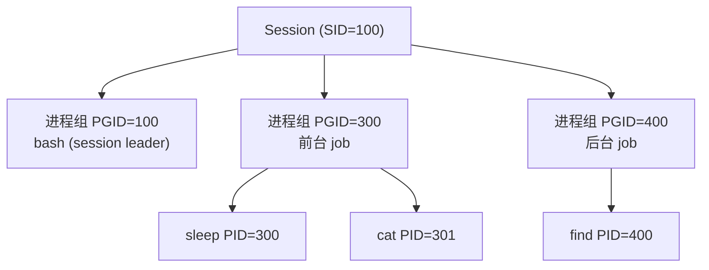
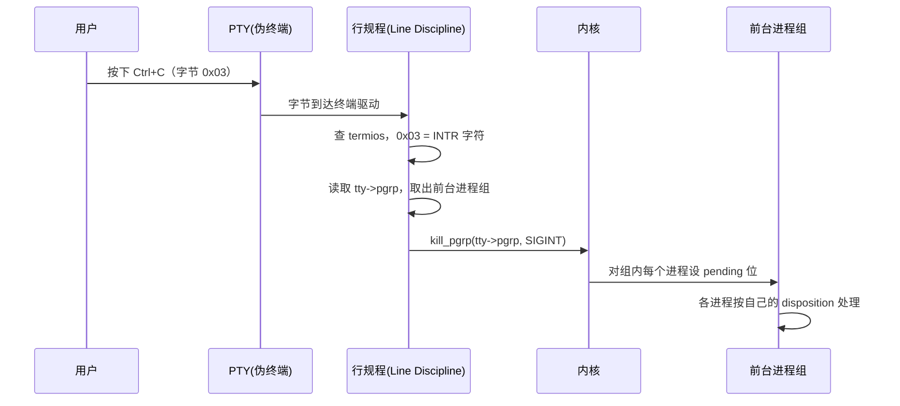
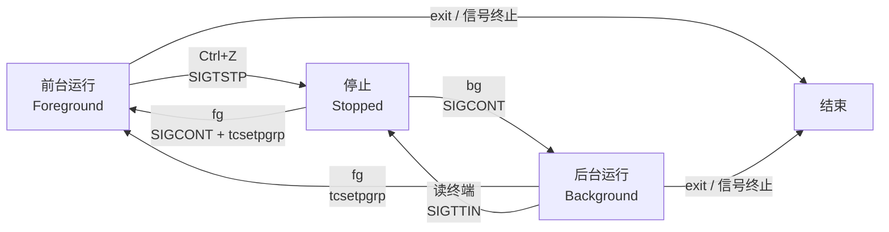
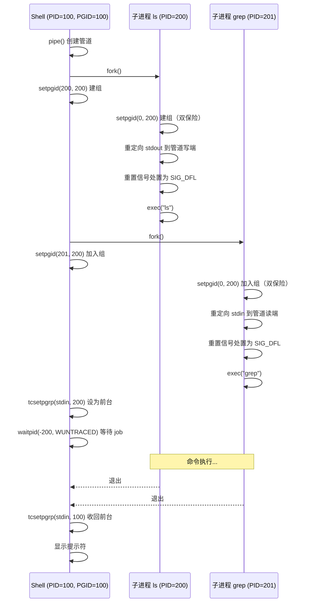

# 进程组与会话

> **核心问题**：fg/bg/jobs 背后的状态机是什么？

---

## 1. 谁把两个进程绑在一起？

在终端运行一个管道，然后按 Ctrl+C：

```
$ sleep 100 | cat
^C
$
```

两个进程同时退出了。第二课讲过原因：Ctrl+C 让终端驱动向**前台进程组**(foreground process group)发送 SIGINT，组内所有进程都收到信号。

但第二课没有回答三个问题：

1. 谁创建了这个"进程组"？
2. 为什么 `sleep` 和 `cat` 在同一个组里？
3. shell 自己在不在这个组里？

这三个问题的答案构成了本章的主线。

---

## 2. 进程组(Process Group)

### 什么是进程组

进程组是一组共享同一个 PGID(Process Group ID) 的进程。PGID 等于组长(group leader)的 PID。组长就是第一个加入（或创建）这个组的进程。

```
进程组 (PGID = 200)
├── sleep  PID=200  ← 组长（PGID == PID）
└── cat    PID=201
```

### 内核中 PGID 存在哪

第一课介绍了 `task_struct`。PGID 的存储路径是 `task_struct->signal->pids[PIDTYPE_PGID]`，涉及三个数据结构：

```c
// include/linux/sched.h
struct task_struct {
    struct signal_struct  *signal;    // 同一线程组共享
    // ...
};

// include/linux/sched/signal.h
struct signal_struct {
    struct pid  *pids[PIDTYPE_MAX];  // 下标：PID / TGID / PGID / SID
    // ...
};

// include/linux/pid.h
enum pid_type {
    PIDTYPE_PID,   // 0 — 进程 ID
    PIDTYPE_TGID,  // 1 — 线程组 ID
    PIDTYPE_PGID,  // 2 — 进程组 ID  ← 我们关心的
    PIDTYPE_SID,   // 3 — 会话 ID
    PIDTYPE_MAX,	 // 4 — 不是真的类型，C 的惯用手法：放在 enum 末尾当数组长度用
};

struct pid {
    refcount_t          count;            // 引用计数
    unsigned int        level;            // namespace 层级深度
    spinlock_t          lock;
    struct hlist_head   tasks[PIDTYPE_MAX]; // 反向链表：挂着所有指向此 pid 的 task
    struct upid         numbers[];        // 各层 namespace 中的数值
};
```

第一课讲过，每个进程对应一个 `task_struct`。`task_struct` 的 `signal->pids[]` 数组存放了这个进程的一组不同类型的 ID。同属于一个进程组的进程，它们的 `pids[PIDTYPE_PGID]` 是相同的，都指向**同一个** `struct pid` 实例：

```
task_struct (sleep, PID=200)          task_struct (cat, PID=201)
  └→ signal->pids[PGID] ──┐            └→ signal->pids[PGID] ──┐
                           │                                    │
                           ▼                                    ▼
                       ┌──────────────────────────────────────────┐
                       │ struct pid  (代表 PGID=200)              │
                       │   tasks[PGID]: sleep ←→ cat             │
                       │   numbers[0].nr = 200                   │
                       └──────────────────────────────────────────┘
```

所以进程组不是一个单独的内核对象。所谓进程组，就是一群 `pids[PIDTYPE_PGID]` 相同的进程。`setpgid()` 做的事就是改写进程的 `pids[PIDTYPE_PGID]` 的值，让它指向另一个 `struct pid`。改完之后这个进程就属于新的进程组了。

### 系统调用

| 调用 | 作用 |
|------|------|
| `setpgid(pid, pgid)` | 将进程 pid 的 PGID 设为 pgid。pid=0 表示自己，pgid=0 表示用 pid 做 PGID |
| `getpgid(pid)` | 查询进程 pid 的 PGID |
| `getpgrp()` | 等价于 `getpgid(0)`，查询自己的 PGID |

### kill 向整组发信号

`kill()` 系统调用的第一个参数如果传**负数**，内核把它解释为 PGID，向该组的所有进程发信号：

```c
kill(-300, SIGINT);   // 向 PGID=300 的所有进程发 SIGINT
```

用户进程通过 `kill()` 系统调用来发信号。行规程(line discipline)是内核代码，不需要走系统调用，它直接调用内核内部的 `kill_pgrp()` 函数，效果相同：向整个前台进程组发信号，不是逐个发。

---

## 3. 为什么需要进程组？

三个原因，逐个展开。

### 原子性

终端驱动只知道一个 PGID。按 Ctrl+C 时，行规程执行一次 `kill(-pgid, sig)`。如果没有进程组，终端驱动需要维护一个"当前前台进程列表"，在进程创建和退出时更新它，这会引入复杂的同步问题。进程组把"谁属于前台"这个信息下放到每个进程自己的 PGID 字段里，终端驱动只需要记住一个数字。

### 管道一致性

`ls | sort | head` 是一个 job，三个进程应该作为一个整体被管理。用户按 Ctrl+C 期望三个都停，按 Ctrl+Z 期望三个都暂停。进程组让 shell 把一条管道中的所有进程放进同一个组，实现统一控制。

### 前台/后台区分

终端只有一个"前台进程组"。其他进程组都是后台。这个区分让 shell 能同时管理多个 job：前台 job 能读写终端，后台 job 不能读终端（否则多个 job 同时读 stdin 会混乱）。

### shell 怎么建组

理解了进程组的作用，回到第 1 节的问题：`sleep 100 | cat` 的进程组是谁创建的？

答案是 shell。shell 每启动一个 job（无论是单个命令还是一条管道），都会为它创建一个新的进程组。以 `ls | grep foo` 为例：

1. shell fork 出子进程 A（PID 300）来执行 `ls`，fork 出子进程 B（PID 301）来执行 `grep`
2. 第一个子进程 A 的 PID（300）作为整个 job 的 PGID
3. shell 调用 `setpgid(300, 300)` 和 `setpgid(301, 300)`，把 A 和 B 都放进 PGID=300 的组
4. 子进程 A 和 B 也分别调用 `setpgid(0, 300)` 把自己放进这个组

为什么 shell 和子进程**都要调用** `setpgid`？因为存在竞态(race condition)。fork 返回后，不确定是父进程先执行还是子进程先执行。如果只有 shell 调用，子进程可能在 shell 来得及设置之前就执行了 exec，那时它还在 shell 的进程组里。如果只有子进程调用，shell 可能在子进程设置之前就调用了 `tcsetpgrp`（第 5 节会讲），把一个还不存在的进程组设为前台。两边都调用，谁先执行都能正确建组。后执行的那个调用会发现 PGID 已经对了，相当于空操作。

---

## 4. 会话(Session)

### 为什么还需要会话

进程组把一条管道绑在一起。但一个 shell 窗口里可能有多个 job：一个前台、若干后台。这些 job（进程组）加上 shell 自己，构成一个更大的集合。这个集合需要和同一个终端关联，关闭终端时这些进程都应该收到 SIGHUP。

会话(Session)就是这个更大的集合。

### 三级层次

```
┌─────────────────────────────────────────────────────┐
│ Session (SID = 100)                                 │
│                                                     │
│  ┌─────────────────┐  ┌──────────────────────────┐  │
│  │ 进程组 PGID=100 │  │ 进程组 PGID=300          │  │
│  │                 │  │                          │  │
│  │  bash (PID=100) │  │  sleep (PID=300, leader) │  │
│  │  (session       │  │  cat   (PID=301)         │  │
│  │   leader)       │  │                          │  │
│  └─────────────────┘  └──────────────────────────┘  │
│                                                     │
│  ┌──────────────────────────┐                       │
│  │ 进程组 PGID=400          │                       │
│  │                          │                       │
│  │  find (PID=400, leader)  │  ← 后台 job           │
│  └──────────────────────────┘                       │
└─────────────────────────────────────────────────────┘
```

- **会话(Session)**：包含多个进程组，由 session leader 创建
- **进程组(Process Group)**：一个 job，包含一个或多个进程
- **进程(Process)**：最小的执行单元

SID(Session ID) 等于 session leader 的 PID。session leader 通常是 shell 进程。



### setsid()

进程调用 `setsid()` 创建一个新会话。调用后：

1. 调用者成为新会话的 session leader
2. 调用者成为新进程组的组长（PGID = PID = SID）
3. 新会话没有控制终端（控制终端的概念见第 5 节）

限制：已经是进程组组长的进程不能调用 `setsid()`。原因是 `setsid()` 会创建一个新进程组，PGID = 调用者的 PID。但组长的 PID 已经等于当前的 PGID，老的进程组里可能还有其他成员在用这个 PGID。如果再创建一个同样 PGID 的新组，内核就无法区分新组和老组了。

### 终端模拟器启动时的过程

打开一个终端窗口（如 iTerm2）时发生的事：

1. 终端模拟器创建一对 PTY(pseudo-terminal)
2. 终端模拟器 fork 一个子进程
3. 子进程调用 `setsid()`，创建新会话，自己成为 session leader
4. 子进程调用 `open("/dev/pts/N")` 获得从端的 fd，这个从端成为新会话的控制终端
5. 子进程用 `dup2` 把这个 fd 复制到 0、1、2 三个位置（见下文解释）
6. 子进程 exec 执行 shell（如 bash、zsh）
7. 从此，shell 的 stdin/stdout/stderr 都指向 PTY 从端，shell 是这个会话的 session leader

### fd 怎么变成 stdin/stdout/stderr

上面第 4、5 步需要解释。这涉及文件描述符(file descriptor, fd)的基本机制。

**fd 是什么？** 每个进程有一张文件描述符表(file descriptor table)，是一个数组。数组的下标（0、1、2、3...）就是 fd，每个槽位指向一个内核中的文件或设备对象。进程通过 fd（整数编号）来读写文件和设备。

```
进程的 fd 表
┌────┬──────────────────────┐
│ 0  │  → ???               │ ← stdin（标准输入）
├────┼──────────────────────┤
│ 1  │  → ???               │ ← stdout（标准输出）
├────┼──────────────────────┤
│ 2  │  → ???               │ ← stderr（标准错误）
├────┼──────────────────────┤
│ 3  │  → （空）             │
│ .. │                      │
└────┴──────────────────────┘
```

stdin、stdout、stderr 不是三个特殊的东西。它们只是 fd 0、1、2 的别名。内核不知道什么是"标准输入"，它只知道 fd 编号。之所以 fd 0 叫 stdin，纯粹是 Unix 的**约定**：所有程序都默认从 fd 0 读输入，向 fd 1 写输出，向 fd 2 写错误信息。

**`open` 做了什么？** `open("/dev/pts/0")` 在 fd 表中找到最小的空闲槽位，让它指向 `/dev/pts/0` 这个设备，返回这个槽位的编号。如果 fd 0、1、2 都空着，第一次 `open` 返回 0。

**`dup2` 做了什么？** `dup2(fd, 0)` 把 fd 表中第 0 个槽位的指向，改成和 fd 指向同一个设备。效果就是"让 fd 0 指向 fd 所指向的东西"。

终端模拟器的子进程做的事：

```
setsid()                        // 创建新会话，脱离旧终端
int fd = open("/dev/pts/0")     // 打开 PTY 从端，假设返回 fd=3
dup2(fd, 0)                     // fd 表[0] → /dev/pts/0   （stdin）
dup2(fd, 1)                     // fd 表[1] → /dev/pts/0   （stdout）
dup2(fd, 2)                     // fd 表[2] → /dev/pts/0   （stderr）
close(fd)                       // 不再需要 fd=3，关掉
exec("bash")                    // 替换为 shell，fd 表保留
```

exec 后，shell 的 fd 0/1/2 全部指向 PTY 从端。shell 调用 `read(0, ...)` 读用户输入，实际是在读 PTY 从端。shell 调用 `write(1, ...)` 输出内容，实际是在写 PTY 从端。终端模拟器从主端读到这些内容，显示在屏幕上。

```
进程的 fd 表（exec 后的 shell）
┌────┬──────────────────────┐
│ 0  │  → /dev/pts/0        │ ← stdin：从这里读用户输入
├────┼──────────────────────┤
│ 1  │  → /dev/pts/0        │ ← stdout：往这里写输出
├────┼──────────────────────┤
│ 2  │  → /dev/pts/0        │ ← stderr：往这里写错误
└────┴──────────────────────┘
         全部指向同一个 PTY 从端
```

这就是为什么前面说"shell 的 `STDIN_FILENO`（fd 0）指向 PTY 从端，也就是控制终端"。

---

## 5. 控制终端(Controlling Terminal)

### 控制终端是什么

上一节讲了终端模拟器启动时，shell 的 fd 0/1/2 都指向 PTY 从端。但 fd 是每个进程自己的东西（每个进程有自己的 fd 表）。内核需要在**会话级别**记住"这个会话绑定的是哪个终端设备"，这就是控制终端。

控制终端就是一个会话绑定的 PTY 从端设备对象。每个会话最多绑定一个。fd 表中的 fd 0/1/2 是用户态进程访问这个设备的方式，而控制终端是内核记录的会话级属性。

在内核中，控制终端存储在 `task_struct->signal->tty` 字段里，它是一个指向 `struct tty_struct` 的指针，直接指向这个从端设备对象。同一个会话中的所有进程共享这个指针。

### 控制终端的作用

控制终端是会话和用户之间的连接点。它的作用体现在内核中 `struct tty_struct` 存储的两个关键字段上：

```c
// include/linux/tty.h（简化）
struct tty_struct {
    struct pid  *pgrp;     // 前台进程组（pgrp = Process GRouP）
    struct pid  *session;  // 所属会话
    // ...
};
```

**作用一：路由键盘信号。** 用户按 Ctrl+C 时，行规程需要知道信号该发给谁。它从 `tty->pgrp` 取出前台进程组，调用 `kill_pgrp(tty->pgrp, SIGINT)` 发信号。终端驱动不知道"哪些进程在前台"，它只知道 `tty->pgrp` 这一个指针。

**作用二：终端断开时通知会话。** 关闭终端窗口时，内核从 `tty->session` 找到 session leader，向它发送 SIGHUP。

这两个作用都依赖 `struct tty_struct` 上的字段。没有控制终端，键盘信号不知道往哪发，终端断开也没人收到通知。

### tcsetpgrp / tcgetpgrp

`tty->pgrp` 是谁设置的？是 shell。shell 通过以下系统调用操作控制终端上的 `pgrp` 字段：

| 调用 | 作用 |
|------|------|
| `tcsetpgrp(fd, pgid)` | 改写 `tty->pgrp` 的值，把前台进程组设为 pgid |
| `tcgetpgrp(fd)` | 读取 `tty->pgrp` 的值，查询当前前台进程组 |

第一个参数 fd 要求是控制终端的文件描述符。shell 的 stdin（fd 0，即 `STDIN_FILENO`）指向的就是 PTY 从端，也就是控制终端。所以 shell 传 `STDIN_FILENO` 就是在操作自己的控制终端。

shell 启动一个前台命令时：

1. 为命令创建新进程组（`setpgid`）
2. 调用 `tcsetpgrp(STDIN_FILENO, child_pgid)` 把 `tty->pgrp` 改为新进程组
3. `waitpid` 等待命令结束
4. 命令结束后，调用 `tcsetpgrp(STDIN_FILENO, shell_pgid)` 把 `tty->pgrp` 改回自己

### 完整的 Ctrl+C 路径

第二课画了一个简化版的 Ctrl+C 流程图。现在有了进程组和控制终端的知识，可以画出完整路径：



### SIGTTIN 和 SIGTTOU：后台进程的终端访问控制

如果一个后台进程试图从终端读取输入，会发生什么？

终端驱动检测到读取者的 PGID 和 `tty->pgrp` 不一致，说明它不是前台进程组的成员。终端驱动不会让它读到数据，而是向该进程的进程组发送 **SIGTTIN**。SIGTTIN 的默认动作是停止(Stop)进程。

```
$ cat &             ← cat 在后台运行
[1] 500
$
[1]+  Stopped         cat
```

`cat` 试图读 stdin，收到 SIGTTIN，被停止。

类似地，后台进程试图写入终端时，如果终端设置了 `TOSTOP` 标志，内核向其发送 **SIGTTOU**，同样停止进程。默认情况下 `TOSTOP` 未设置，后台进程可以直接写终端（所以后台 job 的输出会突然出现在屏幕上）。

这两个信号的意义是：**保证同一时刻只有一个 job 在读终端**。否则多个 job 同时读 stdin，谁读到哪个字节就变成不确定的了。

---

## 6. Job Control 状态机

### 三个状态

一个 job（进程组）在 shell 的管理下有三个状态：



### Ctrl+Z 的完整流程

用户按 Ctrl+Z 暂停一个前台 job，背后发生了什么：

1. 用户按 Ctrl+Z，终端驱动识别出 SUSP 字符
2. 行规程调用 `kill(-fg_pgid, SIGTSTP)` 向前台进程组发送 SIGTSTP
3. 前台进程组的所有进程收到 SIGTSTP，默认动作是停止(Stop)
4. 进程状态从 Running 变为 Stopped
5. 内核向 shell（父进程）发送 SIGCHLD，通知子进程状态变化
6. shell 的 `waitpid`（带 `WUNTRACED` 标志）返回，报告子进程被停止
7. shell 用 `tcsetpgrp` 把前台还给自己
8. shell 在 job 表中记录这个 job 为 Stopped 状态
9. shell 打印 `[1]+  Stopped` 并显示新的提示符

### fg 做了什么

```
$ fg %1
```

1. shell 在 job 表中找到 job 1 对应的 PGID
2. shell 调用 `tcsetpgrp(STDIN_FILENO, job_pgid)` 把前台交给这个 job
3. shell 调用 `kill(-job_pgid, SIGCONT)` 向整个进程组发送 SIGCONT
4. Stopped 的进程收到 SIGCONT，恢复运行
5. shell 调用 `waitpid` 等待这个 job 结束（或再次被停止）

### bg 做了什么

```
$ bg %1
```

1. shell 在 job 表中找到 job 1 对应的 PGID
2. shell 调用 `kill(-job_pgid, SIGCONT)` 向整个进程组发送 SIGCONT
3. 进程恢复运行，但 shell **不调用 `tcsetpgrp`**，前台仍然是 shell 自己
4. job 在后台运行，shell 继续显示提示符

fg 和 bg 的区别就是一个 `tcsetpgrp`：fg 把前台交给 job，bg 不交。

### jobs 做了什么

`jobs` 只是打印 shell 内部的 job 表，不涉及任何系统调用。shell 维护一个数据结构，记录每个 job 的 PGID、状态（Running / Stopped）和命令行文本。

---

## 7. Shell 怎么管理进程组

把前面各节的知识组合起来，看 shell 执行一条管道命令 `ls | grep foo` 的完整过程：



### Shell 自己忽略的信号

Shell 在启动时必须忽略三个信号：

| 信号 | 为什么忽略 |
|------|-----------|
| SIGTSTP | 用户按 Ctrl+Z 时，shell 不能被暂停（否则谁来恢复它？） |
| SIGTTIN | shell 有时在后台进程组里（前台 job 运行时），不能被停止 |
| SIGTTOU | shell 需要调用 `tcsetpgrp` 修改终端属性，不能因此被停止 |

加上第二课已经讲过的 SIGINT，shell 启动时至少忽略四个信号。子进程在 fork 后、exec 前要把这些信号全部重置为 SIG_DFL。

### 前台 job 退出后的回收

前台 job 退出后，shell 必须立即调用 `tcsetpgrp(STDIN_FILENO, shell_pgid)` 把前台进程组设回自己。如果不做这一步，终端的前台进程组指向一个已经不存在的 PGID，下一次 Ctrl+C 的信号会发给错误的目标（或者没有目标）。

---

## 8. 孤儿进程组(Orphan Process Group)

### 问题场景

考虑这个场景：

```bash
$ bash              # 启动子 shell (PID=500)
$ sleep 100 &       # 在子 shell 中启动后台 job
[1] 501
$ sleep 200         # 在子 shell 中运行前台命令
^Z                  # Ctrl+Z 暂停 sleep 200
[2]+  Stopped       sleep 200
$ exit              # 退出子 shell
```

子 shell 退出了，但 `sleep 200`（PID=502）还处于 Stopped 状态。它的进程组里没有任何进程的父进程还在同一个会话中活跃。谁来恢复它？没有人能对它执行 `fg`。

### 定义

POSIX 对孤儿进程组(orphan process group)的定义：一个进程组，如果组内**每个成员**的父进程要么也在组内，要么不在同一个会话中，则该组是孤儿进程组。

换一种说法：这个进程组和外部世界（同会话中的其他进程组）之间没有父子连线了。没有任何外部进程能对它做 `waitpid` 或发送 `SIGCONT`。

### 内核的处理

当一个进程组变成孤儿进程组时，如果组内有任何处于 Stopped 状态的进程，内核会：

1. 向该组发送 **SIGHUP**（通知"你的控制方已经不在了"）
2. 紧接着发送 **SIGCONT**（让 Stopped 的进程恢复运行，以便响应 SIGHUP）

SIGHUP 的默认动作是终止进程。所以通常结果是：Stopped 的孤儿进程被唤醒，然后立即被 SIGHUP 杀死。

为什么要先 SIGHUP 再 SIGCONT？如果只发 SIGCONT，Stopped 的进程恢复运行后没有人管理它（没有 shell 能 fg/bg 它），它会成为一个失控的进程。如果只发 SIGHUP，进程处于 Stopped 状态收不到信号（Stopped 的进程不处理信号，除了 SIGKILL 和 SIGCONT）。所以必须两个都发：SIGHUP 标记为待处理，SIGCONT 让进程恢复，恢复后处理 pending 的 SIGHUP 然后退出。

---

## 9. 本章小结

| 概念 | 说明 |
|------|------|
| 进程组(Process Group) | 共享同一个 PGID 的进程集合，PGID = 组长的 PID |
| 会话(Session) | 包含多个进程组，绑定一个控制终端，SID = session leader 的 PID |
| 控制终端(Controlling Terminal) | 会话与用户交互的通道，负责发送键盘信号 |
| 前台进程组(Foreground Process Group) | 终端上当前接收键盘信号的进程组 |
| `setpgid()` | 设置进程的 PGID |
| `setsid()` | 创建新会话 |
| `tcsetpgrp()` / `tcgetpgrp()` | 设置/查询终端的前台进程组 |
| SIGTTIN / SIGTTOU | 后台进程读/写终端时被停止 |
| Job Control | shell 通过进程组 + 信号 + tcsetpgrp 管理前台/后台/停止三个状态 |
| 孤儿进程组(Orphan Process Group) | 与同会话其他进程组无父子连线的组，内核发 SIGHUP + SIGCONT |

**核心洞察**：进程组、会话、控制终端三个概念构成一个三级层次结构。终端驱动只和一个 PGID 交互，shell 通过 `setpgid` 和 `tcsetpgrp` 两个系统调用在这个层次结构上操作，就实现了完整的 job control。fg/bg/jobs 不是魔法，它们各自只做一两个系统调用。

---

**Linux 源码入口**：
- [`kernel/exit.c`](https://elixir.bootlin.com/linux/latest/source/kernel/exit.c) — `exit_notify()` → `kill_orphaned_pgrp()`：孤儿进程组处理
- [`kernel/sys.c`](https://elixir.bootlin.com/linux/latest/source/kernel/sys.c) — `setpgid()`、`setsid()`：进程组和会话的创建
- [`drivers/tty/tty_jobctrl.c`](https://elixir.bootlin.com/linux/latest/source/drivers/tty/tty_jobctrl.c) — `tty_check_change()`：SIGTTIN/SIGTTOU 检查

---

下一篇：[`04_namespace.md`](04_namespace.md) — Namespace：怎么让进程以为自己是整个系统唯一的？
